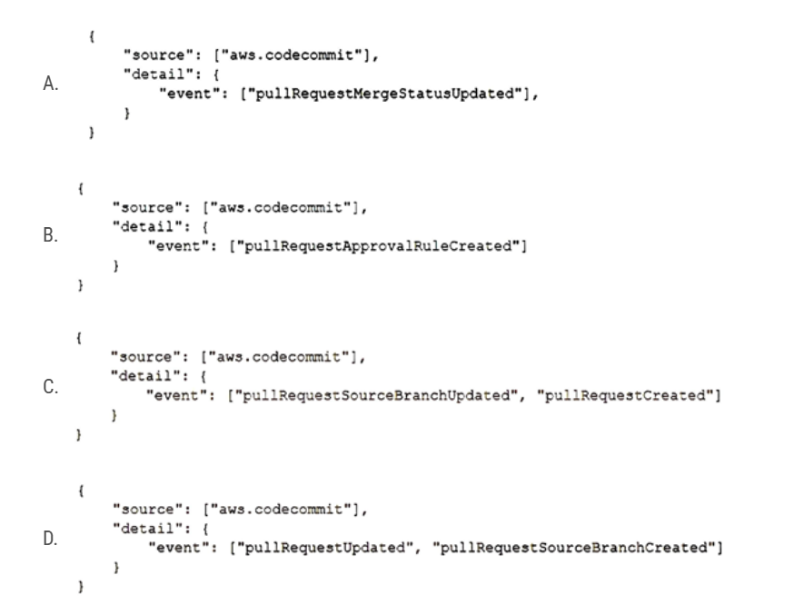
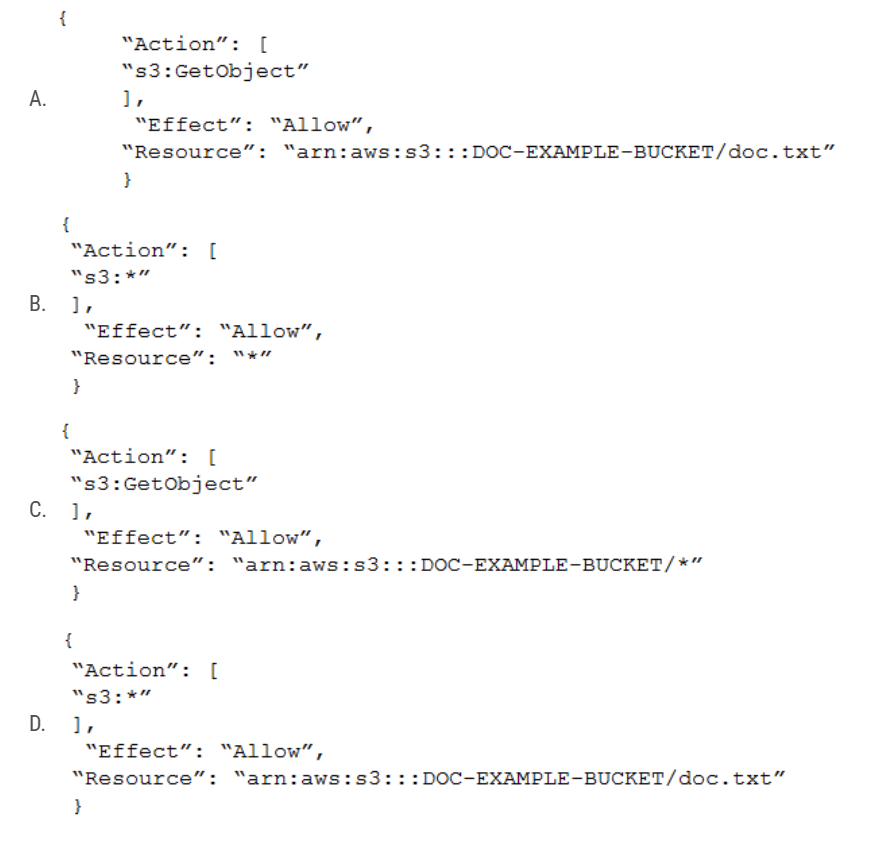

# AWS DVA 02

1. A developer is working on an existing application that uses Amazon DynamoDB as its data store. The DynamoDB table has the following attributes: partNumber (partition key), vendor (sort key), description, productFamily, and productType. When the developer analyzes the usage patterns, the developer notices that there are application modules that frequently look for a list of products based on the productFamily and productType attributes. The developer wants to make changes to the application to improve performance of the query operations. Which solution will meet these requirements?
   - [ ] A. Create a global secondary index (GSI) with productFamily as the partition key and productType as the sort key.
   - [ ] B. Create a local secondary index (LSI) with productFamily as the partition key and productType as the sort key.
   - [ ] C. Recreate the table. Add partNumber as the partition key and vendor as the sort key. During table creation, add a local secondary index (LSI) with productFamily as the partition key and productType as the sort key.
   - [ ] D. Update the queries to use Scan operations with productFamily as the partition key and productType as the sort key.

   

      
Answer

      A.
      - A: This option will allow you to create a new index where you can query the table using productFamily and productType without needing to modify the main table. GSIs are best suited for this use case, where you need a different partition key than the main table.
      - B: LSIs are used when you want to maintain the same partition key but need alternative sort keys. This solution will not work because the partition key (partNumber) remains unchanged, and we want to query using productFamily as the partition key.
      - C: This is suggesting to recreate the table with the same keys but then add an LSI. The LSI's suggested configuration is still incorrect as you cannot change the partition key using an LSI.
      - D: Scan operations read every item in the entire table and then filter out values to provide the desired result, which is less efficient and consumes more read capacity compared to Query operations. This would not improve performance.

   

2. A developer creates a VPC named VPC-A that has public and private subnets. The developer also creates an Amazon RDS database inside the private subnet of VPC-A. To perform some queries, the developer creates an AWS Lambda function in the default VPC. The Lambda function has code to access the RDS database. When the Lambda function runs, an error message indicates that the function cannot connect to the RDS database. How can the developer solve this problem?
   - [ ] A. Modify the RDS security group. Add a rule to allow traffic from all the ports from the VPC CIDR block.
   - [ ] B. Redeploy the Lambda function in the same subnet as the RDS instance. Ensure that the RDS security group allows traffic from the Lambda function.
   - [ ] C. Create a security group for the Lambda function. Add a new rule in the RDS security group to allow traffic from the new Lambda security group.
   - [ ] D. Create an IAM role. Attach a policy that allows access to the RDS database. Attach the role to the Lambda function.

   

      
Answer

      B.
      This solution is appropriate. By deploying the Lambda function inside the same VPC (VPC-A) and allowing traffic from the Lambda's security group in the RDS security group, you can ensure that the Lambda function can communicate with the RDS instance.

   

3. A company runs an application on AWS. The company deployed the application on Amazon EC2 instances. The application stores data on Amazon Aurora. The application recently logged multiple application-specific custom DECRYP_ERROR errors to Amazon CloudWatch logs. The company did not detect the issue until the automated tests that run every 30 minutes failed. A developer must implement a solution that will monitor for the custom errors and alert a development team in real time when these errors occur in the production environment. Which solution will meet these requirements with the LEAST operational overhead?
   - [ ] A. Configure the application to create a custom metric and to push the metric to CloudWatch. Create an AWS CloudTrail alarm. Configure the CloudTrail alarm to use an Amazon Simple Notification Service (Amazon SNS) topic to send notifications.
   - [ ] B. Create an AWS Lambda function to run every 5 minutes to scan the CloudWatch logs for the keyword DECRYP_ERROR. Configure the Lambda function to use Amazon Simple Notification Service (Amazon SNS) to send a notification.
   - [ ] C. Use Amazon CloudWatch Logs to create a metric filter that has a filter pattern for DECRYP_ERROR. Create a CloudWatch alarm on this metric for a threshold >=1. Configure the alarm to send Amazon Simple Notification Service (Amazon SNS) notifications.
   - [ ] D. Install the CloudWatch unified agent on the EC2 instance. Configure the application to generate a metric for the keyword DECRYP_ERROR errors. Configure the agent to send Amazon Simple Notification Service (Amazon SNS) notifications.

   

      
Answer

      C.

   

4. A developer created an AWS Lambda function that accesses resources in a VPC. The Lambda function polls an Amazon Simple Queue Service (Amazon SQS) queue for new messages through a VPC endpoint. Then the function calculates a rolling average of the numeric values that are contained in the messages. After initial tests of the Lambda function, the developer found that the value of the rolling average that the function returned was not accurate. How can the developer ensure that the function calculates an accurate rolling average?
   - [ ] A. Set the function's reserved concurrency to 1. Calculate the rolling average in the function. Store the calculated rolling average in Amazon ElastiCache.
   - [ ] B. Modify the function to store the values in Amazon ElastiCache. When the function initializes, use the previous values from the cache to calculate the rolling average.
   - [ ] C. Set the function's provisioned concurrency to 1. Calculate the rolling average in the function. Store the calculated rolling average in Amazon ElastiCache.
   - [ ] D. Modify the function to store the values in the function's layers. When the function initializes, use the previously stored values to calculate the rolling average.

   

      
Answer

      A.

   

5. A developer is writing unit tests for a new application that will be deployed on AWS. The developer wants to validate all pull requests with unit tests and merge the code with the main branch only when all tests pass. The developer stores the code in AWS CodeCommit and sets up AWS CodeBuild to run the unit tests. The developer creates an AWS Lambda function to start the CodeBuild task. The developer needs to identify the CodeCommit events in an Amazon EventBridge event that can invoke the Lambda function when a pull request is created or updated.
Which CodeCommit event will meet these requirements?

   

   

      
Answer

      C.

   

6. A developer deployed an application to an Amazon EC2 instance. The application needs to know the public IPv4 address of the instance. How can the application find this information?
   - [ ] A. Query the instance metadata from <http://169.254.169.254/latest/meta-data/>.
   - [ ] B. Query the instance user data from <http://169.254.169.254/latest/user-data/>.
   - [ ] C. Query the Amazon Machine Image (AMI) information from <http://169.254.169.254/latest/meta-data/ami/>.
   - [ ] D. Check the hosts file of the operating system.

   

      
Answer

      A.

   

7. An application under development is required to store hundreds of video files. The data must be encrypted within the application prior to storage, with a unique key for each video file. How should the developer code the application?
   - [ ] A. Use the KMS Encrypt API to encrypt the data. Store the encrypted data key and data.
   - [ ] B. Use a cryptography library to generate an encryption key for the application. Use the encryption key to encrypt the data. Store the encrypted data.
   - [ ] C. Use the KMS GenerateDataKey API to get a data key. Encrypt the data with the data key. Store the encrypted data key and data.
   - [ ] D. Upload the data to an S3 bucket using server side-encryption with an AWS KMS key.

   

      
Answer

      C.

   

8. A company is planning to deploy an application on AWS behind an Elastic Load Balancer. The application uses an HTTP/HTTPS listener and must access the client IP addresses. Which load-balancing solution meets these requirements?
   - [ ] A. Use an Application Load Balancer and the X-Forwarded-For headers.
   - [ ] B. Use a Network Load Balancer (NLB). Enable proxy protocol support on the NLB and the target application.
   - [ ] C. Use an Application Load Balancer. Register the targets by the instance ID.
   - [ ] D. Use a Network Load Balancer and the X-Forwarded-For headers.
   

      
Answer

      A.

   

9. A developer wants to debug an application by searching and filtering log data. The application logs are stored in Amazon CloudWatch Logs. The developer creates a new metric filter to count exceptions in the application logs. However, no results are returned from the logs. What is the reason that no filtered results are being returned?
   - [ ] A. A setup of the Amazon CloudWatch interface VPC endpoint is required for filtering the CloudWatch Logs in the VPC.
   - [ ] B. CloudWatch Logs only publishes metric data for events that happen after the filter is created.
   - [ ] C. The log group for CloudWatch Logs should be first streamed to Amazon OpenSearch Service before metric filtering returns the results.
   - [ ] D. Metric data points for logs groups can be filtered only after they are exported to an Amazon S3 bucket.

   

      
Answer

      B.

   

10. A company is planning to use AWS CodeDeploy to deploy an application to Amazon Elastic Container Service (Amazon ECS). During the deployment of a new version of the application, the company initially must expose only 10% of live traffic to the new version of the deployed application. Then, after 15 minutes elapse, the company must route all the remaining live traffic to the new version of the deployed application. Which CodeDeploy predefined configuration will meet these requirements?
    - [ ] A. CodeDeployDefault.ECSCanary10Percent15Minutes
    - [ ] B. CodeDeployDefault.LambdaCanary10Percent5Minutes
    - [ ] C. CodeDeployDefault.LambdaCanary10Percentl15Minutes
    - [ ] D. CodeDeployDefault.ECSLinear10PercentEvery1Minutes

    

      
Answer

      A.

     

11. A company hosts a batch processing application on AWS Elastic Beanstalk with instances that run the most recent version of Amazon Linux. The application sorts and processes large datasets. In recent weeks, the application's performance has decreased significantly during a peak period for traffic. A developer suspects that the application issues are related to the memory usage. The developer checks the Elastic Beanstalk console and notices that memory usage is not being tracked. How should the developer gather more information about the application performance issues?
    - [ ] A. Configure the Amazon CloudWatch agent to push logs to Amazon CloudWatch Logs by using port 443.
    - [ ] B. Configure the Elastic Beanstalk .ebextensions directory to track the memory usage of the instances.
    - [ ] C. Configure the Amazon CloudWatch agent to track the memory usage of the instances.
    - [ ] D. Configure an Amazon CloudWatch dashboard to track the memory usage of the instances.

    

       
Answer

       C.
       By default, Amazon CloudWatch does not monitor certain system-level metrics like memory usage, disk space, etc. for EC2 instances. To gather system-level metrics, you need to use the CloudWatch agent. By installing and configuring the CloudWatch agent on your Elastic Beanstalk instances, you can monitor memory usage and other system-level metrics.

    

12. A developer is building a highly secure healthcare application using serverless components. This application requires writing temporary data to /tmp storage on an AWS Lambda function. How should the developer encrypt this data?
    - [ ] A. Enable Amazon EBS volume encryption with an AWS KMS key in the Lambda function configuration so that all storage attached to the Lambda function is encrypted.
    - [ ] B. Set up the Lambda function with a role and key policy to access an AWS KMS key. Use the key to generate a data key used to encrypt all data prior to writing to /tmp storage.
    - [ ] C. Use OpenSSL to generate a symmetric encryption key on Lambda startup. Use this key to encrypt the data prior to writing to /tmp.
    - [ ] D. Use an on-premises hardware security module (HSM) to generate keys, where the Lambda function requests a data key from the HSM and uses that to encrypt data on all requests to the function.

    

       
Answer

       B.

    

13. A developer has created an AWS Lambda function to provide notification through Amazon Simple Notification Service (Amazon SNS) whenever a file is uploaded to Amazon S3 that is larger than 50 MB. The developer has deployed and tested the Lambda function by using the CLI. However, when the event notification is added to the S3 bucket and a 3,000 MB file is uploaded, the Lambda function does not launch. Which of the following is a possible reason for the Lambda function's inability to launch?
    - [ ] A. The S3 event notification does not activate for files that are larger than 1,000 MB.
    - [ ] B. The resource-based policy for the Lambda function does not have the required permissions to be invoked by Amazon S3.
    - [ ] C. Lambda functions cannot be invoked directly from an S3 event.
    - [ ] D. The S3 bucket needs to be made public.
    

       
Answer

       B.
       - A: This is not correct. S3 event notifications can be triggered for files of any size.
       - B: When setting up S3 to trigger a Lambda function, the function itself needs to have a resource-based policy that allows S3 to invoke it. If this permission is not set, even though the S3 bucket is configured to send an event, the Lambda function will not be allowed to process it.
       - C: This is incorrect. One of the primary use cases for Lambda is to process events directly from services like Amazon S3.
       - D: This is not correct. S3 buckets should not be made public unless there's a very specific requirement. Making a bucket public won't solve the issue of Lambda not being invoked.

    

14. A developer is creating a Ruby application and needs to automate the deployment, scaling, and management of an environment without requiring knowledge of the underlying infrastructure. Which service would best accomplish this task?
    - [ ] A. AWS CodeDeploy
    - [ ] B. AWS CloudFormation
    - [ ] C. AWS OpsWorks
    - [ ] D. AWS Elastic Beanstalk

    

       
Answer

       D.

    

15. A company has a web application that is deployed on AWS. The application uses an Amazon API Gateway API and an AWS Lambda function as its backend. The application recently demonstrated unexpected behavior. A developer examines the Lambda function code, finds an error, and modifies the code to resolve the problem. Before deploying the change to production, the developer needs to run tests to validate that the application operates properly. The application has only a production environment available. The developer must create a new development environment to test the code changes. The developer must also prevent other developers from overwriting these changes during the test cycle. Which combination of steps will meet these requirements with the LEAST development effort? (Choose two.)
    - [ ] A. Create a new resource in the current stage. Create a new method with Lambda proxy integration. Select the Lambda function. Add the hotfix alias. Redeploy the current stage. Test the backend.
    - [ ] B. Update the Lambda function in the API Gateway API integration request to use the hotfix alias. Deploy the API Gateway API to a new stage named hotfix. Test the backend.
    - [ ] C. Modify the Lambda function by fixing the code. Test the Lambda function. Create the alias hotfix. Point the alias to the $LATEST version.
    - [ ] D. Modify the Lambda function by fixing the code. Test the Lambda function. When the Lambda function is working as expected, publish the Lambda function as a new version. Create the alias hotfix. Point the alias to the new version.
    - [ ] E. Create a new API Gateway API for the development environment. Add a resource and method with Lambda integration. Choose the Lambda function and the hotfix alias. Deploy to a new stage. Test the backend.

    

       
Answer

       BD.
       - Option C:
         1. Modify the Lambda function by fixing the code.
         2. Test the Lambda function.
         3. Create the alias hotfix.
         4. Point the alias to the $LATEST version.
       - Option D:
         1. Modify the Lambda function by fixing the code.
         2. Test the Lambda function.
         3. When the Lambda function is working as expected, publish the Lambda function as a new version.
         4. Create the alias hotfix.
         5. Point the alias to the new version.
       - Key Differences:
         - Versioning:
           - In C: After testing, the alias "hotfix" is pointed to the $LATEST version.
           - In D: After testing, the Lambda function is published as a new version. Then the "hotfix" alias points to this new version, not $LATEST.
         - Stability & Best Practices:
           - In C: Pointing an alias to $LATEST is generally not recommended for production or stable environments. The $LATEST version always points to the most recent code. If someone modifies the code in the Lambda function, the hotfix alias would immediately reflect these changes, which could introduce instability.
           - In D: By publishing the code as a new version and pointing the alias to that specific version, it ensures that the "hotfix" alias won't accidentally execute newer (and potentially untested) code changes.
       - In summary, the main difference is in how the "hotfix" alias is used. Option D follows best practices by creating a new version of the Lambda function and pointing the alias to that specific version, ensuring stability and predictability. Option C, on the other hand, points the alias to $LATEST, which can be more volatile and isn't generally recommended for production or stable use cases.

    

16. A developer is implementing an AWS Cloud Development Kit (AWS CDK) serverless application. The developer will provision several AWS Lambda functions and Amazon API Gateway APIs during AWS CloudFormation stack creation. The developer's workstation has the AWS Serverless Application Model (AWS SAM) and the AWS CDK installed locally. How can the developer test a specific Lambda function locally?
    - [ ] A. Run the sam package and sam deploy commands. Create a Lambda test event from the AWS Management Console. Test the Lambda function.
    - [ ] B. Run the cdk synth and cdk deploy commands. Create a Lambda test event from the AWS Management Console. Test the Lambda function.
    - [ ] C. Run the cdk synth and sam local invoke commands with the function construct identifier and the path to the synthesized CloudFormation template.
    - [ ] D. Run the cdk synth and sam local start-lambda commands with the function construct identifier and the path to the synthesized CloudFormation template.

    

       
Answer

       C.

    

17. A company's new mobile app uses Amazon API Gateway. As the development team completes a new release of its APIs, a developer must safely and transparently roll out the API change. What is the SIMPLEST solution for the developer to use for rolling out the new API version to a limited number of users through API Gateway?
    - [ ] A. Create a new API in API Gateway. Direct a portion of the traffic to the new API using an Amazon Route 53 weighted routing policy.
    - [ ] B. Validate the new API version and promote it to production during the window of lowest expected utilization.
    - [ ] C. Implement an Amazon CloudWatch alarm to trigger a rollback if the observed HTTP 500 status code rate exceeds a predetermined threshold.
    - [ ] D. Use the canary release deployment option in API Gateway. Direct a percentage of the API traffic using the canarySettings setting.

    

       
Answer

       D.

    

18. A company caches session information for a web application in an Amazon DynamoDB table. The company wants an automated way to delete old items from the table. What is the simplest way to do this?
    - [ ] A. Write a script that deletes old records; schedule the script as a cron job on an Amazon EC2 instance.
    - [ ] B. Add an attribute with the expiration time; enable the Time To Live feature based on that attribute.
    - [ ] C. Each day, create a new table to hold session data; delete the previous day's table.
    - [ ] D. Add an attribute with the expiration time; name the attribute ItemExpiration.

    

       
Answer

       B.

    

19. A company is using an Amazon API Gateway REST API endpoint as a webhook to publish events from an on-premises source control management (SCM) system to Amazon EventBridge. The company has configured an EventBridge rule to listen for the events and to control application deployment in a central AWS account. The company needs to receive the same events across multiple receiver AWS accounts. How can a developer meet these requirements without changing the configuration of the SCM system?
    - [ ] A. Deploy the API Gateway REST API to all the required AWS accounts. Use the same custom domain name for all the gateway endpoints so that a single SCM webhook can be used for all events from all accounts.
    - [ ] B. Deploy the API Gateway REST API to all the receiver AWS accounts. Create as many SCM webhooks as the number of AWS accounts.
    - [ ] C. Grant permission to the central AWS account for EventBridge to access the receiver AWS accounts. Add an EventBridge event bus on the receiver AWS accounts as the targets to the existing EventBridge rule.
    - [ ] D. Convert the API Gateway type from REST API to HTTP API.

    

       
Answer

       C.
       This is the correct approach. By granting permissions, you can enable the central AWS account's EventBridge to put events on the event buses of the receiver AWS accounts. This way, events received in the central account can be forwarded to the other accounts without requiring any changes to the SCM system.

    

20. A company moved some of its secure files to a private Amazon S3 bucket that has no public access. The company wants to develop a serverless application that gives its employees the ability to log in and securely share the files with other users. Which AWS feature should the company use to share and access the files securely?
    - [ ] A. Amazon Cognito user pool
    - [ ] B. S3 presigned URLs
    - [ ] C. S3 bucket policy
    - [ ] D. Amazon Cognito identity pool

    

       
Answer

       A.
       This would handle the authentication and identity management of the employees. Once authenticated, other mechanisms like S3 presigned URLs can be used to securely share files, but the initial user authentication and login would be managed by the Amazon Cognito user pool.

    

21. A company needs to develop a proof of concept for a web service application. The application will show the weather forecast for one of the company's office locations. The application will provide a REST endpoint that clients can call. Where possible, the application should use caching features provided by AWS to limit the number of requests to the backend service. The application backend will receive a small amount of traffic only during testing. Which approach should the developer take to provide the REST endpoint MOST cost-effectively?
    - [ ] A. Create a container image. Deploy the container image by using Amazon Elastic Kubernetes Service (Amazon EKS). Expose the functionality by using Amazon API Gateway.
    - [ ] B. Create an AWS Lambda function by using the AWS Serverless Application Model (AWS SAM). Expose the Lambda functionality by using Amazon API Gateway.
    - [ ] C. Create a container image. Deploy the container image by using Amazon Elastic Container Service (Amazon ECS). Expose the functionality by using Amazon API Gateway.
    - [ ] D. Create a microservices application. Deploy the application to AWS Elastic Beanstalk. Expose the AWS Lambda functionality by using an Application Load Balancer.

    

       
Answer

       B.

    

22. An e-commerce web application that shares session state on-premises is being migrated to AWS. The application must be fault tolerant, natively highly scalable, and any service interruption should not affect the user experience. What is the best option to store the session state?
    - [ ] A. Store the session state in Amazon ElastiCache.
    - [ ] B. Store the session state in Amazon CloudFront.
    - [ ] C. Store the session state in Amazon S3.
    - [ ] D. Enable session stickiness using elastic load balancers.
  
    

       
Answer

       A.

    

23. A developer is building an application that uses Amazon DynamoDB. The developer wants to retrieve multiple specific items from the database with a single API call. Which DynamoDB API call will meet these requirements with the MINIMUM impact on the database?
    - [ ] A. BatchGetItem
    - [ ] B. GetItem
    - [ ] C. Scan
    - [ ] D. Query

    

       
Answer

       A.

    

24. A developer has written an application that runs on Amazon EC2 instances. The developer is adding functionality for the application to write objects to an Amazon S3 bucket. Which policy must the developer modify to allow the instances to write these objects?
    - [ ] A. The IAM policy that is attached to the EC2 instance profile role
    - [ ] B. The session policy that is applied to the EC2 instance role session
    - [ ] C. The AWS Key Management Service (AWS KMS) key policy that is attached to the EC2 instance profile role
    - [ ] D. The Amazon VPC endpoint policy

    

       
Answer

       A.

    

25. A developer is leveraging a Border Gateway Protocol (BGP)-based AWS VPN connection to connect from on-premises to Amazon EC2 instances in the developer's account. The developer is able to access an EC2 instance in subnet A, but is unable to access an EC2 instance in subnet B in the same VPC. Which logs can the developer use to verify whether the traffic is reaching subnet B?
    - [ ] A. VPN logs
    - [ ] B. BGP logs
    - [ ] C. VPC Flow Logs
    - [ ] D. AWS CloudTrail logs

    

       
Answer

       C.

    

26. A developer is creating a service that uses an Amazon S3 bucket for image uploads. The service will use an AWS Lambda function to create a thumbnail of each image. Each time an image is uploaded, the service needs to send an email notification and create the thumbnail. The developer needs to configure the image processing and email notifications setup. Which solution will meet these requirements?
    - [ ] A. Create an Amazon Simple Notification Service (Amazon SNS) topic. Configure S3 event notifications with a destination of the SNS topic. Subscribe the Lambda function to the SNS topic. Create an email notification subscription to the SNS topic.
    - [ ] B. Create an Amazon Simple Notification Service (Amazon SNS) topic. Configure S3 event notifications with a destination of the SNS topic. Subscribe the Lambda function to the SNS topic. Create an Amazon Simple Queue Service (Amazon SQS) queue. Subscribe the SQS queue to the SNS topic. Create an email notification subscription to the SQS queue.
    - [ ] C. Create an Amazon Simple Queue Service (Amazon SQS) queue. Configure S3 event notifications with a destination of the SQS queue. Subscribe the Lambda function to the SQS queue. Create an email notification subscription to the SQS queue.
    - [ ] D. Create an Amazon Simple Queue Service (Amazon SQS) queue. Send S3 event notifications to Amazon EventBridge. Create an EventBridge rule that runs the Lambda function when images are uploaded to the S3 bucket. Create an EventBridge rule that sends notifications to the SQS queue. Create an email notification subscription to the SQS queue.

    

       
Answer

       A.

    

27. A developer has designed an application to store incoming data as JSON files in Amazon S3 objects. Custom business logic in an AWS Lambda function then transforms the objects, and the Lambda function loads the data into an Amazon DynamoDB table. Recently, the workload has experienced sudden and significant changes in traffic. The flow of data to the DynamoDB table is becoming throttled. The developer needs to implement a solution to eliminate the throttling and load the data into the DynamoDB table more consistently. Which solution will meet these requirements?
    - [ ] A. Refactor the Lambda function into two functions. Configure one function to transform the data and one function to load the data into the DynamoDB table. Create an Amazon Simple Queue Service (Amazon SQS) queue in between the functions to hold the items as messages and to invoke the second function.
    - [ ] B. Turn on auto scaling for the DynamoDB table. Use Amazon CloudWatch to monitor the table's read and write capacity metrics and to track consumed capacity.
    - [ ] C. Create an alias for the Lambda function. Configure provisioned concurrency for the application to use.
    - [ ] D. Refactor the Lambda function into two functions. Configure one function to store the data in the DynamoDB table. Configure the second function to process the data and update the items after the data is stored in DynamoDB. Create a DynamoDB stream to invoke the second function after the data is stored.

    
Answer

       A.
       - A: By refactoring the Lambda function into two and introducing an SQS queue, we're creating a buffer mechanism. This allows for more consistent data loading into DynamoDB, as data can be dequeued and processed at a controlled rate. If traffic surges occur, SQS can hold the data until the Lambda function can catch up, preventing immediate overloading of the DynamoDB table. This seems like a viable solution.
       - B. Auto scaling for the DynamoDB table allows the table to adjust its provisioned throughput capacity up and down within minimum and maximum limits in response to actual traffic patterns. This can help handle increased loads but doesn't provide a buffering mechanism like SQS for sudden and significant traffic surges. This is a useful feature, but by itself, during sudden spikes, there might still be periods where write requests get throttled before auto-scaling can adjust.
       - C. Provisioned concurrency for Lambda ensures that the function initializes quickly, but it doesn't address the throttling issue with DynamoDB directly.
       - D. Creating two functions and utilizing DynamoDB streams ensures that the data is first written to the table and then processed. However, if the issue is with writing data to the DynamoDB table in the first place, this solution doesn't address the root of the problem.

    

28. A developer is creating an AWS Lambda function in VPC mode. An Amazon S3 event will invoke the Lambda function when an object is uploaded into an S3 bucket. The Lambda function will process the object and produce some analytic results that will be recorded into a file. Each processed object will also generate a log entry that will be recorded into a file. Other Lambda functions, AWS services, and on-premises resources must have access to the result files and log file. Each log entry must also be appended to the same shared log file. The developer needs a solution that can share files and append results into an existing file. Which solution should the developer use to meet these requirements?
    - [ ] A. Create an Amazon Elastic File System (Amazon EFS) file system. Mount the EFS file system in Lambda. Store the result files and log file in the mount point. Append the log entries to the log file.
    - [ ] B. Create an Amazon Elastic Block Store (Amazon EBS) Multi-Attach enabled volume. Attach the EBS volume to all Lambda functions. Update the Lambda function code to download the log file, append the log entries, and upload the modified log file to Amazon EBS.
    - [ ] C. Create a reference to the /tmp local directory. Store the result files and log file by using the directory reference. Append the log entry to the log file.
    - [ ] D. Create a reference to the /opt storage directory. Store the result files and log file by using the directory reference. Append the log entry to the log file.

    

       
Answer

       A.

    

29. A company has an AWS Lambda function that processes incoming requests from an Amazon API Gateway API. The API calls the Lambda function by using a Lambda alias. A developer updated the Lambda function code to handle more details related to the incoming requests. The developer wants to deploy the new Lambda function for more testing by other developers with no impact to customers that use the API. Which solution will meet these requirements with the LEAST operational overhead?
    - [ ] A. Create a new version of the Lambda function. Create a new stage on API Gateway with integration to the new Lambda version. Use the new API Gateway stage to test the Lambda function.
    - [ ] B. Update the existing Lambda alias used by API Gateway to a weighted alias. Add the new Lambda version as an additional Lambda function with a weight of 10%. Use the existing API Gateway stage for testing.
    - [ ] C. Create a new version of the Lambda function. Create and deploy a second Lambda function to filter incoming requests from API Gateway. If the filtering Lambda function detects a test request, the filtering Lambda function will invoke the new Lambda version of the code. For other requests, the filtering Lambda function will invoke the old Lambda version. Update the API Gateway API to use the filtering Lambda function.
    - [ ] D. Create a new version of the Lambda function. Create a new API Gateway API for testing purposes. Update the integration of the new API with the new Lambda version. Use the new API for testing.

    

       
Answer

       A.
       - By creating a new version of the Lambda function, you maintain the original version, which ensures the current users are not affected by the new code.
       - API Gateway allows multiple stages. Creating a new stage specifically for testing ensures that it doesn't interfere with the production stage. Developers can test using this new stage, while customers continue using the existing stage.
       - B. This approach would result in 10% of traffic (including real customer traffic) being routed to the new Lambda version. This could lead to potential impacts on customers.
       - C. Introducing a filtering Lambda function adds complexity and overhead. It could also introduce latency since requests now have to pass through an additional Lambda function.
       - D. Creating a new API Gateway API altogether is overkill for testing a new version of a Lambda function. A new stage in the existing API is simpler and achieves the same goal.

    

30. A company uses AWS Lambda functions and an Amazon S3 trigger to process images into an S3 bucket. A development team set up multiple environments in a single AWS account. After a recent production deployment, the development team observed that the development S3 buckets invoked the production environment Lambda functions. These invocations caused unwanted execution of development S3 files by using production Lambda functions. The development team must prevent these invocations. The team must follow security best practices. Which solution will meet these requirements?
    - [ ] A. Update the Lambda execution role for the production Lambda function to add a policy that allows the execution role to read from only the production environment S3 bucket.
    - [ ] B. Move the development and production environments into separate AWS accounts. Add a resource policy to each Lambda function to allow only S3 buckets that are within the same account to invoke the function.
    - [ ] C. Add a resource policy to the production Lambda function to allow only the production environment S3 bucket to invoke the function.
    - [ ] D. Move the development and production environments into separate AWS accounts. Update the Lambda execution role for each function to add a policy that allows the execution role to read from the S3 bucket that is within the same account.

    

       
Answer

       B.
       Separating development and production environments into distinct AWS accounts is a best practice. This will inherently prevent cross-environment mistakes. By adding a resource policy to each Lambda function that restricts invocation to S3 buckets from the same account, you ensure that a development S3 bucket in a development account cannot trigger a Lambda function in the production account.

    

31. A developer is creating an application. New users of the application must be able to create an account and register by using their own social media accounts. Which AWS service or resource should the developer use to meet these requirements?
    - [ ] A. IAM role
    - [ ] B. Amazon Cognito identity pools
    - [ ] C. Amazon Cognito user pools
    - [ ] D. AWS Directory Service

    

       
Answer

       C.

    

32. A social media application uses the AWS SDK for JavaScript on the frontend to get user credentials from AWS Security Token Service (AWS STS). The application stores its assets in an Amazon S3 bucket. The application serves its content by using an Amazon CloudFront distribution with the origin set to the S3 bucket. The credentials for the role that the application assumes to make the SDK calls are stored in plaintext in a JSON file within the application code. The developer needs to implement a solution that will allow the application to get user credentials without having any credentials hardcoded in the application code. Which solution will meet these requirements?
    - [ ] A. Add a Lambda@Edge function to the distribution. Invoke the function on viewer request. Add permissions to the function's execution role to allow the function to access AWS STS. Move all SDK calls from the frontend into the function.
    - [ ] B. Add a CloudFront function to the distribution. Invoke the function on viewer request. Add permissions to the function's execution role to allow the function to access AWS STS. Move all SDK calls from the frontend into the function.
    - [ ] C. Add a Lambda@Edge function to the distribution. Invoke the function on viewer request. Move the credentials from the JSON file into the function. Move all SDK calls from the frontend into the function.
    - [ ] D. Add a CloudFront function to the distribution. Invoke the function on viewer request. Move the credentials from the JSON file into the function. Move all SDK calls from the frontend into the function.

    

       
Answer

       A.

    

33. An ecommerce website uses an AWS Lambda function and an Amazon RDS for MySQL database for an order fulfillment service. The service needs to return order confirmation immediately. During a marketing campaign that caused an increase in the number of orders, the website's operations team noticed errors for “too many connections” from Amazon RDS. However, the RDS DB cluster metrics are healthy. CPU and memory capacity are still available. What should a developer do to resolve the errors?
    - [ ] A. Initialize the database connection outside the handler function. Increase the max_user_connections value on the parameter group of the DB cluster. Restart the DB cluster.
    - [ ] B. Initialize the database connection outside the handler function. Use RDS Proxy instead of connecting directly to the DB cluster.
    - [ ] C. Use Amazon Simple Queue Service (Amazon SQS) FIFO queues to queue the orders. Ingest the orders into the database. Set the Lambda function's concurrency to a value that equals the number of available database connections.
    - [ ] D. Use Amazon Simple Queue Service (Amazon SQS) FIFO queues to queue the orders. Ingest the orders into the database. Set the Lambda function's concurrency to a value that is less than the number of available database connections.

    

       
Answer

       B.

    

34. A company stores its data in data tables in a series of Amazon S3 buckets. The company received an alert that customer credit card information might have been exposed in a data table on one of the company's public applications. A developer needs to identify all potential exposures within the application environment. Which solution will meet these requirements?
    - [ ] A. Use Amazon Athena to run a job on the S3 buckets that contain the affected data. Filter the findings by using the `SensitiveData:S3Object/Personal` finding type.
    - [ ] B. Use Amazon Macie to run a job on the S3 buckets that contain the affected data. Filter the findings by using the `SensitiveData:S3Object/Financial` finding type.
    - [ ] C. Use Amazon Macie to run a job on the S3 buckets that contain the affected data. Filter the findings by using the `SensitiveData:S3Object/Personal` finding type.
    - [ ] D. Use Amazon Athena to run a job on the S3 buckets that contain the affected data. Filter the findings by using the `SensitiveData:S3Object/Financial` finding type.

    

       
Answer

       B.
       Amazon Macie can be used to discover sensitive data like credit card information in S3 buckets. The classification for financial data, including credit card numbers, would fall under the `SensitiveData:S3Object/Financial` finding type.

    

35. A software company is launching a multimedia application. The application will allow guest users to access sample content before the users decide if they want to create an account to gain full access. The company wants to implement an authentication process that can identify users who have already created an account. The company also needs to keep track of the number of guest users who eventually create an account. Which combination of steps will meet these requirements? (Choose two.)
    - [ ] A. Create an Amazon Cognito user pool. Configure the user pool to allow unauthenticated users. Exchange user tokens for temporary credentials that allow authenticated users to assume a role.
    - [ ] B. Create an Amazon Cognito identity pool. Configure the identity pool to allow unauthenticated users. Exchange unique identity for temporary credentials that allow all users to assume a role.
    - [ ] C. Create an Amazon CloudFront distribution. Configure the distribution to allow unauthenticated users. Exchange user tokens for temporary credentials that allow all users to assume a role.
    - [ ] D. Create a role for authenticated users that allows access to all content. Create a role for unauthenticated users that allows access to only the sample content.
    - [ ] E. Allow all users to access the sample content by default. Create a role for authenticated users that allows access to the other content.

    

       
Answer

       BD.
       1. The company needs an authentication process that identifies users with accounts.
       2. 2The company needs to track guest users who eventually create an account.
       3. Guest users should be able to access sample content.
       4. B: Identity Pools handle the creation of unique identities for users and grant temporary AWS credentials. By configuring the identity pool to allow unauthenticated users, you are giving guest users a way to access resources with temporary AWS credentials.
       5. D: By creating separate IAM roles for authenticated and unauthenticated users, you can control the access levels based on user status. Authenticated users get access to everything, whereas unauthenticated (guest) users can only access sample content.

    

36. A company is updating an application to move the backend of the application from Amazon EC2 instances to a serverless model. The application uses an Amazon RDS for MySQL DB instance and runs in a single VPC on AWS. The application and the DB instance are deployed in a private subnet in the VPC. The company needs to connect AWS Lambda functions to the DB instance. Which solution will meet these requirements?
    - [ ] A. Create Lambda functions inside the VPC with the AWSLambdaBasicExecutionRole policy attached to the Lambda execution role. Modify the RDS security group to allow inbound access from the Lambda security group.
    - [ ] B. Create Lambda functions inside the VPC with the AWSLambdaVPCAccessExecutionRole policy attached to the Lambda execution role. Modify the RDS security group to allow inbound access from the Lambda security group.
    - [ ] C. Create Lambda functions with the AWSLambdaBasicExecutionRole policy attached to the Lambda execution role. Create an interface VPC endpoint for the Lambda functions. Configure the interface endpoint policy to allow the lambda:InvokeFunclion action for each Lambda function's Amazon Resource Name (ARN).
    - [ ] D. Create Lambda functions with the AWSLambdaVPCAccessExecutionRole policy attached to the Lambda execution role. Create an interface VPC endpoint for the Lambda functions. Configure the interface endpoint policy to allow the lambda:InvokeFunction action for each Lambda function's Amazon Resource Name (ARN).
    

       
Answer

       B.
      AWSLambdaVPCAccessExecutionRole is a managed AWS IAM policy that grants a Lambda function permissions to manage Elastic Network Interfaces (ENIs) in a VPC. Lambda creates and manages these ENIs on your behalf, enabling the function to connect to other resources in a VPC. The second part of this option is also right: you would need to modify the RDS security group to allow inbound traffic from the Lambda function's security group.

    

37. A company has a web application that runs on Amazon EC2 instances with a custom Amazon Machine Image (AMI). The company uses AWS CloudFormation to provision the application. The application runs in the us-east-1 Region, and the company needs to deploy the application to the us-west-1 Region. An attempt to create the AWS CloudFormation stack in us-west-1 fails. An error message states that the AMI ID does not exist. A developer must resolve this error with a solution that uses the least amount of operational overhead. Which solution meets these requirements?
    - [ ] A. Change the AWS CloudFormation templates for us-east-1 and us-west-1 to use an AWS AMI. Relaunch the stack for both Regions.
    - [ ] B. Copy the custom AMI from us-east-1 to us-west-1. Update the AWS CloudFormation template for us-west-1 to refer to AMI ID for the copied AMI. Relaunch the stack.
    - [ ] C. Build the custom AMI in us-west-1. Create a new AWS CloudFormation template to launch the stack in us-west-1 with the new AMI ID.
    - [ ] D. Manually deploy the application outside AWS CloudFormation in us-west-1.

    

       
Answer

       B.

    

38. A developer is updating several AWS Lambda functions and notices that all the Lambda functions share the same custom libraries. The developer wants to centralize all the libraries, update the libraries in a convenient way, and keep the libraries versioned. Which solution will meet these requirements with the LEAST development effort?
    - [ ] A. Create an AWS CodeArtifact repository that contains all the custom libraries.
    - [ ] B. Create a custom container image for the Lambda functions to save all the custom libraries.
    - [ ] C. Create a Lambda layer that contains all the custom libraries.
    - [ ] D. Create an Amazon Elastic File System (Amazon EFS) file system to store all the custom libraries.
    

       
Answer

       C.

    

39. A developer wants to use AWS Elastic Beanstalk to test a new version of an application in a test environment. Which deployment method offers the FASTEST deployment?
    - [ ] A. Immutable
    - [ ] B. Rolling
    - [ ] C. Rolling with additional batch
    - [ ] D. All at once

    

       
Answer

       D.

    

40. A company is providing read access to objects in an Amazon S3 bucket for different customers. The company uses IAM permissions to restrict access to the S3 bucket. The customers can access only their own files. Due to a regulation requirement, the company needs to enforce encryption in transit for interactions with Amazon S3. Which solution will meet these requirements?
    - [ ] A. Add a bucket policy to the S3 bucket to deny S3 actions when the aws:SecureTransport condition is equal to false.
    - [ ] B. Add a bucket policy to the S3 bucket to deny S3 actions when the s3:x-amz-acl condition is equal to public-read.
    - [ ] C. Add an IAM policy to the IAM users to enforce the usage of the AWS SDK.
    - [ ] D. Add an IAM policy to the IAM users that allows S3 actions when the s3:x-amz-acl condition is equal to bucket-owner-read.

    

       
Answer

       A.
       - A. This option adds a bucket policy to deny S3 actions when requests are not made over HTTPS (when aws:SecureTransport is false). This ensures that data is encrypted in transit. This is the correct option.
       - B. The s3:x-amz-acl condition key is related to S3 object ACLs (Access Control Lists) and has nothing to do with enforcing encryption in transit. The value public-read would grant public read access to the object, which isn't relevant to the requirement.
       - C. Simply enforcing the usage of the AWS SDK doesn't guarantee encryption in transit. Users can use the SDK to make both HTTP and HTTPS requests.
       - D. Like option B, the s3:x-amz-acl condition key pertains to S3 object ACLs. The value bucket-owner-read grants the bucket owner read access to the object, which is not related to enforcing encryption in transit.

    

41. A company has an image storage web application that runs on AWS. The company hosts the application on Amazon EC2 instances in an Auto Scaling group. The Auto Scaling group acts as the target group for an Application Load Balancer (ALB) and uses an Amazon S3 bucket to store the images for sale. The company wants to develop a feature to test system requests. The feature will direct requests to a separate target group that hosts a new beta version of the application. Which solution will meet this requirement with the LEAST effort?
    - [ ] A. Create a new Auto Scaling group and target group for the beta version of the application. Update the ALB routing rule with a condition that looks for a cookie named version that has a value of beta. Update the test system code to use this cookie to test the beta version of the application.
    - [ ] B. Create a new ALB, Auto Scaling group, and target group for the beta version of the application. Configure an alternate Amazon Route 53 record for the new ALB endpoint. Use the alternate Route 53 endpoint in the test system requests to test the beta version of the application.
    - [ ] C. Create a new ALB, Auto Scaling group, and target group for the beta version of the application. Use Amazon CloudFront with Lambda@Edge to determine which specific request will go to the new ALB. Use the CloudFront endpoint to send the test system requests to test the beta version of the application.
    - [ ] D. Create a new Auto Scaling group and target group for the beta version of the application. Update the ALB routing rule with a condition that looks for a cookie named version that has a value of beta. Use Amazon CloudFront with Lambda@Edge to update the test system requests to add the required cookie when the requests go to the ALB.

    

       
Answer

       A.
       - A. This option involves adding a new target group and Auto Scaling group for the beta version. Requests carrying a cookie named "version" with a value "beta" are routed to the new beta version. This option does not involve any DNS changes and provides a simple mechanism to direct traffic to the beta version based on the presence of a cookie. It requires minimal effort and doesn't necessitate external systems for traffic routing.
       - B. This option involves creating a completely separate infrastructure (a new ALB, Auto Scaling group, and target group) for the beta version. While it might work, it's more effort than simply adding a routing condition in the existing ALB.
       - C. This option uses Lambda@Edge to decide where to send the traffic. While Lambda@Edge can be used to manipulate request and response headers, it's an additional layer of complexity, requiring you to manage CloudFront and Lambda configurations.
       - D. This option combines both the ALB and CloudFront with Lambda@Edge, making it more complex than Option A. It's using Lambda@Edge to set the cookie, and then ALB to route based on that cookie. It's essentially a more convoluted version of Option A.

    

42. A team is developing an application that is deployed on Amazon EC2 instances. During testing, the team receives an error. The EC2 instances are unable to access an Amazon S3 bucket. Which steps should the team take to troubleshoot this issue? (Choose two.)
    - [ ] A. Check whether the policy that is assigned to the IAM role that is attached to the EC2 instances grants access to Amazon S3.
    - [ ] B. Check the S3 bucket policy to validate the access permissions for the S3 bucket.
    - [ ] C. Check whether the policy that is assigned to the IAM user that is attached to the EC2 instances grants access to Amazon S3.
    - [ ] D. Check the S3 Lifecycle policy to validate the permissions that are assigned to the S3 bucket.
    - [ ] E. Check the security groups that are assigned to the EC2 instances. Make sure that a rule is not blocking the access to Amazon S3.

    

       
Answer

       AB.

    

43. A developer is working on an ecommerce website. The developer wants to review server logs without logging in to each of the application servers individually. The website runs on multiple Amazon EC2 instances, is written in Python, and needs to be highly available. How can the developer update the application to meet these requirements with MINIMUM changes?
    - [ ] A. Rewrite the application to be cloud native and to run on AWS Lambda, where the logs can be reviewed in Amazon CloudWatch.
    - [ ] B. Set up centralized logging by using Amazon OpenSearch Service, Logstash, and OpenSearch Dashboards.
    - [ ] C. Scale down the application to one larger EC2 instance where only one instance is recording logs.
    - [ ] D. Install the unified Amazon CloudWatch agent on the EC2 instances. Configure the agent to push the application logs to CloudWatch.

    

       
Answer

       D.

    

44. A company is creating an application that processes .csv files from Amazon S3. A developer has created an S3 bucket. The developer has also created an AWS Lambda function to process the .csv files from the S3 bucket. Which combination of steps will invoke the Lambda function when a .csv file is uploaded to Amazon S3? (Choose two.)
    - [ ] A. Create an Amazon EventBridge rule. Configure the rule with a pattern to match the S3 object created event.
    - [ ] B. Schedule an Amazon EventBridge rule to run a new Lambda function to scan the S3 bucket.
    - [ ] C. Add a trigger to the existing Lambda function. Set the trigger type to EventBridge. Select the Amazon EventBridge rule.
    - [ ] D. Create a new Lambda function to scan the S3 bucket for recently added S3 objects.
    - [ ] E. Add S3 Lifecycle rules to invoke the existing Lambda function.

    

       
Answer

       AC.

    

45. A developer needs to build an AWS CloudFormation template that self-populates the AWS Region variable that deploys the CloudFormation template. What is the MOST operationally efficient way to determine the Region in which the template is being deployed?
    - [ ] A. Use the AWS::Region pseudo parameter.
    - [ ] B. Require the Region as a CloudFormation parameter.
    - [ ] C. Find the Region from the AWS::StackId pseudo parameter by using the Fn::Split intrinsic function.
    - [ ] D. Dynamically import the Region by referencing the relevant parameter in AWS Systems Manager Parameter Store.
    

       
Answer

       A.
       `AWS::Region` pseudo parameter directly gives you the AWS region where the stack is being created. It's straightforward and doesn't require any additional work or functions.

    

46. A company has hundreds of AWS Lambda functions that the company's QA team needs to test by using the Lambda function URLs. A developer needs to configure the authentication of the Lambda functions to allow access so that the QA IAM group can invoke the Lambda functions by using the public URLs. Which solution will meet these requirements?
    - [ ] A. Create a CLI script that loops on the Lambda functions to add a Lambda function URL with the AWS_IAM auth type. Run another script to create an IAM identity-based policy that allows the lambda:InvokeFunctionUrl action to all the Lambda function Amazon Resource Names (ARNs). Attach the policy to the QA IAM group.
    - [ ] B. Create a CLI script that loops on the Lambda functions to add a Lambda function URL with the NONE auth type. Run another script to create an IAM resource-based policy that allows the lambda:InvokeFunctionUrl action to all the Lambda function Amazon Resource Names (ARNs). Attach the policy to the QA IAM group.
    - [ ] C. Create a CLI script that loops on the Lambda functions to add a Lambda function URL with the AWS_IAM auth type. Run another script to loop on the Lambda functions to create an IAM identity-based policy that allows the lambda:InvokeFunctionUrl action from the QA IAM group's Amazon Resource Name (ARN).
    - [ ] D. Create a CLI script that loops on the Lambda functions to add a Lambda function URL with the NONE auth type. Run another script to loop on the Lambda functions to create an IAM resource-based policy that allows the lambda:InvokeFunctionUrl action from the QA IAM group's Amazon Resource Name (ARN).

    

       
Answer

       C.

    

47. A developer maintains a critical business application that uses Amazon DynamoDB as the primary data store. The DynamoDB table contains millions of documents and receives 30-60 requests each minute. The developer needs to perform processing in near-real time on the documents when they are added or updated in the DynamoDB table. How can the developer implement this feature with the LEAST amount of change to the existing application code?
    - [ ] A. Set up a cron job on an Amazon EC2 instance. Run a script every hour to query the table for changes and process the documents.
    - [ ] B. Enable a DynamoDB stream on the table. Invoke an AWS Lambda function to process the documents.
    - [ ] C. Update the application to send a PutEvents request to Amazon EventBridge. Create an EventBridge rule to invoke an AWS Lambda function to process the documents.
    - [ ] D. Update the application to synchronously process the documents directly after the DynamoDB write.

    

       
Answer

       B.

    

48. A developer is writing an application for a company. The application will be deployed on Amazon EC2 and will use an Amazon RDS for Microsoft SQL Server database. The company's security team requires that database credentials are rotated at least weekly. How should the developer configure the database credentials for this application?
    - [ ] A. Create a database user. Store the user name and password in an AWS Systems Manager Parameter Store secure string parameter. Enable rotation of the AWS Key Management Service (AWS KMS) key that is used to encrypt the parameter.
    - [ ] B. Enable IAM authentication for the database. Create a database user for use with IAM authentication. Enable password rotation.
    - [ ] C. Create a database user. Store the user name and password in an AWS Secrets Manager secret that has daily rotation enabled.
    - [ ] D. Use the EC2 user data to create a database user. Provide the user name and password in environment variables to the application.

    

       
Answer

       C.

    

49. A real-time messaging application uses Amazon API Gateway WebSocket APIs with backend HTTP service. A developer needs to build a feature in the application to identify a client that keeps connecting to and disconnecting from the WebSocket connection. The developer also needs the ability to remove the client. Which combination of changes should the developer make to the application to meet these requirements? (Choose two.)
    - [ ] A. Switch to HTTP APIs in the backend service.
    - [ ] B. Switch to REST APIs in the backend service.
    - [ ] C. Use the callback URL to disconnect the client from the backend service.
    - [ ] D. Add code to track the client status in Amazon ElastiCache in the backend service.
    - [ ] E. Implement $connect and $disconnect routes in the backend service.

    

       
Answer

       DE:
       - A. Switching to HTTP APIs wouldn't inherently help track WebSocket connections or disconnections. WebSocket is a separate protocol from HTTP.
       - B. Switching to REST APIs wouldn't help either. WebSocket provides a full-duplex communication channel, unlike REST APIs, which is necessary for real-time messaging applications.
       - C. The callback URL mechanism is not a standard way to disconnect a client from a WebSocket. WebSocket APIs have built-in $disconnect for this purpose.
       - D. While you can use Amazon ElastiCache (or other databases) to track client status, including connections and disconnections, by saving and updating the client status each time they connect or disconnect, it would be more about keeping track of state rather than the actual mechanism to connect/disconnect.
       - E. Implementing $connect and $disconnect routes in the backend service allows you to execute custom logic each time a client connects or disconnects. This can be used to track which clients are connecting and disconnecting and is a standard feature for WebSocket APIs in API Gateway.

    

50. A developer has written code for an application and wants to share it with other developers on the team to receive feedback. The shared application code needs to be stored long-term with multiple versions and batch change tracking. Which AWS service should the developer use?
    - [ ] A. AWS CodeBuild
    - [ ] B. Amazon S3
    - [ ] C. AWS CodeCommit
    - [ ] D. AWS Cloud9

    

       
Answer

       C.

    

51. A company's developer is building a static website to be deployed in Amazon S3 for a production environment. The website integrates with an Amazon Aurora PostgreSQL database by using an AWS Lambda function. The website that is deployed to production will use a Lambda alias that points to a specific version of the Lambda function. The company must rotate the database credentials every 2 weeks. Lambda functions that the company deployed previously must be able to use the most recent credentials. Which solution will meet these requirements?
    - [ ] A. Store the database credentials in AWS Secrets Manager. Turn on rotation. Write code in the Lambda function to retrieve the credentials from Secrets Manager.
    - [ ] B. Include the database credentials as part of the Lambda function code. Update the credentials periodically and deploy the new Lambda function.
    - [ ] C. Use Lambda environment variables. Update the environment variables when new credentials are available.
    - [ ] D. Store the database credentials in AWS Systems Manager Parameter Store. Turn on rotation. Write code in the Lambda function to retrieve the credentials from Systems Manager Parameter Store

    

       
Answer

       A.

    

52. A developer is developing an application that uses signed requests (Signature Version 4) to call other AWS services. The developer has created a canonical request, has created the string to sign, and has calculated signing information. Which methods could the developer use to complete a signed request? (Choose two.)
    - [ ] A. Add the signature to an HTTP header that is named Authorization.
    - [ ] B. Add the signature to a session cookie.
    - [ ] C. Add the signature to an HTTP header that is named Authentication.
    - [ ] D. Add the signature to a query string parameter that is named X-Amz-Signature.
    - [ ] E. Add the signature to an HTTP header that is named WWW-Authenticate.

    

       
Answer

       AD.
       - By adding it to the request's HTTP header. Specifically, the signature is included in the Authorization header.
       - By adding it to the query string, especially for presigned URLs. When included in the query string, the signature is in the X-Amz-Signature parameter.

    

53. A company must deploy all its Amazon RDS DB instances by using AWS CloudFormation templates as part of AWS CodePipeline continuous integration and continuous delivery (CI/CD) automation. The primary password for the DB instance must be automatically generated as part of the deployment process. Which solution will meet these requirements with the LEAST development effort?
    - [ ] A. Create an AWS Lambda-backed CloudFormation custom resource. Write Lambda code that generates a secure string. Return the value of the secure string as a data field of the custom resource response object. Use the CloudFormation Fn::GetAtt intrinsic function to get the value of the secure string. Use the value to create the DB instance.
    - [ ] B. Use the AWS CodeBuild action of CodePipeline to generate a secure string by using the following AWS CLI command: aws secretsmanager get-random-password. Pass the generated secure string as a CloudFormation parameter with the NoEcho attribute set to true. Use the parameter reference to create the DB instance.
    - [ ] C. Create an AWS Lambda-backed CloudFormation custom resource. Write Lambda code that generates a secure string. Return the value of the secure string as a data field of the custom resource response object. Use the CloudFormation Fn::GetAtt intrinsic function to get a value of the secure string. Create secrets in AWS Secrets Manager. Use the secretsmanager dynamic reference to use the value stored in the secret to create the DB instance.
    - [ ] D. Use the AWS::SecretsManager::Secret resource to generate a secure string. Store the secure string as a secret in AWS Secrets Manager. Use the secretsmanager dynamic reference to use the value stored in the secret to create the DB instance.

    

       
Answer

       D.
       - A. This option involves creating a Lambda-backed CloudFormation custom resource, writing Lambda code to generate a secure string, and then using the Fn::GetAtt function to retrieve the generated password. While this would work, it requires writing and managing Lambda code, which increases the development effort.
       - B. This option involves using AWS CodeBuild to execute the AWS CLI command for generating a password. While this method might work, it's a bit more convoluted and requires handling the password in the pipeline's artifact, which is not as secure as other options.
       - C. This option is similar to option A but has an additional step of creating secrets in AWS Secrets Manager. It involves unnecessary additional steps and hence is not the most efficient.
       - D. This option leverages the AWS::SecretsManager::Secret CloudFormation resource to generate a secure string. It also uses the Secrets Manager dynamic reference in CloudFormation to directly fetch the generated secret (password) and use it for the RDS instance. This option avoids the need for custom Lambda code or managing the password outside of the secure context of Secrets Manager.

    

54. An organization is storing large files in Amazon S3, and is writing a web application to display meta-data about the files to end-users. Based on the metadata a user selects an object to download. The organization needs a mechanism to index the files and provide single-digit millisecond latency retrieval for the metadata. What AWS service should be used to accomplish this?
    - [ ] A. Amazon DynamoDB
    - [ ] B. Amazon EC2
    - [ ] C. AWS Lambda
    - [ ] D. Amazon RDS

    

       
Answer

       A.

    

55. A developer is creating an AWS Serverless Application Model (AWS SAM) template. The AWS SAM template contains the definition of multiple AWS Lambda functions, an Amazon S3 bucket, and an Amazon CloudFront distribution. One of the Lambda functions runs on Lambda@Edge in the CloudFront distribution. The S3 bucket is configured as an origin for the CloudFront distribution. When the developer deploys the AWS SAM template in the eu-west-1 Region, the creation of the stack fails. Which of the following could be the reason for this issue?
    - [ ] A. CloudFront distributions can be created only in the us-east-1 Region.
    - [ ] B. Lambda@Edge functions can be created only in the us-east-1 Region.
    - [ ] C. A single AWS SAM template cannot contain multiple Lambda functions.
    - [ ] D. The CloudFront distribution and the S3 bucket cannot be created in the same Region.

    

       
Answer

       B.

    

56. A developer is integrating Amazon ElastiCache in an application. The cache will store data from a database. The cached data must populate real-time dashboards. Which caching strategy will meet these requirements?
    - [ ] A. A read-through cache
    - [ ] B. A write-behind cache
    - [ ] C. A lazy-loading cache
    - [ ] D. A write-through cache

    

       
Answer

       D.

    

57. A developer is creating an AWS Lambda function. The Lambda function needs an external library to connect to a third-party solution. The external library is a collection of files with a total size of 100 MB. The developer needs to make the external library available to the Lambda execution environment and reduce the Lambda package space. Which solution will meet these requirements with the LEAST operational overhead?
    - [ ] A. Create a Lambda layer to store the external library. Configure the Lambda function to use the layer.
    - [ ] B. Create an Amazon S3 bucket. Upload the external library into the S3 bucket. Mount the S3 bucket folder in the Lambda function. Import the library by using the proper folder in the mount point.
    - [ ] C. Load the external library to the Lambda function's /tmp directory during deployment of the Lambda package. Import the library from the /tmp directory.
    - [ ] D. Create an Amazon Elastic File System (Amazon EFS) volume. Upload the external library to the EFS volume. Mount the EFS volume in the Lambda function. Import the library by using the proper folder in the mount point.

    

       
Answer

       A.

    

58. A company has a front-end application that runs on four Amazon EC2 instances behind an Elastic Load Balancer (ELB) in a production environment that is provisioned by AWS Elastic Beanstalk. A developer needs to deploy and test new application code while updating the Elastic Beanstalk platform from the current version to a newer version of Node.js. The solution must result in zero downtime for the application. Which solution meets these requirements?
    - [ ] A. Clone the production environment to a different platform version. Deploy the new application code, and test it. Swap the environment URLs upon verification.
    - [ ] B. Deploy the new application code in an all-at-once deployment to the existing EC2 instances. Test the code. Redeploy the previous code if verification fails.
    - [ ] C. Perform an immutable update to deploy the new application code to new EC2 instances. Serve traffic to the new instances after they pass health checks.
    - [ ] D. Use a rolling deployment for the new application code. Apply the code to a subset of EC2 instances until the tests pass. Redeploy the previous code if the tests fail.

    

       
Answer

       A.
       - A. Cloning the production environment creates a separate environment with identical settings. When the new application code is deployed and tested on the cloned environment, the developer can safely swap the environment URLs. This ensures zero downtime because the old environment can keep serving requests until the new environment is ready. Once verified, the URLs are swapped, directing traffic to the new environment.
       - B. An all-at-once deployment updates all instances simultaneously. If there's an issue with the new code, it could cause downtime until the previous version is redeployed.
       - C. An immutable update starts a new set of instances with the updated code/platform. Only when these instances are healthy, traffic is routed to them. This ensures zero downtime, but it might take longer as an entirely new environment is provisioned. However, this option doesn't discuss the update to the Node.js platform version.
       - D. A rolling deployment updates a subset of instances, and if the tests pass, it continues to update the rest. If the tests fail, it implies that a subset of instances is already running potentially problematic code, which might lead to downtime.

    

59. A developer is creating an AWS Lambda function. The Lambda function will consume messages from an Amazon Simple Queue Service (Amazon SQS) queue. The developer wants to integrate unit testing as part of the function's continuous integration and continuous delivery (CI/CD) process. How can the developer unit test the function?
    - [ ] A. Create an AWS CloudFormation template that creates an SQS queue and deploys the Lambda function. Create a stack from the template during the CI/CD process. Invoke the deployed function. Verify the output.
    - [ ] B. Create an SQS event for tests. Use a test that consumes messages from the SQS queue during the function's Cl/CD process.
    - [ ] C. Create an SQS queue for tests. Use this SQS queue in the application's unit test. Run the unit tests during the CI/CD process.
    - [ ] D. Use the aws lambda invoke command with a test event during the CI/CD process.

    

       
Answer

       D.
       - A. This approach tests the actual deployment of the Lambda and SQS, which is more suitable for an integration test, not a unit test.
       - B. Creating an SQS event for tests seems like a better fit for integration testing, as it depends on the real SQS service to function.
       - C. Creating an SQS queue and running the application's unit tests against it again is more of an integration testing approach.
       - D. Using the aws lambda invoke command with a test event during the CI/CD process is more oriented towards testing the Lambda function's logic in isolation (provided the test event mocks the expected SQS message). This is closest to unit testing, where the focus is on the function's logic rather than its integration with external services.

    

60. A developer is working on a web application that uses Amazon DynamoDB as its data store. The application has two DynamoDB tables: one table that is named artists and one table that is named songs. The artists table has artistName as the partition key. The songs table has songName as the partition key and artistName as the sort key. The table usage patterns include the retrieval of multiple songs and artists in a single database operation from the webpage. The developer needs a way to retrieve this information with minimal network traffic and optimal application performance. Which solution will meet these requirements?
    - [ ] A. Perform a BatchGetltem operation that returns items from the two tables. Use the list of songName/artistName keys for the songs table and the list of artistName key for the artists table.
    - [ ] B. Create a local secondary index (LSI) on the songs table that uses artistName as the partition key. Perform a query operation for each artistName on the songs table that filters by the list of songName. Perform a query operation for each artistName on the artists table.
    - [ ] C. Perform a BatchGetitem operation on the songs table that uses the songName/artistName keys. Perform a BatchGetltem operation on the artists table that uses artistName as the key.
    - [ ] D. Perform a Scan operation on each table that filters by the list of songName/artistName for the songs table and the list of artistName in the artists table.

    

       
Answer

       A.

    

61. A company is developing an ecommerce application that uses Amazon API Gateway APIs. The application uses AWS Lambda as a backend. The company needs to test the code in a dedicated, monitored test environment before the company releases the code to the production environment. Which solution will meet these requirements?
    - [ ] A. Use a single stage in API Gateway. Create a Lambda function for each environment. Configure API clients to send a query parameter that indicates the environment and the specific Lambda function.
    - [ ] B. Use multiple stages in API Gateway. Create a single Lambda function for all environments. Add different code blocks for different environments in the Lambda function based on Lambda environment variables.
    - [ ] C. Use multiple stages in API Gateway. Create a Lambda function for each environment. Configure API Gateway stage variables to route traffic to the Lambda function in different environments.
    - [ ] D. Use a single stage in API Gateway. Configure API clients to send a query parameter that indicates the environment. Add different code blocks for different environments in the Lambda function to match the value of the query parameter.

    

       
Answer

       C.

    

62. A developer creates an AWS Lambda function that retrieves and groups data from several public API endpoints. The Lambda function has been updated and configured to connect to the private subnet of a VPC. An internet gateway is attached to the VPC. The VPC uses the default network ACL and security group configurations. The developer finds that the Lambda function can no longer access the public API. The developer has ensured that the public API is accessible, but the Lambda function cannot connect to the API. How should the developer fix the connection issue?
    - [ ] A. Ensure that the network ACL allows outbound traffic to the public internet.
    - [ ] B. Ensure that the security group allows outbound traffic to the public internet.
    - [ ] C. Ensure that outbound traffic from the private subnet is routed to a public NAT gateway.
    - [ ] D. Ensure that outbound traffic from the private subnet is routed to a new internet gateway.

    

       
Answer

       C.

    

63. A developer needs to store configuration variables for an application. The developer needs to set an expiration date and time for the configuration. The developer wants to receive notifications before the configuration expires. Which solution will meet these requirements with the LEAST operational overhead?
    - [ ] A. Create a standard parameter in AWS Systems Manager Parameter Store. Set Expiration and ExpirationNotification policy types.
    - [ ] B. Create a standard parameter in AWS Systems Manager Parameter Store. Create an AWS Lambda function to expire the configuration and to send Amazon Simple Notification Service (Amazon SNS) notifications.
    - [ ] C. Create an advanced parameter in AWS Systems Manager Parameter Store. Set Expiration and ExpirationNotification policy types.
    - [ ] D. Create an advanced parameter in AWS Systems Manager Parameter Store. Create an Amazon EC2 instance with a cron job to expire the configuration and to send notifications.

    

       
Answer

       C.

    

64. A company is developing a serverless application that consists of various AWS Lambda functions behind Amazon API Gateway APIs. A developer needs to automate the deployment of Lambda function code. The developer will deploy updated Lambda functions with AWS CodeDeploy. The deployment must minimize the exposure of potential errors to end users. When the application is in production, the application cannot experience downtime outside the specified maintenance window. Which deployment configuration will meet these requirements with the LEAST deployment time?
    - [ ] A. Use the AWS CodeDeploy in-place deployment configuration for the Lambda functions. Shift all traffic immediately after deployment.
    - [ ] B. Use the AWS CodeDeploy linear deployment configuration to shift 10% of the traffic every minute.
    - [ ] C. Use the AWS CodeDeploy all-at-once deployment configuration to shift all traffic to the updated versions immediately.
    - [ ] D. Use the AWS CodeDeploy predefined canary deployment configuration to shift 10% of the traffic immediately and shift the remaining traffic after 5 minutes.

    

       
Answer

       D.
       - A. In-place deployment configuration for Lambda functions does not exist. Moreover, shifting all traffic immediately after deployment could expose all users to potential errors, which is not the desired behavior.
       - B. Linear deployment configuration would shift 10% of the traffic every minute. While this approach is gradual, it may take longer to fully deploy the updated function, especially if there are issues detected during the rollout.
       - C. All-at-once deployment would shift all traffic immediately. This option poses the highest risk of exposing all users to potential errors, and if there are any problems, they would impact all users at once.
       - D. Canary deployment would shift 10% of the traffic immediately, allowing for a quick test of the new function version with a smaller subset of users. If no issues are detected, the remaining 90% of the traffic would be shifted after 5 minutes. This method combines both immediate validation and a rapid full rollout, resulting in the least deployment time while still reducing risk.

    

65. A company created four AWS Lambda functions that connect to a relational database server that runs on an Amazon RDS instance. A security team requires the company to automatically change the database password every 30 days. Which solution will meet these requirements MOST securely?
    - [ ] A. Store the database credentials in the environment variables of the Lambda function. Deploy the Lambda function with the new credentials every 30 days.
    - [ ] B. Store the database credentials in AWS Secrets Manager. Configure a 30-day rotation schedule for the credentials.
    - [ ] C. Store the database credentials in AWS Systems Manager Parameter Store secure strings. Configure a 30-day schedule for the secure strings.
    - [ ] D. Store the database credentials in an Amazon S3 bucket that uses server-side encryption with customer-provided encryption keys (SSE-C). Configure a 30-day key rotation schedule for the customer key.

    

       
Answer

       B.

    

66. A developer is setting up a deployment pipeline. The pipeline includes an AWS CodeBuild build stage that requires access to a database to run integration tests. The developer is using a buildspec.yml file to configure the database connection. Company policy requires automatic rotation of all database credentials. Which solution will handle the database credentials MOST securely?
    - [ ] A. Retrieve the credentials from variables that are hardcoded in the buildspec.yml file. Configure an AWS Lambda function to rotate the credentials.
    - [ ] B. Retrieve the credentials from an environment variable that is linked to a SecureString parameter in AWS Systems Manager Parameter Store. Configure Parameter Store for automatic rotation.
    - [ ] C. Retrieve the credentials from an environment variable that is linked to an AWS Secrets Manager secret. Configure Secrets Manager for automatic rotation.
    - [ ] D. Retrieve the credentials from an environment variable that contains the connection string in plaintext. Configure an Amazon EventBridge event to rotate the credentials.

    

       
Answer

       C.

    

67. A company is developing a serverless multi-tier application on AWS. The company will build the serverless logic tier by using Amazon API Gateway and AWS Lambda. While the company builds the logic tier, a developer who works on the frontend of the application must develop integration tests. The tests must cover both positive and negative scenarios, depending on success and error HTTP status codes. Which solution will meet these requirements with the LEAST effort?
    - [ ] A. Set up a mock integration for API methods in API Gateway. In the integration request from Method Execution, add simple logic to return either a success or error based on HTTP status code. In the integration response, add messages that correspond to the HTTP status codes.
    - [ ] B. Create two mock integration resources for API methods in API Gateway. In the integration request, return a success HTTP status code for one resource and an error HTTP status code for the other resource. In the integration response, add messages that correspond to the HTTP status codes.
    - [ ] C. Create Lambda functions to perform tests. Add simple logic to return either success or error, based on the HTTP status codes. Build an API Gateway Lambda integration. Select appropriate Lambda functions that correspond to the HTTP status codes.
    - [ ] D. Create a Lambda function to perform tests. Add simple logic to return either success or error-based HTTP status codes. Create a mock integration in API Gateway. Select the Lambda function that corresponds to the HTTP status codes.

    

       
Answer

       A.

    

68. Users are reporting errors in an application. The application consists of several microservices that are deployed on Amazon Elastic Container Service (Amazon ECS) with AWS Fargate. Which combination of steps should a developer take to fix the errors? (Choose two.)
    - [ ] A. Deploy AWS X-Ray as a sidecar container to the microservices. Update the task role policy to allow access to the X-Ray API.
    - [ ] B. Deploy AWS X-Ray as a daemonset to the Fargate cluster. Update the service role policy to allow access to the X-Ray API.
    - [ ] C. Instrument the application by using the AWS X-Ray SDK. Update the application to use the PutXrayTrace API call to communicate with the X-Ray API.
    - [ ] D. Instrument the application by using the AWS X-Ray SDK. Update the application to communicate with the X-Ray daemon.
    - [ ] E. Instrument the ECS task to send the stdout and stderr output to Amazon CloudWatch Logs. Update the task role policy to allow the cloudwatch:PullLogs action.

    

       
Answer

       AD.
       - A. AWS X-Ray can be deployed as a sidecar container alongside the application in ECS tasks. This approach enables the application to communicate with the X-Ray daemon over the local loopback interface.
       - D. After you've deployed X-Ray as a sidecar, the application should be instrumented using the AWS X-Ray SDK. The SDK will send trace data to the X-Ray daemon, which then forwards it to the X-Ray service.

    

69. A developer is creating an application for a company. The application needs to read the file doc.txt that is placed in the root folder of an Amazon S3 bucket that is named DOC-EXAMPLE-BUCKET. The company’s security team requires the principle of least privilege to be applied to the application’s IAM policy. Which IAM policy statement will meet these security requirements?

    

    

       
Answer

       A.

    

70. A company has an application that uses AWS CodePipeline to automate its continuous integration and continous delivery (CI/CD) workflow. The application uses AWS CodeCommit for version control. A developer who was working on one of the tasks did not pull the most recent changes from the main branch. A week late, the developer noticed merge conflicts. How  can the developer resolve the merge conflicts in the developer's branch woith the LEAST development effort?
    - [ ] A. Clone the repository. Create a new branch. Update the branch with the changes.
    - [ ] B. Create a new branch. Apply the changes from the previous branch.
    - [ ] C. Use the Commit Visualizer view to compare the commit when a feature was added. Fiz the merge conflicts.
    - [ ] D. Stop the pull from the main branch to the feature branch. Rebase the feature branch from the main branch.

    

       
Answer

       D.
       This option suggests stopping the pull (which is usually where you'd see the merge conflict), then rebasing the feature branch onto the main branch. This is the best approach as it will take the changes in the main branch and replay the changes in the feature branch on top of them. If there are conflicts during this process, they can be resolved one by one. After this, the feature branch can be cleanly merged into the main branch.

    

