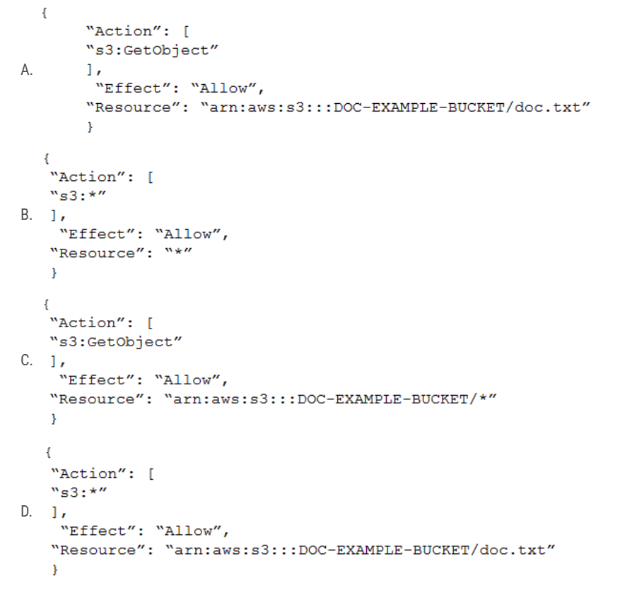

# AWS DVA 03

1. A developer wants to add request validation to a production environment Amazon API Gateway API. The developer needs to test the changes before the API is deployed to the production environment. For the test, the developer will send test requests to the API through a testing tool. Which solution will meet these requirements with the LEAST operational overhead?
   - [ ] A. Export the existing API to an OpenAPI file. Create a new API. Import the OpenAPI file. Modify the new API to add request validation. Perform the tests. Modify the existing API to add request validation. Deploy the existing API to production.
   - [ ] B. Modify the existing API to add request validation. Deploy the updated API to a new API Gateway stage. Perform the tests. Deploy the updated API to the API Gateway production stage.
   - [ ] C. Create a new API. Add the necessary resources and methods, including new request validation. Perform the tests. Modify the existing API to add request validation. Deploy the existing API to production
   - [ ] D. Clone the existing API. Modify the new API to add request validation. Perform the tests. Modify the existing API to add request validation. Deploy the existing API to production.

   <details>
      <summary>Answer</summary>

      B.
      - You're working with the same API.
      - You're using API Gateway's built-in functionality for creating different stages, which is designed precisely for such scenarios.
      - It allows for easy promotion of changes from one stage to another.

   </details>

2. An online food company provides an Amazon API Gateway HTTP API to receive orders for partners. The API is integrated with an AWS Lambda function. The Lambda function stores the orders in an Amazon DynamoDB table. The company expects to onboard additional partners. Some of the partners require additional Lambda functions to receive orders. The company has created an Amazon S3 bucket. The company needs to store all orders and updates in the S3 bucket for future analysis. How can the developer ensure that all orders and updates are stored to Amazon S3 with the LEAST development effort?
   - [ ] A. Create a new Lambda function and a new API Gateway API endpoint. Configure the new Lambda function to write to the S3 bucket. Modify the original Lambda function to post updates to the new API endpoint.
   - [ ] B. Use Amazon Kinesis Data Streams to create a new data stream. Modify the Lambda function to publish orders to the data stream. Configure the data stream to write to the S3 bucket.
   - [ ] C. Enable DynamoDB Streams on the DynamoDB table. Create a new Lambda function. Associate the stream’s Amazon Resource Name (ARN) with the Lambda function. Configure the Lambda function to write to the S3 bucket as records appear in the table's stream.
   - [ ] D. Modify the Lambda function to publish to a new Amazon Simple Notification Service (Amazon SNS) topic as the Lambda function receives orders. Subscribe a new Lambda function to the topic. Configure the new Lambda function to write to the S3 bucket as updates come through the topic.

   <details>
      <summary>Answer</summary>

      C.

   </details>

3. A company's website runs on an Amazon EC2 instance and uses Auto Scaling to scale the environment during peak times. Website users across the world are experiencing high latency due to static content on the EC2 instance, even during non-peak hours. Which combination of steps will resolve the latency issue? (Choose two.)
   - [ ] A. Double the Auto Scaling group's maximum number of servers.
   - [ ] B. Host the application code on AWS Lambda.
   - [ ] C. Scale vertically by resizing the EC2 instances.
   - [ ] D. Create an Amazon CloudFront distribution to cache the static content.
   - [ ] E. Store the application's static content in Amazon S3.

   <details>
      <summary>Answer</summary>

      DE.

   </details>

4. Company A has an S3 bucket containing premier content that they intend to make available to only paid subscribers of their website. The S3 bucket currently has default permissions of all objects being private to prevent inadvertent exposure of the premier content to non-paying website visitors. How can Company A provide only paid subscribers the ability to download a premier content file in the S3 bucket?
   - [ ] A. Apply a bucket policy that grants anonymous users to download the content from the S3 bucket
   - [ ] B. Generate a pre-signed object URL for the premier content file when a paid subscriber requests a download
   - [ ] C. Add a bucket policy that requires Multi-Factor Authentication for requests to access the S3 bucket objects
   - [ ] D. Enable server side encryption on the S3 bucket for data protection against the non-paying website visitors

   <details>
      <summary>Answer</summary>

      B.

   </details>

5. A developer is creating an AWS Lambda function that searches for items from an Amazon DynamoDB table that contains customer contact information. The DynamoDB table items have the customer’s email_address as the partition key and additional properties such as customer_type, name and `job_title`. The Lambda function runs whenever a user types a new character into the customer_type text input. The developer wants the search to return partial matches of all the email_address property of a particular customer_type. The developer does not want to recreate the DynamoDB table. What should the developer do to meet these requirements?
   - [ ] A. Add a global secondary index (GSI) to the DynamoDB table with customer_type as the partition key and email_address as the sort key. Perform a query operation on the GSI by using the begins_with key condition expression with the email_address property.
   - [ ] B. Add a global secondary index (GSI) to the DynamoDB table with email_address as the partition key and customer_type as the sort key. Perform a query operation on the GSI by using the begins_with key condition expression with the email_address property.
   - [ ] C. Add a local secondary index (LSI) to the DynamoDB table with customer_type as the partition key and email_address as the sort key. Perform a query operation on the LSI by using the begins_with key condition expression with the email_address property.
   - [ ] D. Add a local secondary index (LSI) to the DynamoDB table with job_title as the partition key and email_address as the sort key. Perform a query operation on the LSI by using the begins_with key condition expression with the email_address property.

   <details>
      <summary>Answer</summary>

      A.

   </details>

6. A developer is building an application that uses AWS API Gateway APIs, AWS Lambda functions, and AWS DynamoDB tables. The developer uses the AWS Serverless Application Model (AWS SAM) to build and run serverless applications on AWS. Each time the developer pushes changes for only to the Lambda functions, all the artifacts in the application are rebuilt. The developer wants to implement AWS SAM Accelerate by running a command to only redeploy the Lambda functions that have changed. Which command will meet these requirements?
   - [ ] A. sam deploy --force-upload
   - [ ] B. sam deploy --no-execute-changeset
   - [ ] C. sam package
   - [ ] D. sam sync --watch

   <details>
      <summary>Answer</summary>

      D.
      If the developer wants to use AWS SAM Accelerate to only redeploy the Lambda functions that have changed, they should use the sam sync command. Additionally, the --watch flag can be used to automatically detect and deploy changes as they are made.

   </details>

7. A developer is building an application that gives users the ability to view bank accounts from multiple sources in a single dashboard. The developer has automated the process to retrieve API credentials for these sources. The process invokes an AWS Lambda function that is associated with an AWS CloudFormation custom resource. The developer wants a solution that will store the API credentials with minimal operational overhead. Which solution will meet these requirements in the MOST secure way?
   - [ ] A. Add an AWS Secrets Manager GenerateSecretString resource to the CloudFormation template. Set the value to reference new credentials for the CloudFormation resource.
   - [ ] B. Use the AWS SDK ssm:PutParameter operation in the Lambda function from the existing custom resource to store the credentials as a parameter. Set the parameter value to reference the new credentials. Set the parameter type to SecureString.
   - [ ] C. Add an AWS Systems Manager Parameter Store resource to the CloudFormation template. Set the CloudFormation resource value to reference the new credentials. Set the resource NoEcho attribute to true.
   - [ ] D. Use the AWS SDK ssm:PutParameter operation in the Lambda function from the existing custom resource to store the credentials as a parameter. Set the parameter value to reference the new credentials. Set the parameter NoEcho attribute to true.

   <details>
      <summary>Answer</summary>

      B:
      - Option A suggests using AWS Secrets Manager, which is specifically designed to handle and rotate secrets in a secure manner. But the described use of a GenerateSecretString resource doesn't fit the scenario of storing provided API credentials; rather, it's for generating random secrets.
      - Option B and Option D suggest using the Systems Manager Parameter Store with the ssm:PutParameter operation. Among them, Option B specifies storing the credentials as a SecureString, which means they're stored encrypted, making this choice secure.
      - Option C involves the Parameter Store as well, but the primary focus of the option seems to be on the NoEcho attribute of CloudFormation, which simply means that the value won't be echoed back in CloudFormation's outputs. This doesn't directly relate to the secure storage of the credentials.

   </details>

8. A developer is trying to get data from an Amazon DynamoDB table called demoman-table. The developer configured the AWS CLI to use a specific IAM user's credentials and executed the following command: The command returned errors and no rows were returned. What is the MOST likely cause of these issues?

    ```bash
    aws dynamodb get-item --table-name demoman-table --key `{"id": {"N": "1993"}}`
    ```

   - [ ] A. The command is incorrect; it should be rewritten to use put-item with a string argument.
   - [ ] B. The developer needs to log a ticket with AWS Support to enable access to the demoman-table.
   - [ ] C. Amazon DynamoDB cannot be accessed from the AWS CLI and needs to be called via the REST API.
   - [ ] D. The IAM user needs an associated policy with read access to demoman-table.

   <details>
      <summary>Answer</summary>

      D.

   </details>

9. An organization is using Amazon CloudFront to ensure that its users experience low-latency access to its web application. The organization has identified a need to encrypt all traffic between users and CloudFront, and all traffic between CloudFront and the web application. How can these requirements be met? (Choose two.)
   - [ ] A. Use AWS KMS to encrypt traffic between CloudFront and the web application.
   - [ ] B. Set the Origin Protocol Policy to HTTPS ONLLY
   - [ ] C. Set the Origin's HTTP Port to 443.
   - [ ] D. Set the Viewer Protocol Policy to HTTPS Only or Redirect HTTP to HTTPS.
   - [ ] E. Enable the CloudFront option Restrict Viewer Access.

   <details>
      <summary>Answer</summary>

      BD.
      - A: Incorrect. AWS KMS (Key Management Service) is used to manage cryptographic keys for your applications, not for encrypting traffic.
      - B: Correct. This ensures that CloudFront always uses HTTPS when fetching content from the origin, which will encrypt the traffic between CloudFront and the web application.
      - C: While port 443 is the default port for HTTPS, just setting the port alone doesn't dictate the protocol to be used.
      - D: This ensures that users either always use HTTPS or are redirected to HTTPS if they try to access using HTTP, which will encrypt the traffic between users and CloudFront.
      - E: This option is used to serve private content through CloudFront using signed URLs or signed cookies, not for encrypting traffic.

   </details>

10. A developer is planning to migrate on-premises company data to Amazon S3. The data must be encrypted, and the encryption keys must support automatic annual rotation. The company must use AWS Key Management Service (AWS KMS) to encrypt the data. Which type of keys should the developer use to meet these requirements?
    - [ ] A. Amazon S3 managed keys
    - [ ] B. Symmetric customer managed keys with key material that is generated by AWS
    - [ ] C. Asymmetric customer managed keys with key material that is generated by AWS
    - [ ] D. Symmetric customer managed keys with imported key material

    <details>
      <summary>Answer</summary>

      B.
      - A: This uses Amazon S3 to manage the encryption key. It doesn't provide control over key rotation directly through AWS KMS.
      - B: This allows for automatic key rotation when it's enabled in AWS KMS.
      - C: Amazon S3 does not support asymmetric CMKs for server-side encryption.
      - D: You can use imported key material, but the requirement is to have the encryption keys support automatic annual rotation. AWS KMS does not rotate symmetric CMKs that have imported key material.

     </details>

11. A team of developers is using an AWS CodePipeline pipeline as a continuous integration and continuous delivery (CI/CD) mechanism for a web application. A developer has written unit tests to programmatically test the functionality of the application code. The unit tests produce a test report that shows the results of each individual check. The developer now wants to run these tests automatically during the CI/CD process. Which solution will meet this requirement with the LEAST operational effort?
    - [ ] A. Write a Git pre-commit hook that runs the tests before every commit. Ensure that each developer who is working on the project has the pre-commit hook installed locally. Review the test report and resolve any issues before pushing changes to AWS CodeCommit.
    - [ ] B. Add a new stage to the pipeline. Use AWS CodeBuild as the provider. Add the new stage after the stage that deploys code revisions to the test environment. Write a buildspec that fails the CodeBuild stage if any test does not pass. Use the test reports feature of CodeBuild to integrate the report with the CodeBuild console. View the test results in CodeBuild. Resolve any issues.
    - [ ] C. Add a new stage to the pipeline. Use AWS CodeBuild as the provider. Add the new stage before the stage that deploys code revisions to the test environment. Write a buildspec that fails the CodeBuild stage if any test does not pass. Use the test reports feature of CodeBuild to integrate the report with the CodeBuild console. View the test results in CodeBuild. Resolve any issues.
    - [ ] D. Add a new stage to the pipeline. Use Jenkins as the provider. Configure CodePipeline to use Jenkins to run the unit tests. Write a Jenkinsfile that fails the stage if any test does not pass. Use the test report plugin for Jenkins to integrate the report with the Jenkins dashboard. View the test results in Jenkins. Resolve any issues.
    <details>
       <summary>Answer</summary>

       C.
       - A: Using a Git pre-commit hook runs the tests locally before a developer commits. However, it requires each developer to have the hook installed and does not centralize the test reporting. Furthermore, it relies on local testing environments, which can introduce inconsistencies.
       - B. Adding a new stage after deploying to the test environment is not the best choice. Testing should ideally occur before deploying to catch and prevent issues before they reach any environment.
       - C. This option integrates the test phase directly into the CI/CD pipeline, ensuring the tests run before deployment, and leverages AWS CodeBuild's test reporting feature. This solution is centralized, consistent, and provides transparency to the entire team.
       - D. While Jenkins is a popular CI/CD tool, it introduces additional operational overhead by integrating and maintaining another tool in the pipeline. AWS CodePipeline and CodeBuild are natively integrated, and for this scenario, introducing Jenkins would add unnecessary complexity.

    </details>

12. A company has multiple Amazon VPC endpoints in the same VPC. A developer needs to configure an Amazon S3 bucket policy so users can access an S3 bucket only by using these VPC endpoints. Which solution will meet these requirements?
    - [ ] A. Create multiple S3 bucket polices by using each VPC endpoint ID that have the aws:SourceVpce value in the StringNotEquals condition.
    - [ ] B. Create a single S3 bucket policy that has the aws:SourceVpc value and in the StringNotEquals condition to use VPC ID.
    - [ ] C. Create a single S3 bucket policy that has the aws:SourceVpce value and in the StringNotEquals condition to use vpce*.
    - [ ] D. Create a single S3 bucket policy that has multiple aws:sourceVpce value in the StringNotEquals condition. Repeat for all the VPC endpoint IDs.

    <details>
       <summary>Answer</summary>

       C.

    </details>

13. A company uses a custom root certificate authority certificate chain (Root CA Cert) that is 10 KB in size to generate SSL certificates for its on-premises HTTPS endpoints. One of the company’s cloud-based applications has hundreds of AWS Lambda functions that pull data from these endpoints. A developer updated the trust store of the Lambda execution environment to use the Root CA Cert when the Lambda execution environment is initialized. The developer bundled the Root CA Cert as a text file in the Lambda deployment bundle. After 3 months of development, the Root CA Cert is no longer valid and must be updated. The developer needs a more efficient solution to update the Root CA Cert for all deployed Lambda functions. The solution must not include rebuilding or updating all Lambda functions that use the Root CA Cert. The solution must also work for all development, testing, and production environments. Each environment is managed in a separate AWS account. Which combination of steps should the developer take to meet these requirements MOST cost-effectively? (Choose two.)
    - [ ] A. Store the Root CA Cert as a secret in AWS Secrets Manager. Create a resource-based policy. Add IAM users to allow access to the secret.
    - [ ] B. Store the Root CA Cert as a SecureString parameter in AWS Systems Manager Parameter Store. Create a resource-based policy. Add IAM users to allow access to the policy.
    - [ ] C. Store the Root CA Cert in an Amazon S3 bucket. Create a resource-based policy to allow access to the bucket.
    - [ ] D. Refactor the Lambda code to load the Root CA Cert from the Root CA Cert’s location. Modify the runtime trust store inside the Lambda function handler.
    - [ ] E. Refactor the Lambda code to load the Root CA Cert from the Root CA Cert’s location. Modify the runtime trust store outside the Lambda function handler.
    <details>
       <summary>Answer</summary>

       BE.
       - A. Storing the Root CA Cert in AWS Secrets Manager allows centralized updates. However, Secrets Manager might not be the most cost-effective solution for data that isn't frequently accessed.
       - B. AWS Systems Manager Parameter Store, especially for SecureString parameters, provides centralized storage for configuration data and secrets. This solution is more cost-effective than Secrets Manager for items that aren't accessed as frequently.
       - C. Storing the Root CA Cert in an S3 bucket also allows centralized updates. S3 is a cost-effective solution for storing data, but it might not be the most appropriate for sensitive information like certificates unless you enforce proper security controls.
       - D & E. Modifying the Lambda function to dynamically load the Root CA Cert means you won't need to repackage and redeploy the Lambda function every time the certificate is updated. The distinction between modifying the runtime trust store inside vs. outside the Lambda function handler is about performance. Modifying outside the handler (i.e., at the global scope) means it's done once when the Lambda container is initialized, which is more performance-efficient than modifying inside the handler, which would run every time the Lambda function is invoked.

    </details>

14. A developer maintains applications that store several secrets in AWS Secrets Manager. The applications use secrets that have changed over time. The developer needs to identify required secrets that are still in use. The developer does not want to cause any application downtime. What should the developer do to meet these requirements?
    - [ ] A. Configure an AWS CloudTrail log file delivery to an Amazon S3 bucket. Create an Amazon CloudWatch alarm for the GetSecretValue Secrets Manager API operation requests.
    - [ ] B. Create a secretsmanager-secret-unused AWS Config managed rule. Create an Amazon EventBridge rule to initiate notifications when the AWS Config managed rule is met.
    - [ ] C. Deactivate the applications secrets and monitor the applications error logs temporarily.
    - [ ] D. Configure AWS X-Ray for the applications. Create a sampling rule to match the GetSecretValue Secrets Manager API operation requests.

    <details>
       <summary>Answer</summary>

       B.

    </details>

15. A developer is writing a serverless application that requires an AWS Lambda function to be invoked every 10 minutes. What is an automated and serverless way to invoke the function?
    - [ ] A. Deploy an Amazon EC2 instance based on Linux, and edit its /etc/crontab file by adding a command to periodically invoke the Lambda function.
    - [ ] B. Configure an environment variable named PERIOD for the Lambda function. Set the value to 600.
    - [ ] C. Create an Amazon EventBridge (Amazon CloudWatch Events) rule that runs on a regular schedule to invoke the Lambda function.
    - [ ] D. Create an Amazon Simple Notification Service (Amazon SNS) topic that has a subscription to the Lambda function with a 600-second timer.
    <details>
       <summary>Answer</summary>

       C.

    </details>

16. A company is using Amazon OpenSearch Service to implement an audit monitoring system. A developer needs to create an AWS CloudFormation custom resource that is associated with an AWS Lambda function to configure the OpenSearch Service domain. The Lambda function must access the OpenSearch Service domain by using OpenSearch Service internal master user credentials. What is the MOST secure way to pass these credentials to the Lambda function?
    - [ ] A. Use a CloudFormation parameter to pass the master user credentials at deployment to the OpenSearch Service domain's MasterUserOptions and the Lambda function's environment variable. Set the NoEcho attribute to true.
    - [ ] B. Use a CloudFormation parameter to pass the master user credentials at deployment to the OpenSearch Service domain's MasterUserOptions and to create a parameter in AWS Systems Manager Parameter Store. Set the NoEcho attribute to true. Create an IAM role that has the ssm GetParameter permission. Assign the role to the Lambda function. Store the parameter name as the Lambda function's environment variable. Resolve the parameter's value at runtime
    - [ ] C. Use a CloudFormation parameter to pass the master user credentials at deployment to the OpenSearch Service domain's MasterUserOptions and the Lambda function's environment variable. Encrypt the parameter's value by using the AWS Key Management Service (AWS KMS) encrypt command.
    - [ ] D. Use CloudFormation to create an AWS Secrets Manager secret. Use a CloudFormation dynamic reference to retrieve the secret's value for the OpenSearch Service domain's MasterUserOptions. Create an IAM role that has the secretsmanager:GetSecretValue permission. Assign the role to the Lambda function. Store the secret's name as the Lambda function's environment variable. Resolve the secret's value at runtime.

    <details>
       <summary>Answer</summary>

       D.

    </details>

17. An application runs on multiple EC2 instances behind an ELB. Where is the session data best written so that it can be served reliably across multiple requests?
    - [ ] A. Write data to Amazon ElastiCache.
    - [ ] B. Write data to Amazon Elastic Block Store.
    - [ ] C. Write data to Amazon EC2 Instance Store.
    - [ ] D. Write data to the root filesystem.

    <details>
       <summary>Answer</summary>

       A.

    </details>

18. An ecommerce application is running behind an Application Load Balancer. A developer observes some unexpected load on the application during non-peak hours. The developer wants to analyze patterns for the client IP addresses that use the application. Which HTTP header should the developer use for this analysis?
    - [ ] A. The X-Forwarded-Proto header
    - [ ] B. The X-Forwarded-Host header
    - [ ] C. The X-Forwarded-For header
    - [ ] D. The X-Forwarded-Port header

    <details>
       <summary>Answer</summary>

       C.

    </details>

19. A developer migrated a legacy application to an AWS Lambda function. The function uses a third-party service to pull data with a series of API calls at the end of each month. The function then processes the data to generate the monthly reports. The function has been working with no issues so far. The third-party service recently issued a restriction to allow a fixed number of API calls each minute and each day. If the API calls exceed the limit for each minute or each day, then the service will produce errors. The API also provides the minute limit and daily limit in the response header. This restriction might extend the overall process to multiple days because the process is consuming more API calls than the available limit. What is the MOST operationally efficient way to refactor the serverless application to accommodate this change?
    - [ ] A. Use an AWS Step Functions state machine to monitor API failures. Use the Wait state to delay calling the Lambda function.
    - [ ] B. Use an Amazon Simple Queue Service (Amazon SQS) queue to hold the API calls. Configure the Lambda function to poll the queue within the API threshold limits.
    - [ ] C. Use an Amazon CloudWatch Logs metric to count the number of API calls. Configure an Amazon CloudWatch alarm that stops the currently running instance of the Lambda function when the metric exceeds the API threshold limits.
    - [ ] D. Use Amazon Kinesis Data Firehose to batch the API calls and deliver them to an Amazon S3 bucket with an event notification to invoke the Lambda function.

    <details>
       <summary>Answer</summary>

       B.

    </details>

20. A Developer must analyze performance issues with production-distributed applications written as AWS Lambda functions. These distributed Lambda applications invoke other components that make up the applications. How should the Developer identify and troubleshoot the root cause of the performance issues in production?
    - [ ] A. Add logging statements to the Lambda functions, then use Amazon CloudWatch to view the logs.
    - [ ] B. Use AWS CloudTrail and then examine the logs.
    - [ ] C. Use AWS X-Ray, then examine the segments and errors.
    - [ ] D. Run Amazon Inspector agents and then analyze performance.

    <details>
       <summary>Answer</summary>

       C.

    </details>

21. A developer wants to deploy a new version of an AWS Elastic Beanstalk application. During deployment, the application must maintain full capacity and avoid service interruption. Additionally, the developer must minimize the cost of additional resources that support the deployment. Which deployment method should the developer use to meet these requirements?
    - [ ] A. All at once
    - [ ] B. Rolling with additional batch
    - [ ] C. Blue/green
    - [ ] D. Immutable

    <details>
       <summary>Answer</summary>

       D.
       - A. All at once: This method updates all instances simultaneously. During the update, the application has downtime, which does not meet the requirement of avoiding service interruption.
       - B. Rolling with additional batch: This method creates an additional batch of instances to ensure full capacity during the deployment. While it avoids downtime, it temporarily increases the cost due to the additional instances, which might not minimize the cost as effectively as the immutable update.
       - C. Blue/green: This method creates a separate environment and switches the CNAME record to the new environment once it's ready. While this approach avoids downtime and ensures full capacity, it could potentially double the cost since it involves running two environments simultaneously.
       - D. Immutable: This method performs updates by launching a new set of instances in a new Auto Scaling group. Once the new instances pass health checks, they are moved into the existing Auto Scaling group, and the old instances are terminated. This method ensures full capacity, avoids downtime, and minimizes additional costs because it does not double the environment's running resources for an extended period. It adds resources temporarily and only in the amount necessary to maintain capacity.

    </details>

22. A developer has observed an increase in bugs in the AWS Lambda functions that a development team has deployed in its Node.js application. To minimize these bugs, the developer wants to implement automated testing of Lambda functions in an environment that closely simulates the Lambda environment. The developer needs to give other developers the ability to run the tests locally. The developer also needs to integrate the tests into the team’s continuous integration and continuous delivery (CI/CD) pipeline before the AWS Cloud Development Kit (AWS CDK) deployment. Which solution will meet these requirements?
    - [ ] A. Create sample events based on the Lambda documentation. Create automated test scripts that use the cdk local invoke command to invoke the Lambda functions. Check the response. Document the test scripts for the other developers on the team. Update the CI/CD pipeline to run the test scripts.
    - [ ] B. Install a unit testing framework that reproduces the Lambda execution environment. Create sample events based on the Lambda documentation. Invoke the handler function by using a unit testing framework. Check the response. Document how to run the unit testing framework for the other developers on the team. Update the CI/CD pipeline to run the unit testing framework.
    - [ ] C. Install the AWS Serverless Application Model (AWS SAM) CLI tool. Use the sam local generate-event command to generate sample events for the automated tests. Create automated test scripts that use the sam local invoke command to invoke the Lambda functions. Check the response. Document the test scripts for the other developers on the team. Update the CI/CD pipeline to run the test scripts.
    - [ ] D. Create sample events based on the Lambda documentation. Create a Docker container from the Node.js base image to invoke the Lambda functions. Check the response. Document how to run the Docker container for the other developers on the team. Update the CI/CD pipeline to run the Docker container.
  
    <details>
       <summary>Answer</summary>

       C.

    </details>

23. A developer is troubleshooting an application that uses Amazon DynamoDB in the us-west-2 Region. The application is deployed to an Amazon EC2 instance. The application requires read-only permissions to a table that is named Cars. The EC2 instance has an attached IAM role that contains the following IAM policy: When the application tries to read from the Cars table, an Access Denied error occurs. How can the developer resolve this error?

    ```json
    {
       "Version": "2012-10-17",
       "Statement": [
          {
             "Sid": "ReadOnlyAPIActions",
             "Effect": "Allow",
             "Action": [
                "dynamodb:GetItem",
                "dynamodb:BatchGetItem",
                "dynamodb:Scan",
                "dynamodb:Query",
                "dynamodb:ConditionCheckItem"
             ],
             "Resource": "arn:aws:dynamodb:us-west-2:account-id:table/Cars"
          }
       ]

    }
    ```

    - [ ] A. Modify the IAM policy resource to be “arn:aws:dynamodb-us-west-2:account-id:table/*”
    - [ ] B. Modify the IAM policy to include the dynamodb:* action.
    - [ ] C. Create a trust policy that specifies the EC2 service principal. Associate the role with the policy.
    - [ ] D. Create a trust relationship between the role and dynamodb.amazonaws.com.

    <details>
       <summary>Answer</summary>

       C.

    </details>

24. When using the AWS Encryption SDK, how does the developer keep track of the data encryption keys used to encrypt data?
    - [ ] A. The developer must manually keep track of the data encryption keys used for each data object.
    - [ ] B. The SDK encrypts the data encryption key and stores it (encrypted) as part of the returned ciphertext.
    - [ ] C. The SDK stores the data encryption keys automatically in Amazon S3.
    - [ ] D. The data encryption key is stored in the Userdata for the EC2 instance.

    <details>
       <summary>Answer</summary>

       B.

    </details>

25. An application that runs on AWS Lambda requires access to specific highly confidential objects in an Amazon S3 bucket. In accordance with the principle of least privilege, a company grants access to the S3 bucket by using only temporary credentials. How can a developer configure access to the S3 bucket in the MOST secure way?
    - [ ] A. Hardcode the credentials that are required to access the S3 objects in the application code. Use the credentials to access the required S3 objects.
    - [ ] B. Create a secret access key and access key ID with permission to access the S3 bucket. Store the key and key ID in AWS Secrets Manager. Configure the application to retrieve the Secrets Manager secret and use the credentials to access the S3 objects.
    - [ ] C. Create a Lambda function execution role. Attach a policy to the role that grants access to specific objects in the S3 bucket.
    - [ ] D. Create a secret access key and access key ID with permission to access the S3 bucket. Store the key and key ID as environment variables in Lambda. Use the environment variables to access the required S3 objects.

    <details>
       <summary>Answer</summary>

       C.
       - A. Hardcoding credentials is a bad practice and not recommended. This approach is insecure and does not use temporary credentials.
       - B. Using AWS Secrets Manager to store long-term credentials does provide a level of security, but it's not using temporary credentials.
       - C. This is the best option among the choices. Creating a Lambda function execution role with an attached policy granting access to specific S3 objects aligns with AWS best practices. AWS Lambda assumes this role when executing the function. By using AWS Identity and Access Management (IAM) roles, Lambda functions are granted temporary credentials to access AWS services, which is in line with the requirement.
       - D. Storing long-term credentials as environment variables, even if they are encrypted, isn't a recommended best practice. It also doesn't use temporary credentials.

    </details>

26. A developer has code that is stored in an Amazon S3 bucket. The code must be deployed as an AWS Lambda function across multiple accounts in the same AWS Region as the S3 bucket. An AWS CloudFormation template that runs for each account will deploy the Lambda function. What is the MOST secure way to allow CloudFormation to access the Lambda code in the S3 bucket?
    - [ ] A. Grant the CloudFormation service role the S3 ListBucket and GetObject permissions. Add a bucket policy to Amazon S3 with the pnncipal of "AWS": [account numbers].
    - [ ] B. Grant the CloudFormation service role the S3 GetObject permission. Add a bucket policy to Amazon S3 with the principal of "*".
    - [ ] C. Use a service-based link to grant the Lambda function the S3 ListBucket and GetObject permissions by explicitly adding the S3 bucket’s account number in the resource.
    - [ ] D. Use a service-based link to grant the Lambda function the S3 GetObject permission. Add a resource of "*" to allow access to the S3 bucket.

    <details>
       <summary>Answer</summary>

       A.

    </details>

27. A developer at a company needs to create a small application that makes the same API call once each day at a designated time. The company does not have infrastructure in the AWS Cloud yet, but the company wants to implement this functionality on AWS. Which solution meets these requirements in the MOST operationally efficient manner?
    - [ ] A. Use a Kubernetes cron job that runs on Amazon Elastic Kubernetes Service (Amazon EKS).
    - [ ] B. Use an Amazon Linux crontab scheduled job that runs on Amazon EC2.
    - [ ] C. Use an AWS Lambda function that is invoked by an Amazon EventBridge (Amazon CloudWatch Events) scheduled event.
    - [ ] D. Use an AWS Batch job that is submitted to an AWS Batch job queue.

       <summary>Answer</summary>

       C.

    </details>

28. A developer is building a serverless application that is based on AWS Lambda. The developer initializes the AWS software development kit (SDK) outside of the Lambda handler function. What is the **PRIMARY** benefit of this action?
    - [ ] A. Improves legibility and stylistic convention
    - [ ] B. Takes advantage of runtime environment reuse
    - [ ] C. Provides better error handling
    - [ ] D. Creates a new SDK instance for each invocation

    <details>
       <summary>Answer</summary>

       B.

    </details>

29. A company is using Amazon RDS as the backend database for its application. After a recent marketing campaign, a surge of read requests to the database increased the latency of data retrieval from the database. The company has decided to implement a caching layer in front of the database. The cached content must be encrypted and must be highly available. Which solution will meet these requirements?
    - [ ] A. Amazon CloudFront
    - [ ] B. Amazon ElastiCache for Memcached
    - [ ] C. Amazon ElastiCache for Redis in cluster mode
    - [ ] D. Amazon DynamoDB Accelerator (DAX)

    <details>
       <summary>Answer</summary>

       C.

    </details>

30. A developer at a company recently created a serverless application to process and show data from business reports. The application's user interface (UI) allows users to select and start processing the flies. The UI displays a message when the result is available to view. The application uses AWS Step Functions with AWS Lambda functions to process the files. The developer used Amazon API Gateway and Lambda functions to create an API to support the UI. The company's UI team reports that the request to process a file s often returning timeout errors because of the size or complexity of the files. The UI team wants the API to provide an immediate response so that the UI can display a message while the files are being processed. The backend process that is invoked by the API needs to send an email message when the report processing is complete. What should the developer do to configure the API to meet these requirements?
    - [ ] A. Change the API Gateway route to add an X-Amz-Invocation-Type header with a static value of 'Event' in the integration request. Deploy the API Gateway stage to apply the changes.
    - [ ] B. Change the configuration of the Lambda function that implements the request to process a file. Configure the maximum age of the event so that the Lambda function will run asynchronously.
    - [ ] C. Change the API Gateway timeout value to match the Lambda function timeout value. Deploy the API Gateway stage to apply the changes.
    - [ ] D. Change the API Gateway route to add an X-Amz-Target header with a static value of 'Async' in the integration request. Deploy the API Gateway stage to apply the changes.

    <details>
       <summary>Answer</summary>

       A.
       The objective is to have the API return an immediate response without waiting for the processing to finish. This can be achieved by invoking the Lambda function asynchronously. The header X-Amz-Invocation-Type with a value of Event allows you to invoke the Lambda function asynchronously. This means the Lambda function will return immediately once it's invoked, and the actual processing will happen in the background.

    </details>

31. A developer has an application that is composed of many different AWS Lambda functions. The Lambda functions all use some of the same dependencies. To avoid security issues, the developer is constantly updating the dependencies of all of the Lambda functions. The result is duplicated effort for each function. How can the developer keep the dependencies of the Lambda functions up to date with the LEAST additional complexity?
    - [ ] A. Define a maintenance window for the Lambda functions to ensure that the functions get updated copies of the dependencies.
    - [ ] B. Upgrade the Lambda functions to the most recent runtime version.
    - [ ] C. Define a Lambda layer that contains all of the shared dependencies.
    - [ ] D. Use an AWS CodeCommit repository to host the dependencies in a centralized location.

    <details>
       <summary>Answer</summary>

       C.

    </details>

32. A mobile app stores blog posts in an Amazon DynamoDB table. Millions of posts are added every day, and each post represents a single item in the table. The mobile app requires only recent posts. Any post that is older than 48 hours can be removed. What is the MOST cost-effective way to delete posts that are older than 48 hours?
    - [ ] A. For each item, add a new attribute of type String that has a timestamp that is set to the blog post creation time. Create a script to find old posts with a table scan and remove posts that are older than 48 hours by using the BatchWriteItem API operation. Schedule a cron job on an Amazon EC2 instance once an hour to start the script.
    - [ ] B. For each item, add a new attribute of type String that has a timestamp that is set to the blog post creation time. Create a script to find old posts with a table scan and remove posts that are older than 48 hours by using the BatchWriteItem API operation. Place the script in a container image. Schedule an Amazon Elastic Container Service (Amazon ECS) task on AWS Fargate that invokes the container every 5 minutes.
    - [ ] C. For each item, add a new attribute of type Date that has a timestamp that is set to 48 hours after the blog post creation time. Create a global secondary index (GSI) that uses the new attribute as a sort key. Create an AWS Lambda function that references the GSI and removes expired items by using the BatchWriteItem API operation. Schedule the function with an Amazon CloudWatch event every minute.
    - [ ] D. For each item, add a new attribute of type Number that has a timestamp that is set to 48 hours after the blog post creation time. Configure the DynamoDB table with a TTL that references the new attribute.

    <details>
       <summary>Answer</summary>

       D.

    </details>

33. A developer is modifying an existing AWS Lambda function. While checking the code, the developer notices hardcoded parameter values for an Amazon RDS for SQL Server user name, password, database, host, and port. There also are hardcoded parameter values for an Amazon DynamoDB table, an Amazon S3 bucket, and an Amazon Simple Notification Service (Amazon SNS) topic. The developer wants to securely store the parameter values outside the code in an encrypted format and wants to turn on rotation for the credentials. The developer also wants to be able to reuse the parameter values from other applications and to update the parameter values without modifying code. Which solution will meet these requirements with the LEAST operational overhead?
    - [ ] A. Create an RDS database secret in AWS Secrets Manager. Set the user name, password, database, host, and port. Turn on secret rotation. Create encrypted Lambda environment variables for the DynamoDB table, S3 bucket, and SNS topic.
    - [ ] B. Create an RDS database secret in AWS Secrets Manager. Set the user name, password, database, host, and port. Turn on secret rotation. Create SecureString parameters in AWS Systems Manager Parameter Store for the DynamoDB table, S3 bucket, and SNS topic.
    - [ ] C. Create RDS database parameters in AWS Systems Manager Parameter Store for the user name, password, database, host, and port. Create encrypted Lambda environment variables for the DynamoDB table, S3 bucket, and SNS topic. Create a Lambda function and set the logic for the credentials rotation task. Schedule the credentials rotation task in Amazon EventBridge.
    - [ ] D. Create RDS database parameters in AWS Systems Manager Parameter Store for the user name, password, database, host, and port. Store the DynamoDB table, S3 bucket, and SNS topic in Amazon S3. Create a Lambda function and set the logic for the credentials rotation. Invoke the Lambda function on a schedule.

    <details>
       <summary>Answer</summary>

       B.

    </details>

34. A Developer accesses AWS CodeCommit over SSH. The SSH keys configured to access AWS CodeCommit are tied to a user with the following permissions: The Developer needs to create/delete branches. Which specific IAM permissions need to be added, based on the principle of least privilege?

    ```json
    {
       "Version": "2012-10-17",
       "Statement": [
          {
             "Sid": "ReadOnlyAPIActions",
             "Effect": "Allow",
             "Action": [
                "codecommit:BatchGetRepository",
                "codecommit:Get*",
                "codecommit:List*",
                "codecommit:GitPull",
                "dynamodb:ConditionCheckItem"
             ],
             "Resource": "*"
          }
       ]

    }
    ```

    - [ ] A. "codecommit:CreateBranch" "codecommit:DeleteBranch"
    - [ ] B. "codecommit:Put*"
    - [ ] C. "codecommit:Update*"
    - [ ] D. "codecommit:*"

    <details>
       <summary>Answer</summary>

       A.

    </details>

35. An application that is deployed to Amazon EC2 is using Amazon DynamoDB. The application calls the DynamoDB REST API. Periodically, the application receives a ProvisionedThroughputExceededException error when the application writes to a DynamoDB table. Which solutions will mitigate this error MOST cost-effectively? (Choose two.)
    - [ ] A. Modify the application code to perform exponential backoff when the error is received.
    - [ ] B. Modify the application to use the AWS SDKs for DynamoDB.
    - [ ] C. Increase the read and write throughput of the DynamoDB table.
    - [ ] D. Create a DynamoDB Accelerator (DAX) cluster for the DynamoDB table.
    - [ ] E. Create a second DynamoDB table. Distribute the reads and writes between two tables.

    <details>
       <summary>Answer</summary>

       AB.
       - A: This is a recommended best practice when dealing with throttling errors from DynamoDB. Exponential backoff is a standard error-handling strategy for network applications in which the client periodically retries a failed request over increasing amounts of time. By doing so, it reduces the impact of request spikes on provisioned throughput.
       - B: AWS SDKs have built-in handling for exponential backoff. If the application is not currently using an SDK, switching to one could simplify the error handling.
       - C: While this would directly address the error, it also comes with increased costs. It's a valid option if the current provisioned throughput is consistently inadequate for the application's needs.
       - D: DAX is a caching service that can reduce the read load on a table. However, it doesn't help with write throughput, which seems to be the problem in this scenario. Thus, this wouldn't address the ProvisionedThroughputExceededException error related to writes.

    </details>

36. A company is updating an application to move the backend of the application from Amazon EC2 instances to a serverless model. The application uses an Amazon RDS for MySQL DB instance and runs in a single VPC on AWS. The application and the DB instance are deployed in a private subnet in the VPC. The company needs to connect AWS Lambda functions to the DB instance. Which solution will meet these requirements?
    - [ ] A. Create Lambda functions inside the VPC with the AWSLambdaBasicExecutionRole policy attached to the Lambda execution role. Modify the RDS security group to allow inbound access from the Lambda security group.
    - [ ] B. Create Lambda functions inside the VPC with the AWSLambdaVPCAccessExecutionRole policy attached to the Lambda execution role. Modify the RDS security group to allow inbound access from the Lambda security group.
    - [ ] C. Create Lambda functions with the AWSLambdaBasicExecutionRole policy attached to the Lambda execution role. Create an interface VPC endpoint for the Lambda functions. Configure the interface endpoint policy to allow the lambda:InvokeFunclion action for each Lambda function's Amazon Resource Name (ARN).
    - [ ] D. Create Lambda functions with the AWSLambdaVPCAccessExecutionRole policy attached to the Lambda execution role. Create an interface VPC endpoint for the Lambda functions. Configure the interface endpoint policy to allow the lambda:InvokeFunction action for each Lambda function's Amazon Resource Name (ARN).
    <details>
       <summary>Answer</summary>

       AB.
      - A. This will ensure that even if the stack is deleted or the database resource is removed from the template, the database will not be deleted.
      - B. By denying update actions on the database resource, you can prevent unintentional changes that might be harmful.

    </details>

37. A company has a web application that runs on Amazon EC2 instances with a custom Amazon Machine Image (AMI). The company uses AWS CloudFormation to provision the application. The application runs in the us-east-1 Region, and the company needs to deploy the application to the us-west-1 Region. An attempt to create the AWS CloudFormation stack in us-west-1 fails. An error message states that the AMI ID does not exist. A developer must resolve this error with a solution that uses the least amount of operational overhead. Which solution meets these requirements?
    - [ ] A. Change the AWS CloudFormation templates for us-east-1 and us-west-1 to use an AWS AMI. Relaunch the stack for both Regions.
    - [ ] B. Copy the custom AMI from us-east-1 to us-west-1. Update the AWS CloudFormation template for us-west-1 to refer to AMI ID for the copied AMI. Relaunch the stack.
    - [ ] C. Build the custom AMI in us-west-1. Create a new AWS CloudFormation template to launch the stack in us-west-1 with the new AMI ID.
    - [ ] D. Manually deploy the application outside AWS CloudFormation in us-west-1.

    <details>
       <summary>Answer</summary>

       B.

    </details>

38. A developer is updating several AWS Lambda functions and notices that all the Lambda functions share the same custom libraries. The developer wants to centralize all the libraries, update the libraries in a convenient way, and keep the libraries versioned. Which solution will meet these requirements with the LEAST development effort?
    - [ ] A. Create an AWS CodeArtifact repository that contains all the custom libraries.
    - [ ] B. Create a custom container image for the Lambda functions to save all the custom libraries.
    - [ ] C. Create a Lambda layer that contains all the custom libraries.
    - [ ] D. Create an Amazon Elastic File System (Amazon EFS) file system to store all the custom libraries.
    <details>
       <summary>Answer</summary>

       C.

    </details>

39. A developer wants to use AWS Elastic Beanstalk to test a new version of an application in a test environment. Which deployment method offers the FASTEST deployment?
    - [ ] A. Immutable
    - [ ] B. Rolling
    - [ ] C. Rolling with additional batch
    - [ ] D. All at once

    <details>
       <summary>Answer</summary>

       D.

    </details>

40. A company is providing read access to objects in an Amazon S3 bucket for different customers. The company uses IAM permissions to restrict access to the S3 bucket. The customers can access only their own files. Due to a regulation requirement, the company needs to enforce encryption in transit for interactions with Amazon S3. Which solution will meet these requirements?
    - [ ] A. Add a bucket policy to the S3 bucket to deny S3 actions when the aws:SecureTransport condition is equal to false.
    - [ ] B. Add a bucket policy to the S3 bucket to deny S3 actions when the s3:x-amz-acl condition is equal to public-read.
    - [ ] C. Add an IAM policy to the IAM users to enforce the usage of the AWS SDK.
    - [ ] D. Add an IAM policy to the IAM users that allows S3 actions when the s3:x-amz-acl condition is equal to bucket-owner-read.

    <details>
       <summary>Answer</summary>

       A.
       - A. This option adds a bucket policy to deny S3 actions when requests are not made over HTTPS (when aws:SecureTransport is false). This ensures that data is encrypted in transit. This is the correct option.
       - B. The s3:x-amz-acl condition key is related to S3 object ACLs (Access Control Lists) and has nothing to do with enforcing encryption in transit. The value public-read would grant public read access to the object, which isn't relevant to the requirement.
       - C. Simply enforcing the usage of the AWS SDK doesn't guarantee encryption in transit. Users can use the SDK to make both HTTP and HTTPS requests.
       - D. Like option B, the s3:x-amz-acl condition key pertains to S3 object ACLs. The value bucket-owner-read grants the bucket owner read access to the object, which is not related to enforcing encryption in transit.

    </details>

41. A company has an image storage web application that runs on AWS. The company hosts the application on Amazon EC2 instances in an Auto Scaling group. The Auto Scaling group acts as the target group for an Application Load Balancer (ALB) and uses an Amazon S3 bucket to store the images for sale. The company wants to develop a feature to test system requests. The feature will direct requests to a separate target group that hosts a new beta version of the application. Which solution will meet this requirement with the LEAST effort?
    - [ ] A. Create a new Auto Scaling group and target group for the beta version of the application. Update the ALB routing rule with a condition that looks for a cookie named version that has a value of beta. Update the test system code to use this cookie to test the beta version of the application.
    - [ ] B. Create a new ALB, Auto Scaling group, and target group for the beta version of the application. Configure an alternate Amazon Route 53 record for the new ALB endpoint. Use the alternate Route 53 endpoint in the test system requests to test the beta version of the application.
    - [ ] C. Create a new ALB, Auto Scaling group, and target group for the beta version of the application. Use Amazon CloudFront with Lambda@Edge to determine which specific request will go to the new ALB. Use the CloudFront endpoint to send the test system requests to test the beta version of the application.
    - [ ] D. Create a new Auto Scaling group and target group for the beta version of the application. Update the ALB routing rule with a condition that looks for a cookie named version that has a value of beta. Use Amazon CloudFront with Lambda@Edge to update the test system requests to add the required cookie when the requests go to the ALB.

    <details>
       <summary>Answer</summary>

       A.
       - A. This option involves adding a new target group and Auto Scaling group for the beta version. Requests carrying a cookie named "version" with a value "beta" are routed to the new beta version. This option does not involve any DNS changes and provides a simple mechanism to direct traffic to the beta version based on the presence of a cookie. It requires minimal effort and doesn't necessitate external systems for traffic routing.
       - B. This option involves creating a completely separate infrastructure (a new ALB, Auto Scaling group, and target group) for the beta version. While it might work, it's more effort than simply adding a routing condition in the existing ALB.
       - C. This option uses Lambda@Edge to decide where to send the traffic. While Lambda@Edge can be used to manipulate request and response headers, it's an additional layer of complexity, requiring you to manage CloudFront and Lambda configurations.
       - D. This option combines both the ALB and CloudFront with Lambda@Edge, making it more complex than Option A. It's using Lambda@Edge to set the cookie, and then ALB to route based on that cookie. It's essentially a more convoluted version of Option A.

    </details>

42. A team is developing an application that is deployed on Amazon EC2 instances. During testing, the team receives an error. The EC2 instances are unable to access an Amazon S3 bucket. Which steps should the team take to troubleshoot this issue? (Choose two.)
    - [ ] A. Check whether the policy that is assigned to the IAM role that is attached to the EC2 instances grants access to Amazon S3.
    - [ ] B. Check the S3 bucket policy to validate the access permissions for the S3 bucket.
    - [ ] C. Check whether the policy that is assigned to the IAM user that is attached to the EC2 instances grants access to Amazon S3.
    - [ ] D. Check the S3 Lifecycle policy to validate the permissions that are assigned to the S3 bucket.
    - [ ] E. Check the security groups that are assigned to the EC2 instances. Make sure that a rule is not blocking the access to Amazon S3.

    <details>
       <summary>Answer</summary>

       AB.

    </details>

43. A developer is working on an ecommerce website. The developer wants to review server logs without logging in to each of the application servers individually. The website runs on multiple Amazon EC2 instances, is written in Python, and needs to be highly available. How can the developer update the application to meet these requirements with MINIMUM changes?
    - [ ] A. Rewrite the application to be cloud native and to run on AWS Lambda, where the logs can be reviewed in Amazon CloudWatch.
    - [ ] B. Set up centralized logging by using Amazon OpenSearch Service, Logstash, and OpenSearch Dashboards.
    - [ ] C. Scale down the application to one larger EC2 instance where only one instance is recording logs.
    - [ ] D. Install the unified Amazon CloudWatch agent on the EC2 instances. Configure the agent to push the application logs to CloudWatch.

    <details>
       <summary>Answer</summary>

       D.

    </details>

44. A company is creating an application that processes .csv files from Amazon S3. A developer has created an S3 bucket. The developer has also created an AWS Lambda function to process the .csv files from the S3 bucket. Which combination of steps will invoke the Lambda function when a .csv file is uploaded to Amazon S3? (Choose two.)
    - [ ] A. Create an Amazon EventBridge rule. Configure the rule with a pattern to match the S3 object created event.
    - [ ] B. Schedule an Amazon EventBridge rule to run a new Lambda function to scan the S3 bucket.
    - [ ] C. Add a trigger to the existing Lambda function. Set the trigger type to EventBridge. Select the Amazon EventBridge rule.
    - [ ] D. Create a new Lambda function to scan the S3 bucket for recently added S3 objects.
    - [ ] E. Add S3 Lifecycle rules to invoke the existing Lambda function.

    <details>
       <summary>Answer</summary>

       AC.

    </details>

45. A developer needs to build an AWS CloudFormation template that self-populates the AWS Region variable that deploys the CloudFormation template. What is the MOST operationally efficient way to determine the Region in which the template is being deployed?
    - [ ] A. Use the AWS::Region pseudo parameter.
    - [ ] B. Require the Region as a CloudFormation parameter.
    - [ ] C. Find the Region from the AWS::StackId pseudo parameter by using the Fn::Split intrinsic function.
    - [ ] D. Dynamically import the Region by referencing the relevant parameter in AWS Systems Manager Parameter Store.
    <details>
       <summary>Answer</summary>

       A.
       `AWS::Region` pseudo parameter directly gives you the AWS region where the stack is being created. It's straightforward and doesn't require any additional work or functions.

    </details>

46. A company has hundreds of AWS Lambda functions that the company's QA team needs to test by using the Lambda function URLs. A developer needs to configure the authentication of the Lambda functions to allow access so that the QA IAM group can invoke the Lambda functions by using the public URLs. Which solution will meet these requirements?
    - [ ] A. Create a CLI script that loops on the Lambda functions to add a Lambda function URL with the AWS_IAM auth type. Run another script to create an IAM identity-based policy that allows the lambda:InvokeFunctionUrl action to all the Lambda function Amazon Resource Names (ARNs). Attach the policy to the QA IAM group.
    - [ ] B. Create a CLI script that loops on the Lambda functions to add a Lambda function URL with the NONE auth type. Run another script to create an IAM resource-based policy that allows the lambda:InvokeFunctionUrl action to all the Lambda function Amazon Resource Names (ARNs). Attach the policy to the QA IAM group.
    - [ ] C. Create a CLI script that loops on the Lambda functions to add a Lambda function URL with the AWS_IAM auth type. Run another script to loop on the Lambda functions to create an IAM identity-based policy that allows the lambda:InvokeFunctionUrl action from the QA IAM group's Amazon Resource Name (ARN).
    - [ ] D. Create a CLI script that loops on the Lambda functions to add a Lambda function URL with the NONE auth type. Run another script to loop on the Lambda functions to create an IAM resource-based policy that allows the lambda:InvokeFunctionUrl action from the QA IAM group's Amazon Resource Name (ARN).

    <details>
       <summary>Answer</summary>

       C.

    </details>

47. A developer maintains a critical business application that uses Amazon DynamoDB as the primary data store. The DynamoDB table contains millions of documents and receives 30-60 requests each minute. The developer needs to perform processing in near-real time on the documents when they are added or updated in the DynamoDB table. How can the developer implement this feature with the LEAST amount of change to the existing application code?
    - [ ] A. Set up a cron job on an Amazon EC2 instance. Run a script every hour to query the table for changes and process the documents.
    - [ ] B. Enable a DynamoDB stream on the table. Invoke an AWS Lambda function to process the documents.
    - [ ] C. Update the application to send a PutEvents request to Amazon EventBridge. Create an EventBridge rule to invoke an AWS Lambda function to process the documents.
    - [ ] D. Update the application to synchronously process the documents directly after the DynamoDB write.

    <details>
       <summary>Answer</summary>

       B.

    </details>

48. A developer is writing an application for a company. The application will be deployed on Amazon EC2 and will use an Amazon RDS for Microsoft SQL Server database. The company's security team requires that database credentials are rotated at least weekly. How should the developer configure the database credentials for this application?
    - [ ] A. Create a database user. Store the user name and password in an AWS Systems Manager Parameter Store secure string parameter. Enable rotation of the AWS Key Management Service (AWS KMS) key that is used to encrypt the parameter.
    - [ ] B. Enable IAM authentication for the database. Create a database user for use with IAM authentication. Enable password rotation.
    - [ ] C. Create a database user. Store the user name and password in an AWS Secrets Manager secret that has daily rotation enabled.
    - [ ] D. Use the EC2 user data to create a database user. Provide the user name and password in environment variables to the application.

    <details>
       <summary>Answer</summary>

       C.

    </details>

49. A real-time messaging application uses Amazon API Gateway WebSocket APIs with backend HTTP service. A developer needs to build a feature in the application to identify a client that keeps connecting to and disconnecting from the WebSocket connection. The developer also needs the ability to remove the client. Which combination of changes should the developer make to the application to meet these requirements? (Choose two.)
    - [ ] A. Switch to HTTP APIs in the backend service.
    - [ ] B. Switch to REST APIs in the backend service.
    - [ ] C. Use the callback URL to disconnect the client from the backend service.
    - [ ] D. Add code to track the client status in Amazon ElastiCache in the backend service.
    - [ ] E. Implement $connect and $disconnect routes in the backend service.

    <details>
       <summary>Answer</summary>

       DE:
       - A. Switching to HTTP APIs wouldn't inherently help track WebSocket connections or disconnections. WebSocket is a separate protocol from HTTP.
       - B. Switching to REST APIs wouldn't help either. WebSocket provides a full-duplex communication channel, unlike REST APIs, which is necessary for real-time messaging applications.
       - C. The callback URL mechanism is not a standard way to disconnect a client from a WebSocket. WebSocket APIs have built-in $disconnect for this purpose.
       - D. While you can use Amazon ElastiCache (or other databases) to track client status, including connections and disconnections, by saving and updating the client status each time they connect or disconnect, it would be more about keeping track of state rather than the actual mechanism to connect/disconnect.
       - E. Implementing $connect and $disconnect routes in the backend service allows you to execute custom logic each time a client connects or disconnects. This can be used to track which clients are connecting and disconnecting and is a standard feature for WebSocket APIs in API Gateway.

    </details>

50. A developer has written code for an application and wants to share it with other developers on the team to receive feedback. The shared application code needs to be stored long-term with multiple versions and batch change tracking. Which AWS service should the developer use?
    - [ ] A. AWS CodeBuild
    - [ ] B. Amazon S3
    - [ ] C. AWS CodeCommit
    - [ ] D. AWS Cloud9

    <details>
       <summary>Answer</summary>

       C.

    </details>

51. A company's developer is building a static website to be deployed in Amazon S3 for a production environment. The website integrates with an Amazon Aurora PostgreSQL database by using an AWS Lambda function. The website that is deployed to production will use a Lambda alias that points to a specific version of the Lambda function. The company must rotate the database credentials every 2 weeks. Lambda functions that the company deployed previously must be able to use the most recent credentials. Which solution will meet these requirements?
    - [ ] A. Store the database credentials in AWS Secrets Manager. Turn on rotation. Write code in the Lambda function to retrieve the credentials from Secrets Manager.
    - [ ] B. Include the database credentials as part of the Lambda function code. Update the credentials periodically and deploy the new Lambda function.
    - [ ] C. Use Lambda environment variables. Update the environment variables when new credentials are available.
    - [ ] D. Store the database credentials in AWS Systems Manager Parameter Store. Turn on rotation. Write code in the Lambda function to retrieve the credentials from Systems Manager Parameter Store

    <details>
       <summary>Answer</summary>

       A.

    </details>

52. A developer is developing an application that uses signed requests (Signature Version 4) to call other AWS services. The developer has created a canonical request, has created the string to sign, and has calculated signing information. Which methods could the developer use to complete a signed request? (Choose two.)
    - [ ] A. Add the signature to an HTTP header that is named Authorization.
    - [ ] B. Add the signature to a session cookie.
    - [ ] C. Add the signature to an HTTP header that is named Authentication.
    - [ ] D. Add the signature to a query string parameter that is named X-Amz-Signature.
    - [ ] E. Add the signature to an HTTP header that is named WWW-Authenticate.

    <details>
       <summary>Answer</summary>

       AD.
       - By adding it to the request's HTTP header. Specifically, the signature is included in the Authorization header.
       - By adding it to the query string, especially for presigned URLs. When included in the query string, the signature is in the X-Amz-Signature parameter.

    </details>

53. A company must deploy all its Amazon RDS DB instances by using AWS CloudFormation templates as part of AWS CodePipeline continuous integration and continuous delivery (CI/CD) automation. The primary password for the DB instance must be automatically generated as part of the deployment process. Which solution will meet these requirements with the LEAST development effort?
    - [ ] A. Create an AWS Lambda-backed CloudFormation custom resource. Write Lambda code that generates a secure string. Return the value of the secure string as a data field of the custom resource response object. Use the CloudFormation Fn::GetAtt intrinsic function to get the value of the secure string. Use the value to create the DB instance.
    - [ ] B. Use the AWS CodeBuild action of CodePipeline to generate a secure string by using the following AWS CLI command: aws secretsmanager get-random-password. Pass the generated secure string as a CloudFormation parameter with the NoEcho attribute set to true. Use the parameter reference to create the DB instance.
    - [ ] C. Create an AWS Lambda-backed CloudFormation custom resource. Write Lambda code that generates a secure string. Return the value of the secure string as a data field of the custom resource response object. Use the CloudFormation Fn::GetAtt intrinsic function to get a value of the secure string. Create secrets in AWS Secrets Manager. Use the secretsmanager dynamic reference to use the value stored in the secret to create the DB instance.
    - [ ] D. Use the AWS::SecretsManager::Secret resource to generate a secure string. Store the secure string as a secret in AWS Secrets Manager. Use the secretsmanager dynamic reference to use the value stored in the secret to create the DB instance.

    <details>
       <summary>Answer</summary>

       D.
       - A. This option involves creating a Lambda-backed CloudFormation custom resource, writing Lambda code to generate a secure string, and then using the Fn::GetAtt function to retrieve the generated password. While this would work, it requires writing and managing Lambda code, which increases the development effort.
       - B. This option involves using AWS CodeBuild to execute the AWS CLI command for generating a password. While this method might work, it's a bit more convoluted and requires handling the password in the pipeline's artifact, which is not as secure as other options.
       - C. This option is similar to option A but has an additional step of creating secrets in AWS Secrets Manager. It involves unnecessary additional steps and hence is not the most efficient.
       - D. This option leverages the AWS::SecretsManager::Secret CloudFormation resource to generate a secure string. It also uses the Secrets Manager dynamic reference in CloudFormation to directly fetch the generated secret (password) and use it for the RDS instance. This option avoids the need for custom Lambda code or managing the password outside of the secure context of Secrets Manager.

    </details>

54. An organization is storing large files in Amazon S3, and is writing a web application to display meta-data about the files to end-users. Based on the metadata a user selects an object to download. The organization needs a mechanism to index the files and provide single-digit millisecond latency retrieval for the metadata. What AWS service should be used to accomplish this?
    - [ ] A. Amazon DynamoDB
    - [ ] B. Amazon EC2
    - [ ] C. AWS Lambda
    - [ ] D. Amazon RDS

    <details>
       <summary>Answer</summary>

       A.

    </details>

55. A developer is creating an AWS Serverless Application Model (AWS SAM) template. The AWS SAM template contains the definition of multiple AWS Lambda functions, an Amazon S3 bucket, and an Amazon CloudFront distribution. One of the Lambda functions runs on Lambda@Edge in the CloudFront distribution. The S3 bucket is configured as an origin for the CloudFront distribution. When the developer deploys the AWS SAM template in the eu-west-1 Region, the creation of the stack fails. Which of the following could be the reason for this issue?
    - [ ] A. CloudFront distributions can be created only in the us-east-1 Region.
    - [ ] B. Lambda@Edge functions can be created only in the us-east-1 Region.
    - [ ] C. A single AWS SAM template cannot contain multiple Lambda functions.
    - [ ] D. The CloudFront distribution and the S3 bucket cannot be created in the same Region.

    <details>
       <summary>Answer</summary>

       B.

    </details>

56. A developer is integrating Amazon ElastiCache in an application. The cache will store data from a database. The cached data must populate real-time dashboards. Which caching strategy will meet these requirements?
    - [ ] A. A read-through cache
    - [ ] B. A write-behind cache
    - [ ] C. A lazy-loading cache
    - [ ] D. A write-through cache

    <details>
       <summary>Answer</summary>

       D.

    </details>

57. A developer is creating an AWS Lambda function. The Lambda function needs an external library to connect to a third-party solution. The external library is a collection of files with a total size of 100 MB. The developer needs to make the external library available to the Lambda execution environment and reduce the Lambda package space. Which solution will meet these requirements with the LEAST operational overhead?
    - [ ] A. Create a Lambda layer to store the external library. Configure the Lambda function to use the layer.
    - [ ] B. Create an Amazon S3 bucket. Upload the external library into the S3 bucket. Mount the S3 bucket folder in the Lambda function. Import the library by using the proper folder in the mount point.
    - [ ] C. Load the external library to the Lambda function's /tmp directory during deployment of the Lambda package. Import the library from the /tmp directory.
    - [ ] D. Create an Amazon Elastic File System (Amazon EFS) volume. Upload the external library to the EFS volume. Mount the EFS volume in the Lambda function. Import the library by using the proper folder in the mount point.

    <details>
       <summary>Answer</summary>

       A.

    </details>

58. A company has a front-end application that runs on four Amazon EC2 instances behind an Elastic Load Balancer (ELB) in a production environment that is provisioned by AWS Elastic Beanstalk. A developer needs to deploy and test new application code while updating the Elastic Beanstalk platform from the current version to a newer version of Node.js. The solution must result in zero downtime for the application. Which solution meets these requirements?
    - [ ] A. Clone the production environment to a different platform version. Deploy the new application code, and test it. Swap the environment URLs upon verification.
    - [ ] B. Deploy the new application code in an all-at-once deployment to the existing EC2 instances. Test the code. Redeploy the previous code if verification fails.
    - [ ] C. Perform an immutable update to deploy the new application code to new EC2 instances. Serve traffic to the new instances after they pass health checks.
    - [ ] D. Use a rolling deployment for the new application code. Apply the code to a subset of EC2 instances until the tests pass. Redeploy the previous code if the tests fail.

    <details>
       <summary>Answer</summary>

       A.
       - A. Cloning the production environment creates a separate environment with identical settings. When the new application code is deployed and tested on the cloned environment, the developer can safely swap the environment URLs. This ensures zero downtime because the old environment can keep serving requests until the new environment is ready. Once verified, the URLs are swapped, directing traffic to the new environment.
       - B. An all-at-once deployment updates all instances simultaneously. If there's an issue with the new code, it could cause downtime until the previous version is redeployed.
       - C. An immutable update starts a new set of instances with the updated code/platform. Only when these instances are healthy, traffic is routed to them. This ensures zero downtime, but it might take longer as an entirely new environment is provisioned. However, this option doesn't discuss the update to the Node.js platform version.
       - D. A rolling deployment updates a subset of instances, and if the tests pass, it continues to update the rest. If the tests fail, it implies that a subset of instances is already running potentially problematic code, which might lead to downtime.

    </details>

59. A developer is creating an AWS Lambda function. The Lambda function will consume messages from an Amazon Simple Queue Service (Amazon SQS) queue. The developer wants to integrate unit testing as part of the function's continuous integration and continuous delivery (CI/CD) process. How can the developer unit test the function?
    - [ ] A. Create an AWS CloudFormation template that creates an SQS queue and deploys the Lambda function. Create a stack from the template during the CI/CD process. Invoke the deployed function. Verify the output.
    - [ ] B. Create an SQS event for tests. Use a test that consumes messages from the SQS queue during the function's Cl/CD process.
    - [ ] C. Create an SQS queue for tests. Use this SQS queue in the application's unit test. Run the unit tests during the CI/CD process.
    - [ ] D. Use the aws lambda invoke command with a test event during the CI/CD process.

    <details>
       <summary>Answer</summary>

       D.
       - A. This approach tests the actual deployment of the Lambda and SQS, which is more suitable for an integration test, not a unit test.
       - B. Creating an SQS event for tests seems like a better fit for integration testing, as it depends on the real SQS service to function.
       - C. Creating an SQS queue and running the application's unit tests against it again is more of an integration testing approach.
       - D. Using the aws lambda invoke command with a test event during the CI/CD process is more oriented towards testing the Lambda function's logic in isolation (provided the test event mocks the expected SQS message). This is closest to unit testing, where the focus is on the function's logic rather than its integration with external services.

    </details>

60. A developer is working on a web application that uses Amazon DynamoDB as its data store. The application has two DynamoDB tables: one table that is named artists and one table that is named songs. The artists table has artistName as the partition key. The songs table has songName as the partition key and artistName as the sort key. The table usage patterns include the retrieval of multiple songs and artists in a single database operation from the webpage. The developer needs a way to retrieve this information with minimal network traffic and optimal application performance. Which solution will meet these requirements?
    - [ ] A. Perform a BatchGetltem operation that returns items from the two tables. Use the list of songName/artistName keys for the songs table and the list of artistName key for the artists table.
    - [ ] B. Create a local secondary index (LSI) on the songs table that uses artistName as the partition key. Perform a query operation for each artistName on the songs table that filters by the list of songName. Perform a query operation for each artistName on the artists table.
    - [ ] C. Perform a BatchGetitem operation on the songs table that uses the songName/artistName keys. Perform a BatchGetltem operation on the artists table that uses artistName as the key.
    - [ ] D. Perform a Scan operation on each table that filters by the list of songName/artistName for the songs table and the list of artistName in the artists table.

    <details>
       <summary>Answer</summary>

       A.

    </details>

61. A company is developing an ecommerce application that uses Amazon API Gateway APIs. The application uses AWS Lambda as a backend. The company needs to test the code in a dedicated, monitored test environment before the company releases the code to the production environment. Which solution will meet these requirements?
    - [ ] A. Use a single stage in API Gateway. Create a Lambda function for each environment. Configure API clients to send a query parameter that indicates the environment and the specific Lambda function.
    - [ ] B. Use multiple stages in API Gateway. Create a single Lambda function for all environments. Add different code blocks for different environments in the Lambda function based on Lambda environment variables.
    - [ ] C. Use multiple stages in API Gateway. Create a Lambda function for each environment. Configure API Gateway stage variables to route traffic to the Lambda function in different environments.
    - [ ] D. Use a single stage in API Gateway. Configure API clients to send a query parameter that indicates the environment. Add different code blocks for different environments in the Lambda function to match the value of the query parameter.

    <details>
       <summary>Answer</summary>

       C.

    </details>

62. A developer creates an AWS Lambda function that retrieves and groups data from several public API endpoints. The Lambda function has been updated and configured to connect to the private subnet of a VPC. An internet gateway is attached to the VPC. The VPC uses the default network ACL and security group configurations. The developer finds that the Lambda function can no longer access the public API. The developer has ensured that the public API is accessible, but the Lambda function cannot connect to the API. How should the developer fix the connection issue?
    - [ ] A. Ensure that the network ACL allows outbound traffic to the public internet.
    - [ ] B. Ensure that the security group allows outbound traffic to the public internet.
    - [ ] C. Ensure that outbound traffic from the private subnet is routed to a public NAT gateway.
    - [ ] D. Ensure that outbound traffic from the private subnet is routed to a new internet gateway.

    <details>
       <summary>Answer</summary>

       C.

    </details>

63. A developer needs to store configuration variables for an application. The developer needs to set an expiration date and time for the configuration. The developer wants to receive notifications before the configuration expires. Which solution will meet these requirements with the LEAST operational overhead?
    - [ ] A. Create a standard parameter in AWS Systems Manager Parameter Store. Set Expiration and ExpirationNotification policy types.
    - [ ] B. Create a standard parameter in AWS Systems Manager Parameter Store. Create an AWS Lambda function to expire the configuration and to send Amazon Simple Notification Service (Amazon SNS) notifications.
    - [ ] C. Create an advanced parameter in AWS Systems Manager Parameter Store. Set Expiration and ExpirationNotification policy types.
    - [ ] D. Create an advanced parameter in AWS Systems Manager Parameter Store. Create an Amazon EC2 instance with a cron job to expire the configuration and to send notifications.

    <details>
       <summary>Answer</summary>

       C.

    </details>

64. A company is developing a serverless application that consists of various AWS Lambda functions behind Amazon API Gateway APIs. A developer needs to automate the deployment of Lambda function code. The developer will deploy updated Lambda functions with AWS CodeDeploy. The deployment must minimize the exposure of potential errors to end users. When the application is in production, the application cannot experience downtime outside the specified maintenance window. Which deployment configuration will meet these requirements with the LEAST deployment time?
    - [ ] A. Use the AWS CodeDeploy in-place deployment configuration for the Lambda functions. Shift all traffic immediately after deployment.
    - [ ] B. Use the AWS CodeDeploy linear deployment configuration to shift 10% of the traffic every minute.
    - [ ] C. Use the AWS CodeDeploy all-at-once deployment configuration to shift all traffic to the updated versions immediately.
    - [ ] D. Use the AWS CodeDeploy predefined canary deployment configuration to shift 10% of the traffic immediately and shift the remaining traffic after 5 minutes.

    <details>
       <summary>Answer</summary>

       D.
       - A. In-place deployment configuration for Lambda functions does not exist. Moreover, shifting all traffic immediately after deployment could expose all users to potential errors, which is not the desired behavior.
       - B. Linear deployment configuration would shift 10% of the traffic every minute. While this approach is gradual, it may take longer to fully deploy the updated function, especially if there are issues detected during the rollout.
       - C. All-at-once deployment would shift all traffic immediately. This option poses the highest risk of exposing all users to potential errors, and if there are any problems, they would impact all users at once.
       - D. Canary deployment would shift 10% of the traffic immediately, allowing for a quick test of the new function version with a smaller subset of users. If no issues are detected, the remaining 90% of the traffic would be shifted after 5 minutes. This method combines both immediate validation and a rapid full rollout, resulting in the least deployment time while still reducing risk.

    </details>

65. A company created four AWS Lambda functions that connect to a relational database server that runs on an Amazon RDS instance. A security team requires the company to automatically change the database password every 30 days. Which solution will meet these requirements MOST securely?
    - [ ] A. Store the database credentials in the environment variables of the Lambda function. Deploy the Lambda function with the new credentials every 30 days.
    - [ ] B. Store the database credentials in AWS Secrets Manager. Configure a 30-day rotation schedule for the credentials.
    - [ ] C. Store the database credentials in AWS Systems Manager Parameter Store secure strings. Configure a 30-day schedule for the secure strings.
    - [ ] D. Store the database credentials in an Amaz

    <details>
       <summary>Answer</summary>

       B.

    </details>

66. A developer is setting up a deployment pipeline. The pipeline includes an AWS CodeBuild build stage that requires access to a database to run integration tests. The developer is using a buildspec.yml file to configure the database connection. Company policy requires automatic rotation of all database credentials. Which solution will handle the database credentials MOST securely?
    - [ ] A. Retrieve the credentials from variables that are hardcoded in the buildspec.yml file. Configure an AWS Lambda function to rotate the credentials.
    - [ ] B. Retrieve the credentials from an environment variable that is linked to a SecureString parameter in AWS Systems Manager Parameter Store. Configure Parameter Store for automatic rotation.
    - [ ] C. Retrieve the credentials from an environment variable that is linked to an AWS Secrets Manager secret. Configure Secrets Manager for automatic rotation.
    - [ ] D. Retrieve the credentials from an environment variable that contains the connection string in plaintext. Configure an Amazon EventBridge event to rotate the credentials.

    <details>
       <summary>Answer</summary>

       C.

    </details>

67. A company is developing a serverless multi-tier application on AWS. The company will build the serverless logic tier by using Amazon API Gateway and AWS Lambda. While the company builds the logic tier, a developer who works on the frontend of the application must develop integration tests. The tests must cover both positive and negative scenarios, depending on success and error HTTP status codes. Which solution will meet these requirements with the LEAST effort?
    - [ ] A. Set up a mock integration for API methods in API Gateway. In the integration request from Method Execution, add simple logic to return either a success or error based on HTTP status code. In the integration response, add messages that correspond to the HTTP status codes.
    - [ ] B. Create two mock integration resources for API methods in API Gateway. In the integration request, return a success HTTP status code for one resource and an error HTTP status code for the other resource. In the integration response, add messages that correspond to the HTTP status codes.
    - [ ] C. Create Lambda functions to perform tests. Add simple logic to return either success or error, based on the HTTP status codes. Build an API Gateway Lambda integration. Select appropriate Lambda functions that correspond to the HTTP status codes.
    - [ ] D. Create a Lambda function to perform tests. Add simple logic to return either success or error-based HTTP status codes. Create a mock integration in API Gateway. Select the Lambda function that corresponds to the HTTP status codes.

    <details>
       <summary>Answer</summary>

       A.

    </details>

68. Users are reporting errors in an application. The application consists of several microservices that are deployed on Amazon Elastic Container Service (Amazon ECS) with AWS Fargate. Which combination of steps should a developer take to fix the errors? (Choose two.)
    - [ ] A. Deploy AWS X-Ray as a sidecar container to the microservices. Update the task role policy to allow access to the X-Ray API.
    - [ ] B. Deploy AWS X-Ray as a daemonset to the Fargate cluster. Update the service role policy to allow access to the X-Ray API.
    - [ ] C. Instrument the application by using the AWS X-Ray SDK. Update the application to use the PutXrayTrace API call to communicate with the X-Ray API.
    - [ ] D. Instrument the application by using the AWS X-Ray SDK. Update the application to communicate with the X-Ray daemon.
    - [ ] E. Instrument the ECS task to send the stdout and stderr output to Amazon CloudWatch Logs. Update the task role policy to allow the cloudwatch:PullLogs action.

    <details>
       <summary>Answer</summary>

       AD.
       - A. AWS X-Ray can be deployed as a sidecar container alongside the application in ECS tasks. This approach enables the application to communicate with the X-Ray daemon over the local loopback interface.
       - D. After you've deployed X-Ray as a sidecar, the application should be instrumented using the AWS X-Ray SDK. The SDK will send trace data to the X-Ray daemon, which then forwards it to the X-Ray service.

    </details>

69. A developer is creating an application for a company. The application needs to read the file doc.txt that is placed in the root folder of an Amazon S3 bucket that is named DOC-EXAMPLE-BUCKET. The company’s security team requires the principle of least privilege to be applied to the application’s IAM policy. Which IAM policy statement will meet these security requirements?

    

    <details>
       <summary>Answer</summary>

       A.

    </details>

70. A company has an application that uses AWS CodePipeline to automate its continuous integration and continous delivery (CI/CD) workflow. The application uses AWS CodeCommit for version control. A developer who was working on one of the tasks did not pull the most recent changes from the main branch. A week late, the developer noticed merge conflicts. How  can the developer resolve the merge conflicts in the developer's branch woith the LEAST development effort?
    - [ ] A. Clone the repository. Create a new branch. Update the branch with the changes.
    - [ ] B. Create a new branch. Apply the changes from the previous branch.
    - [ ] C. Use the Commit Visualizer view to compare the commit when a feature was added. Fiz the merge conflicts.
    - [ ] D. Stop the pull from the main branch to the feature branch. Rebase the feature branch from the main branch.

    <details>
       <summary>Answer</summary>

       D.
       This option suggests stopping the pull (which is usually where you'd see the merge conflict), then rebasing the feature branch onto the main branch. This is the best approach as it will take the changes in the main branch and replay the changes in the feature branch on top of them. If there are conflicts during this process, they can be resolved one by one. After this, the feature branch can be cleanly merged into the main branch.

    </details>
