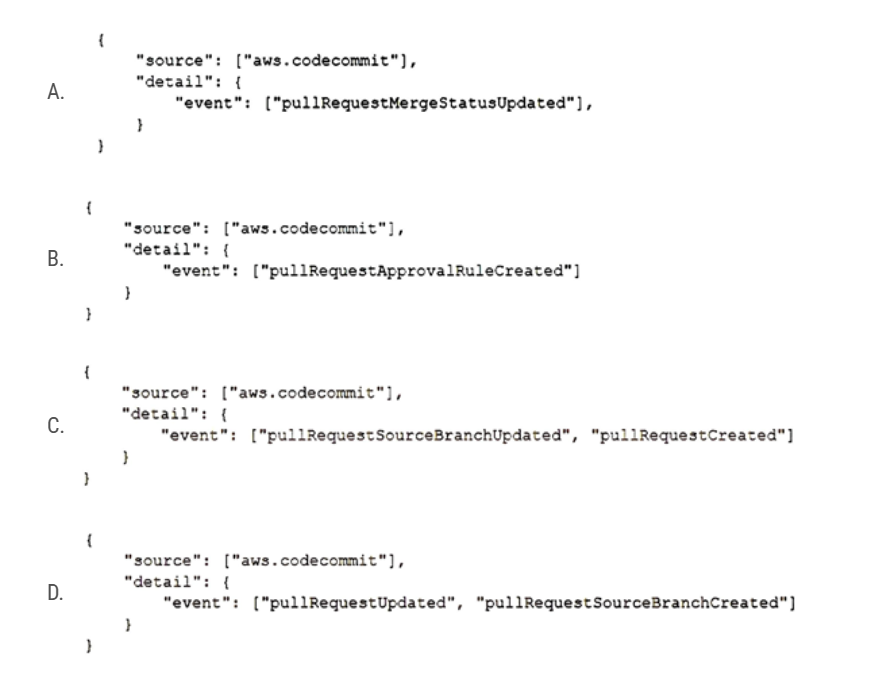

# AWS DAV 02

1. A developer is working on an existing application that uses Amazon DynamoDB as its data store. The DynamoDB table has the following attributes: partNumber (partition key), vendor (sort key), description, productFamily, and productType. When the developer analyzes the usage patterns, the developer notices that there are application modules that frequently look for a list of products based on the productFamily and productType attributes. The developer wants to make changes to the application to improve performance of the query operations. Which solution will meet these requirements?
   - [ ] A. Create a global secondary index (GSI) with productFamily as the partition key and productType as the sort key.
   - [ ] B. Create a local secondary index (LSI) with productFamily as the partition key and productType as the sort key.
   - [ ] C. Recreate the table. Add partNumber as the partition key and vendor as the sort key. During table creation, add a local secondary index (LSI) with productFamily as the partition key and productType as the sort key.
   - [ ] D. Update the queries to use Scan operations with productFamily as the partition key and productType as the sort key.

   <details>
      <summary>Answer</summary>

      A.
      - A: This option will allow you to create a new index where you can query the table using productFamily and productType without needing to modify the main table. GSIs are best suited for this use case, where you need a different partition key than the main table.
      - B: LSIs are used when you want to maintain the same partition key but need alternative sort keys. This solution will not work because the partition key (partNumber) remains unchanged, and we want to query using productFamily as the partition key.
      - C: This is suggesting to recreate the table with the same keys but then add an LSI. The LSI's suggested configuration is still incorrect as you cannot change the partition key using an LSI.
      - D: Scan operations read every item in the entire table and then filter out values to provide the desired result, which is less efficient and consumes more read capacity compared to Query operations. This would not improve performance.

   </details>

2. A developer creates a VPC named VPC-A that has public and private subnets. The developer also creates an Amazon RDS database inside the private subnet of VPC-A. To perform some queries, the developer creates an AWS Lambda function in the default VPC. The Lambda function has code to access the RDS database. When the Lambda function runs, an error message indicates that the function cannot connect to the RDS database. How can the developer solve this problem?
   - [ ] A. Modify the RDS security group. Add a rule to allow traffic from all the ports from the VPC CIDR block.
   - [ ] B. Redeploy the Lambda function in the same subnet as the RDS instance. Ensure that the RDS security group allows traffic from the Lambda function.
   - [ ] C. Create a security group for the Lambda function. Add a new rule in the RDS security group to allow traffic from the new Lambda security group.
   - [ ] D. Create an IAM role. Attach a policy that allows access to the RDS database. Attach the role to the Lambda function.

   <details>
      <summary>Answer</summary>

      B.
      This solution is appropriate. By deploying the Lambda function inside the same VPC (VPC-A) and allowing traffic from the Lambda's security group in the RDS security group, you can ensure that the Lambda function can communicate with the RDS instance.

   </details>

3. A company runs an application on AWS. The company deployed the application on Amazon EC2 instances. The application stores data on Amazon Aurora. The application recently logged multiple application-specific custom DECRYP_ERROR errors to Amazon CloudWatch logs. The company did not detect the issue until the automated tests that run every 30 minutes failed. A developer must implement a solution that will monitor for the custom errors and alert a development team in real time when these errors occur in the production environment. Which solution will meet these requirements with the LEAST operational overhead?
   - [ ] A. Configure the application to create a custom metric and to push the metric to CloudWatch. Create an AWS CloudTrail alarm. Configure the CloudTrail alarm to use an Amazon Simple Notification Service (Amazon SNS) topic to send notifications.
   - [ ] B. Create an AWS Lambda function to run every 5 minutes to scan the CloudWatch logs for the keyword DECRYP_ERROR. Configure the Lambda function to use Amazon Simple Notification Service (Amazon SNS) to send a notification.
   - [ ] C. Use Amazon CloudWatch Logs to create a metric filter that has a filter pattern for DECRYP_ERROR. Create a CloudWatch alarm on this metric for a threshold >=1. Configure the alarm to send Amazon Simple Notification Service (Amazon SNS) notifications.
   - [ ] D. Install the CloudWatch unified agent on the EC2 instance. Configure the application to generate a metric for the keyword DECRYP_ERROR errors. Configure the agent to send Amazon Simple Notification Service (Amazon SNS) notifications.

   <details>
      <summary>Answer</summary>

      C.

   </details>

4. A developer created an AWS Lambda function that accesses resources in a VPC. The Lambda function polls an Amazon Simple Queue Service (Amazon SQS) queue for new messages through a VPC endpoint. Then the function calculates a rolling average of the numeric values that are contained in the messages. After initial tests of the Lambda function, the developer found that the value of the rolling average that the function returned was not accurate. How can the developer ensure that the function calculates an accurate rolling average?
   - [ ] A. Set the function's reserved concurrency to 1. Calculate the rolling average in the function. Store the calculated rolling average in Amazon ElastiCache.
   - [ ] B. Modify the function to store the values in Amazon ElastiCache. When the function initializes, use the previous values from the cache to calculate the rolling average.
   - [ ] C. Set the function's provisioned concurrency to 1. Calculate the rolling average in the function. Store the calculated rolling average in Amazon ElastiCache.
   - [ ] D. Modify the function to store the values in the function's layers. When the function initializes, use the previously stored values to calculate the rolling average.

   <details>
      <summary>Answer</summary>

      A.

   </details>

5. A developer is writing unit tests for a new application that will be deployed on AWS. The developer wants to validate all pull requests with unit tests and merge the code with the main branch only when all tests pass. The developer stores the code in AWS CodeCommit and sets up AWS CodeBuild to run the unit tests. The developer creates an AWS Lambda function to start the CodeBuild task. The developer needs to identify the CodeCommit events in an Amazon EventBridge event that can invoke the Lambda function when a pull request is created or updated.
Which CodeCommit event will meet these requirements?

   

   <details>
      <summary>Answer</summary>

      C.

   </details>

6. A developer deployed an application to an Amazon EC2 instance. The application needs to know the public IPv4 address of the instance. How can the application find this information?
   - [ ] A. Query the instance metadata from <http://169.254.169.254/latest/meta-data/>.
   - [ ] B. Query the instance user data from <http://169.254.169.254/latest/user-data/>.
   - [ ] C. Query the Amazon Machine Image (AMI) information from <http://169.254.169.254/latest/meta-data/ami/>.
   - [ ] D. Check the hosts file of the operating system.

   <details>
      <summary>Answer</summary>

      A.

   </details>

7. An application under development is required to store hundreds of video files. The data must be encrypted within the application prior to storage, with a unique key for each video file. How should the developer code the application?
   - [ ] A. Use the KMS Encrypt API to encrypt the data. Store the encrypted data key and data.
   - [ ] B. Use a cryptography library to generate an encryption key for the application. Use the encryption key to encrypt the data. Store the encrypted data.
   - [ ] C. Use the KMS GenerateDataKey API to get a data key. Encrypt the data with the data key. Store the encrypted data key and data.
   - [ ] D. Upload the data to an S3 bucket using server side-encryption with an AWS KMS key.

   <details>
      <summary>Answer</summary>

      C.

   </details>

8. A company is planning to deploy an application on AWS behind an Elastic Load Balancer. The application uses an HTTP/HTTPS listener and must access the client IP addresses. Which load-balancing solution meets these requirements?
   - [ ] A. Use an Application Load Balancer and the X-Forwarded-For headers.
   - [ ] B. Use a Network Load Balancer (NLB). Enable proxy protocol support on the NLB and the target application.
   - [ ] C. Use an Application Load Balancer. Register the targets by the instance ID.
   - [ ] D. Use a Network Load Balancer and the X-Forwarded-For headers.
   <details>
      <summary>Answer</summary>

      A.

   </details>

9. A developer wants to debug an application by searching and filtering log data. The application logs are stored in Amazon CloudWatch Logs. The developer creates a new metric filter to count exceptions in the application logs. However, no results are returned from the logs. What is the reason that no filtered results are being returned?
   - [ ] A. A setup of the Amazon CloudWatch interface VPC endpoint is required for filtering the CloudWatch Logs in the VPC.
   - [ ] B. CloudWatch Logs only publishes metric data for events that happen after the filter is created.
   - [ ] C. The log group for CloudWatch Logs should be first streamed to Amazon OpenSearch Service before metric filtering returns the results.
   - [ ] D. Metric data points for logs groups can be filtered only after they are exported to an Amazon S3 bucket.

   <details>
      <summary>Answer</summary>

      B.

   </details>

10. A company is planning to use AWS CodeDeploy to deploy an application to Amazon Elastic Container Service (Amazon ECS). During the deployment of a new version of the application, the company initially must expose only 10% of live traffic to the new version of the deployed application. Then, after 15 minutes elapse, the company must route all the remaining live traffic to the new version of the deployed application. Which CodeDeploy predefined configuration will meet these requirements?
    - [ ] A. CodeDeployDefault.ECSCanary10Percent15Minutes
    - [ ] B. CodeDeployDefault.LambdaCanary10Percent5Minutes
    - [ ] C. CodeDeployDefault.LambdaCanary10Percentl15Minutes
    - [ ] D. CodeDeployDefault.ECSLinear10PercentEvery1Minutes

    <details>
      <summary>Answer</summary>

      A.

     </details>

11. A company hosts a batch processing application on AWS Elastic Beanstalk with instances that run the most recent version of Amazon Linux. The application sorts and processes large datasets. In recent weeks, the application's performance has decreased significantly during a peak period for traffic. A developer suspects that the application issues are related to the memory usage. The developer checks the Elastic Beanstalk console and notices that memory usage is not being tracked. How should the developer gather more information about the application performance issues?
    - [ ] A. Configure the Amazon CloudWatch agent to push logs to Amazon CloudWatch Logs by using port 443.
    - [ ] B. Configure the Elastic Beanstalk .ebextensions directory to track the memory usage of the instances.
    - [ ] C. Configure the Amazon CloudWatch agent to track the memory usage of the instances.
    - [ ] D. Configure an Amazon CloudWatch dashboard to track the memory usage of the instances.

    <details>
       <summary>Answer</summary>

       C.
       By default, Amazon CloudWatch does not monitor certain system-level metrics like memory usage, disk space, etc. for EC2 instances. To gather system-level metrics, you need to use the CloudWatch agent. By installing and configuring the CloudWatch agent on your Elastic Beanstalk instances, you can monitor memory usage and other system-level metrics.

    </details>

12. A developer is building a highly secure healthcare application using serverless components. This application requires writing temporary data to /tmp storage on an AWS Lambda function. How should the developer encrypt this data?
    - [ ] A. Enable Amazon EBS volume encryption with an AWS KMS key in the Lambda function configuration so that all storage attached to the Lambda function is encrypted.
    - [ ] B. Set up the Lambda function with a role and key policy to access an AWS KMS key. Use the key to generate a data key used to encrypt all data prior to writing to /tmp storage.
    - [ ] C. Use OpenSSL to generate a symmetric encryption key on Lambda startup. Use this key to encrypt the data prior to writing to /tmp.
    - [ ] D. Use an on-premises hardware security module (HSM) to generate keys, where the Lambda function requests a data key from the HSM and uses that to encrypt data on all requests to the function.

    <details>
       <summary>Answer</summary>

       B.

    </details>

13. A developer has created an AWS Lambda function to provide notification through Amazon Simple Notification Service (Amazon SNS) whenever a file is uploaded to Amazon S3 that is larger than 50 MB. The developer has deployed and tested the Lambda function by using the CLI. However, when the event notification is added to the S3 bucket and a 3,000 MB file is uploaded, the Lambda function does not launch. Which of the following is a possible reason for the Lambda function's inability to launch?
    - [ ] A. The S3 event notification does not activate for files that are larger than 1,000 MB.
    - [ ] B. The resource-based policy for the Lambda function does not have the required permissions to be invoked by Amazon S3.
    - [ ] C. Lambda functions cannot be invoked directly from an S3 event.
    - [ ] D. The S3 bucket needs to be made public.
    <details>
       <summary>Answer</summary>

       B.
       - A: This is not correct. S3 event notifications can be triggered for files of any size.
       - B: When setting up S3 to trigger a Lambda function, the function itself needs to have a resource-based policy that allows S3 to invoke it. If this permission is not set, even though the S3 bucket is configured to send an event, the Lambda function will not be allowed to process it.
       - C: This is incorrect. One of the primary use cases for Lambda is to process events directly from services like Amazon S3.
       - D: This is not correct. S3 buckets should not be made public unless there's a very specific requirement. Making a bucket public won't solve the issue of Lambda not being invoked.

    </details>

14. A developer is creating a Ruby application and needs to automate the deployment, scaling, and management of an environment without requiring knowledge of the underlying infrastructure. Which service would best accomplish this task?
    - [ ] A. AWS CodeDeploy
    - [ ] B. AWS CloudFormation
    - [ ] C. AWS OpsWorks
    - [ ] D. AWS Elastic Beanstalk

    <details>
       <summary>Answer</summary>

       D.

    </details>

15. A company has a web application that is deployed on AWS. The application uses an Amazon API Gateway API and an AWS Lambda function as its backend. The application recently demonstrated unexpected behavior. A developer examines the Lambda function code, finds an error, and modifies the code to resolve the problem. Before deploying the change to production, the developer needs to run tests to validate that the application operates properly. The application has only a production environment available. The developer must create a new development environment to test the code changes. The developer must also prevent other developers from overwriting these changes during the test cycle. Which combination of steps will meet these requirements with the LEAST development effort? (Choose two.)
    - [ ] A. Create a new resource in the current stage. Create a new method with Lambda proxy integration. Select the Lambda function. Add the hotfix alias. Redeploy the current stage. Test the backend.
    - [ ] B. Update the Lambda function in the API Gateway API integration request to use the hotfix alias. Deploy the API Gateway API to a new stage named hotfix. Test the backend.
    - [ ] C. Modify the Lambda function by fixing the code. Test the Lambda function. Create the alias hotfix. Point the alias to the $LATEST version.
    - [ ] D. Modify the Lambda function by fixing the code. Test the Lambda function. When the Lambda function is working as expected, publish the Lambda function as a new version. Create the alias hotfix. Point the alias to the new version.
    - [ ] E. Create a new API Gateway API for the development environment. Add a resource and method with Lambda integration. Choose the Lambda function and the hotfix alias. Deploy to a new stage. Test the backend.
    <details>
       <summary>Answer</summary>

       BD.

    </details>

16. A developer is implementing an AWS Cloud Development Kit (AWS CDK) serverless application. The developer will provision several AWS Lambda functions and Amazon API Gateway APIs during AWS CloudFormation stack creation. The developer's workstation has the AWS Serverless Application Model (AWS SAM) and the AWS CDK installed locally. How can the developer test a specific Lambda function locally?
    - [ ] A. Run the sam package and sam deploy commands. Create a Lambda test event from the AWS Management Console. Test the Lambda function.
    - [ ] B. Run the cdk synth and cdk deploy commands. Create a Lambda test event from the AWS Management Console. Test the Lambda function.
    - [ ] C. Run the cdk synth and sam local invoke commands with the function construct identifier and the path to the synthesized CloudFormation template.
    - [ ] D. Run the cdk synth and sam local start-lambda commands with the function construct identifier and the path to the synthesized CloudFormation template.

    <details>
       <summary>Answer</summary>

       C.

    </details>

17. A company's new mobile app uses Amazon API Gateway. As the development team completes a new release of its APIs, a developer must safely and transparently roll out the API change. What is the SIMPLEST solution for the developer to use for rolling out the new API version to a limited number of users through API Gateway?
    - [ ] A. Create a new API in API Gateway. Direct a portion of the traffic to the new API using an Amazon Route 53 weighted routing policy.
    - [ ] B. Validate the new API version and promote it to production during the window of lowest expected utilization.
    - [ ] C. Implement an Amazon CloudWatch alarm to trigger a rollback if the observed HTTP 500 status code rate exceeds a predetermined threshold.
    - [ ] D. Use the canary release deployment option in API Gateway. Direct a percentage of the API traffic using the canarySettings setting.

    <details>
       <summary>Answer</summary>

       D.

    </details>

18. A company caches session information for a web application in an Amazon DynamoDB table. The company wants an automated way to delete old items from the table. What is the simplest way to do this?
    - [ ] A. Write a script that deletes old records; schedule the script as a cron job on an Amazon EC2 instance.
    - [ ] B. Add an attribute with the expiration time; enable the Time To Live feature based on that attribute.
    - [ ] C. Each day, create a new table to hold session data; delete the previous day's table.
    - [ ] D. Add an attribute with the expiration time; name the attribute ItemExpiration.

    <details>
       <summary>Answer</summary>

       B.

    </details>

19. A company is using an Amazon API Gateway REST API endpoint as a webhook to publish events from an on-premises source control management (SCM) system to Amazon EventBridge. The company has configured an EventBridge rule to listen for the events and to control application deployment in a central AWS account. The company needs to receive the same events across multiple receiver AWS accounts. How can a developer meet these requirements without changing the configuration of the SCM system?
    - [ ] A. Deploy the API Gateway REST API to all the required AWS accounts. Use the same custom domain name for all the gateway endpoints so that a single SCM webhook can be used for all events from all accounts.
    - [ ] B. Deploy the API Gateway REST API to all the receiver AWS accounts. Create as many SCM webhooks as the number of AWS accounts.
    - [ ] C. Grant permission to the central AWS account for EventBridge to access the receiver AWS accounts. Add an EventBridge event bus on the receiver AWS accounts as the targets to the existing EventBridge rule.
    - [ ] D. Convert the API Gateway type from REST API to HTTP API.

    <details>
       <summary>Answer</summary>

       C.
       This is the correct approach. By granting permissions, you can enable the central AWS account's EventBridge to put events on the event buses of the receiver AWS accounts. This way, events received in the central account can be forwarded to the other accounts without requiring any changes to the SCM system.

    </details>

20. A company moved some of its secure files to a private Amazon S3 bucket that has no public access. The company wants to develop a serverless application that gives its employees the ability to log in and securely share the files with other users. Which AWS feature should the company use to share and access the files securely?
    - [ ] A. Amazon Cognito user pool
    - [ ] B. S3 presigned URLs
    - [ ] C. S3 bucket policy
    - [ ] D. Amazon Cognito identity pool

    <details>
       <summary>Answer</summary>

       B.

    </details>

21. A developer maintains an Amazon API Gateway REST API. Customers use the API through a frontend UI and Amazon Cognito authentication. The developer has a new version of the API that contains new endpoints and backward-incompatible interface changes. The developer needs to provide beta access to other developers on the team without affecting customers. Which solution will meet these requirements with the LEAST operational overhead?
    - [ ] A. Define a development stage on the API Gateway API. Instruct the other developers to point the endpoints to the development stage.
    - [ ] B. Define a new API Gateway API that points to the new API application code. Instruct the other developers to point the endpoints to the new API.
    - [ ] C. Implement a query parameter in the API application code that determines which code version to call.
    - [ ] D. Specify new API Gateway endpoints for the API endpoints that the developer wants to add.

    <details>
       <summary>Answer</summary>

       A.

    </details>

22. A developer is creating an application that will store personal health information (PHI). The PHI needs to be encrypted at all times. An encrypted Amazon RDS for MySQL DB instance is storing the data. The developer wants to increase the performance of the application by caching frequently accessed data while adding the ability to sort or rank the cached datasets. Which solution will meet these requirements?
    - [ ] A. Create an Amazon ElastiCache for Redis instance. Enable encryption of data in transit and at rest. Store frequently accessed data in the cache.
    - [ ] B. Create an Amazon ElastiCache for Memcached instance. Enable encryption of data in transit and at rest. Store frequently accessed data in the cache.
    - [ ] C. Create an Amazon RDS for MySQL read replica. Connect to the read replica by using SSL. Configure the read replica to store frequently accessed data.
    - [ ] D. Create an Amazon DynamoDB table and a DynamoDB Accelerator (DAX) cluster for the table. Store frequently accessed data in the DynamoDB table.
  
    <details>
       <summary>Answer</summary>

       A.
       - A. Amazon ElastiCache for Redis supports both encryption at rest and in transit. Additionally, Redis supports sorted data structures like Sorted Sets, which can be used for sorting or ranking datasets.
       - B. Amazon ElastiCache for Memcached supports encryption in transit but does not support encryption at rest (as of my last update in January 2022). Therefore, it's not suitable for storing PHI data that needs to be encrypted at all times.
       - C. Amazon RDS for MySQL read replica can be used to offload read traffic from the primary database, but it doesn't serve as a caching layer like ElastiCache. Also, while connecting with SSL provides encryption in transit, it doesn't necessarily improve cache-like performance for frequently accessed data.
       - D. Amazon DynamoDB with DAX is a caching solution for DynamoDB, but the architecture is more suited for applications that already leverage DynamoDB as the primary database. If you're not already using DynamoDB, introducing it solely for caching may be overkill. Additionally, DAX provides in-memory caching, so you would have to ensure the in-memory data is also encrypted.

    </details>

23. A company has a multi-node Windows legacy application that runs on premises. The application uses a network shared folder as a centralized configuration repository to store configuration files in .xml format. The company is migrating the application to Amazon EC2 instances. As part of the migration to AWS, a developer must identify a solution that provides high availability for the repository. Which solution will meet this requirement MOST cost-effectively?
    - [ ] A. Mount an Amazon Elastic Block Store (Amazon EBS) volume onto one of the EC2 instances. Deploy a file system on the EBS volume. Use the host operating system to share a folder. Update the application code to read and write configuration files from the shared folder.
    - [ ] B. Deploy a micro EC2 instance with an instance store volume. Use the host operating system to share a folder. Update the application code to read and write configuration files from the shared folder.
    - [ ] C. Create an Amazon S3 bucket to host the repository. Migrate the existing .xml files to the S3 bucket. Update the application code to use the AWS SDK to read and write configuration files from Amazon S3.
    - [ ] D. Create an Amazon S3 bucket to host the repository. Migrate the existing xml files to the S3 bucket. Mount the S3 bucket to the EC2 instances as a local volume. Update the application code to read and write configuration files from the disk.

    <details>
       <summary>Answer</summary>

       C.

    </details>

24. A company wants to deploy and maintain static websites on AWS. Each website's source code is hosted in one of several version control systems, including AWS CodeCommit, Bitbucket, and GitHub. The company wants to implement phased releases by using development, staging, user acceptance testing, and production environments in the AWS Cloud. Deployments to each environment must be started by code merges on the relevant Git branch. The company wants to use HTTPS for all data exchange. The company needs a solution that does not require servers to run continuously. Which solution will meet these requirements with the LEAST operational overhead?
    - [ ] A. Host each website by using AWS Amplify with a serverless backend. Conned the repository branches that correspond to each of the desired environments. Start deployments by merging code changes to a desired branch.
    - [ ] B. Host each website in AWS Elastic Beanstalk with multiple environments. Use the EB CLI to link each repository branch. Integrate AWS CodePipeline to automate deployments from version control code merges.
    - [ ] C. Host each website in different Amazon S3 buckets for each environment. Configure AWS CodePipeline to pull source code from version control. Add an AWS CodeBuild stage to copy source code to Amazon S3.
    - [ ] D. Host each website on its own Amazon EC2 instance. Write a custom deployment script to bundle each website's static assets. Copy the assets to Amazon EC2. Set up a workflow to run the script when code is merged.

    <details>
       <summary>Answer</summary>

       A.
       - A. AWS Amplify with a serverless backend would allow for static site hosting with HTTPS support. Amplify can automatically deploy changes based on branches in connected repositories, which aligns with the requirement for deployments initiated by code merges. It also provides a serverless approach, meaning no continuously running servers.
       - B. AWS Elastic Beanstalk (EB) is designed for scalable web applications and services but can also host static sites. Using EB with the CLI to link repositories and integrating AWS CodePipeline can meet the deployment requirements. However, EB does have an underlying infrastructure that would be running continuously. Additionally, the setup and maintenance of EB, the EB CLI, and CodePipeline might introduce a higher operational overhead compared to other solutions.
       - C. Hosting in S3 buckets would mean static hosting with HTTPS (when integrated with Amazon CloudFront). Using CodePipeline and CodeBuild to automate deployments from version control and copy to S3 aligns with the requirements. However, this involves multiple components (S3, CodePipeline, CodeBuild), which can add operational overhead, albeit less than option B.
       - D. Using Amazon EC2 would mean continuously running servers, which violates one of the requirements. Also, manually writing deployment scripts and managing EC2 instances introduces significant operational overhead.

    </details>

25. A company is migrating its on-premises database to Amazon RDS for MySQL. The company has read-heavy workloads, and wants to make sure it re-factors its code to achieve optimum read performance for its queries. How can this objective be met?
    - [ ] A. Add database retries to effectively use RDS with vertical scaling.
    - [ ] B. Use RDS with multi-AZ deployment.
    - [ ] C. Add a connection string to use an RDS read replica for read queries.
    - [ ] D. Add a connection string to use a read replica on an EC2 instance.
    <details>
       <summary>Answer</summary>

       C.

    </details>

26. A developer is creating an application that will be deployed on IoT devices. The application will send data to a RESTful API that is deployed as an AWS Lambda function. The application will assign each API request a unique identifier. The volume of API requests from the application can randomly increase at any given time of day. During periods of request throttling, the application might need to retry requests. The API must be able to handle duplicate requests without inconsistencies or data loss. Which solution will meet these requirements?
    - [ ] A. Create an Amazon RDS for MySQL DB instance. Store the unique identifier for each request in a database table. Modify the Lambda function to check the table for the identifier before processing the request.
    - [ ] B. Create an Amazon DynamoDB table. Store the unique identifier for each request in the table. Modify the Lambda function to check the table for the identifier before processing the request.
    - [ ] C. Create an Amazon DynamoDB table. Store the unique identifier for each request in the table. Modify the Lambda function to return a client error response when the function receives a duplicate request.
    - [ ] D. Create an Amazon ElastiCache for Memcached instance. Store the unique identifier for each request in the cache. Modify the Lambda function to check the cache for the identifier before processing the request.

    <details>
       <summary>Answer</summary>

       B.

    </details>

27. A developer wants to expand an application to run in multiple AWS Regions. The developer wants to copy Amazon Machine Images (AMIs) with the latest changes and create a new application slack in the destination Region. According to company requirements, all AMIs must be encrypted in all Regions. However, not all the AMIs that the company uses are encrypted. How can the developer expand the application to run in the destination Region while meeting the encryption requirement?
    - [ ] A. Create a new AMIs, and specify encryption parameters. Copy the encrypted AMIs to the destination Region. Delete the unencrypted AMIs.
    - [ ] B. Use AWS Key Management Service (AWS KMS) to enable encryption on the unencrypted AMIs. Copy the encrypted AMIs to the destination Region.
    - [ ] C. Use AWS Certificate Manager (ACM) to enable encryption on the unencrypted AMIs. Copy the encrypted AMIs to the destination Region.
    - [ ] D. Copy the unencrypted AMIs to the destination Region. Enable encryption by default in the destination Region.

       <summary>Answer</summary>

       B.
      - A. Creating new AMIs with encryption enabled and then copying them to the destination region is feasible. However, you cannot directly specify encryption parameters on the source AMIs if they are already created and unencrypted. This option implies creating new encrypted AMIs from the instances and then copying them to the destination region, which is plausible but may not be the most straightforward solution.
      - B. AWS Key Management Service (AWS KMS) is used for managing encryption keys, but you cannot directly "enable encryption" on an existing unencrypted AMI using KMS. However, you can copy the AMI and specify a KMS key for encryption during the copy process.
      - C. AWS Certificate Manager (ACM) is for managing SSL/TLS certificates, not for encrypting AMIs.
      - D. If "encryption by default" is enabled in the destination region, any new EBS volumes or snapshot created in that region would be encrypted. However, simply copying an unencrypted AMI to the destination region won't encrypt the AMI automatically, even if encryption by default is enabled.

    </details>

28. A company hosts a client-side web application for one of its subsidiaries on Amazon S3. The web application can be accessed through Amazon CloudFront from <https://www.example.com>. After a successful rollout, the company wants to host three more client-side web applications for its remaining subsidiaries on three separate S3 buckets. To achieve this goal, a developer moves all the common JavaScript files and web fonts to a central S3 bucket that serves the web applications. However, during testing, the developer notices that the browser blocks the JavaScript files and web fonts. What should the developer do to prevent the browser from blocking the JavaScript files and web fonts?
    - [ ] A. Create four access points that allow access to the central S3 bucket. Assign an access point to each web application bucket.
    - [ ] B. Create a bucket policy that allows access to the central S3 bucket. Attach the bucket policy to the central S3 bucket.
    - [ ] C. Create a cross-origin resource sharing (CORS) configuration that allows access to the central S3 bucket. Add the CORS configuration to the central S3 bucket.
    - [ ] D. Create a Content-MD5 header that provides a message integrity check for the central S3 bucket. Insert the Content-MD5 header for each web application request.

    <details>
       <summary>Answer</summary>

       C.

    </details>

29. An application is processing clickstream data using Amazon Kinesis. The clickstream data feed into Kinesis experiences periodic spikes. The PutRecords API call occasionally fails and the logs show that the failed call returns the response shown below, Which techniques will help mitigate this exception? (Choose two.)

    ```json
    {
      "FailedRecordCount": "1",
      "Records": [
         {
            "SequenceNumber": "2123137863287632187",
            "ShardID": "ShardId-463783687423"
         },
         {
            "ErrorCode": "ProvisionedThroughputExceededException",
            "ErrorMessage": "Rate Exceeded for shard ShardId-463783687423 in stream exampleStreamName under account 1234567."
         }
      ]
    }
    ```

    - [ ] A. Implement retries with exponential backoff.
    - [ ] B. Use a PutRecord API instead of PutRecords.
    - [ ] C. Reduce the frequency and/or size of the requests.
    - [ ] D. Use Amazon SNS instead of Kinesis.
    - [ ] E. Reduce the number of KCL consumers.

    <details>
       <summary>Answer</summary>

       AC.
       - A. This is a common best practice for handling throttling errors. By implementing retries with exponential backoff, the application can make repeated attempts to send the data, with increasing wait times between each attempt, until the request succeeds or a maximum number of retries is reached.
       - B. Switching to the PutRecord API from the PutRecords API wouldn't necessarily resolve the throughput exception, especially if the volume of data being sent is the root cause of the problem.
       - C. By reducing the frequency or size of the requests, you're sending data at a rate that better aligns with the Kinesis stream's provisioned throughput, which can help avoid the "Rate Exceeded" errors.
       - D. SNS serves a different use case compared to Kinesis. SNS is for pub/sub messaging while Kinesis is designed for real-time streaming data. Switching to SNS would not directly address the issue of the throughput exception and may not meet the application's requirements.
       - E. Reducing the number of KCL (Kinesis Client Library) consumers wouldn't help with the "Rate Exceeded" errors. The error in question is related to putting (or writing) data into the stream, not reading from it. The number of KCL consumers affects the read capacity, not the write capacity.

    </details>

30. A company has an application that uses Amazon Cognito user pools as an identity provider. The company must secure access to user records. The company has set up multi-factor authentication (MFA). The company also wants to send a login activity notification by email every time a user logs in. What is the MOST operationally efficient solution that meets this requirement?
    - [ ] A. Create an AWS Lambda function that uses Amazon Simple Email Service (Amazon SES) to send the email notification. Add an Amazon API Gateway API to invoke the function. Call the API from the client side when login confirmation is received.
    - [ ] B. Create an AWS Lambda function that uses Amazon Simple Email Service (Amazon SES) to send the email notification. Add an Amazon Cognito post authentication Lambda trigger for the function.
    - [ ] C. Create an AWS Lambda function that uses Amazon Simple Email Service (Amazon SES) to send the email notification. Create an Amazon CloudWatch Logs log subscription filter to invoke the function based on the login status.
    - [ ] D. Configure Amazon Cognito to stream all logs to Amazon Kinesis Data Firehose. Create an AWS Lambda function to process the streamed logs and to send the email notification based on the login status of each user.

    <details>
       <summary>Answer</summary>

       B.

    </details>

31. A developer has an application that stores data in an Amazon S3 bucket. The application uses an HTTP API to store and retrieve objects. When the PutObject API operation adds objects to the S3 bucket the developer must encrypt these objects at rest by using server-side encryption with Amazon S3 managed keys (SSE-S3). Which solution will meet this requirement?
    - [ ] A. Create an AWS Key Management Service (AWS KMS) key. Assign the KMS key to the S3 bucket.
    - [ ] B. Set the x-amz-server-side-encryption header when invoking the PutObject API operation.
    - [ ] C. Provide the encryption key in the HTTP header of every request.
    - [ ] D. Apply TLS to encrypt the traffic to the S3 bucket.

    <details>
       <summary>Answer</summary>

       B.

    </details>

32. A developer needs to perform geographic load testing of an API. The developer must deploy resources to multiple AWS Regions to support the load testing of the API. How can the developer meet these requirements without additional application code?
    - [ ] A. Create and deploy an AWS Lambda function in each desired Region. Configure the Lambda function to create a stack from an AWS CloudFormation template in that Region when the function is invoked.
    - [ ] B. Create an AWS CloudFormation template that defines the load test resources. Use the AWS CLI create-stack-set command to create a stack set in the desired Regions.
    - [ ] C. Create an AWS Systems Manager document that defines the resources. Use the document to create the resources in the desired Regions.
    - [ ] D. Create an AWS CloudFormation template that defines the load test resources. Use the AWS CLI deploy command to create a stack from the template in each Region.

    <details>
       <summary>Answer</summary>

       B.

    </details>

33. A developer is creating an application that includes an Amazon API Gateway REST API in the us-east-2 Region. The developer wants to use Amazon CloudFront and a custom domain name for the API. The developer has acquired an SSL/TLS certificate for the domain from a third-party provider. How should the developer configure the custom domain for the application?
    - [ ] A. Import the SSL/TLS certificate into AWS Certificate Manager (ACM) in the same Region as the API. Create a DNS A record for the custom domain.
    - [ ] B. Import the SSL/TLS certificate into CloudFront. Create a DNS CNAME record for the custom domain.
    - [ ] C. Import the SSL/TLS certificate into AWS Certificate Manager (ACM) in the same Region as the API. Create a DNS CNAME record for the custom domain.
    - [ ] D. Import the SSL/TLS certificate into AWS Certificate Manager (ACM) in the us-east-1 Region. Create a DNS CNAME record for the custom domain.

    <details>
       <summary>Answer</summary>

       D.
       When using a custom domain with Amazon API Gateway and CloudFront, the SSL/TLS certificate needs to be in AWS Certificate Manager (ACM). However, the important detail to remember is that even if your API Gateway is in a region other than us-east-1, when you are associating a custom domain name with an API Gateway, the certificate for the custom domain name should be imported into ACM in the us-east-1 region. This is because API Gateway uses CloudFront for custom domain names, and CloudFront distributions require certificates to be in the us-east-1 region.

    </details>

34. A developer is creating a template that uses AWS CloudFormation to deploy an application. The application is serverless and uses Amazon API Gateway. Amazon DynamoDB, and AWS Lambda. Which AWS service or tool should the developer use to define serverless resources in YAML?
    - [ ] A. CloudFormation serverless intrinsic functions
    - [ ] B. AWS Elastic Beanstalk
    - [ ] C. AWS Serverless Application Model (AWS SAM)
    - [ ] D. AWS Cloud Development Kit (AWS CDK)

    <details>
       <summary>Answer</summary>

       C.
       - A. CloudFormation serverless intrinsic functions: CloudFormation does support creating serverless resources but doesn't have the shorthand syntax that AWS SAM provides for serverless applications.
       - B. AWS Elastic Beanstalk: This service is primarily used for deploying web applications and services. It isn't focused on serverless applications or defining resources in YAML specifically for serverless scenarios.
       - C. AWS Serverless Application Model (AWS SAM): This is the correct choice. AWS SAM provides a simplified CloudFormation syntax to express serverless resources, making it easier to define serverless applications.
       - D. AWS Cloud Development Kit (AWS CDK): The AWS CDK is a software development framework to define cloud infrastructure in code and provision it through AWS CloudFormation. While you can define serverless resources using the AWS CDK, it uses programming languages like TypeScript, Python, etc., not YAML or JSON.

    </details>

35. A developer wants to insert a record into an Amazon DynamoDB table as soon as a new file is added to an Amazon S3 bucket. Which set of steps would be necessary to achieve this?
    - [ ] A. Create an event with Amazon EventBridge that will monitor the S3 bucket and then insert the records into DynamoDB.
    - [ ] B. Configure an S3 event to invoke an AWS Lambda function that inserts records into DynamoDB.
    - [ ] C. Create an AWS Lambda function that will poll the S3 bucket and then insert the records into DynamoDB.
    - [ ] D. Create a cron job that will run at a scheduled time and insert the records into DynamoDB.

    <details>
       <summary>Answer</summary>

       B.

    </details>

36. A development team maintains a web application by using a single AWS CloudFormation template. The template defines web servers and an Amazon RDS database. The team uses the Cloud Formation template to deploy the Cloud Formation stack to different environments. During a recent application deployment, a developer caused the primary development database to be dropped and recreated. The result of this incident was a loss of data. The team needs to avoid accidental database deletion in the future. Which solutions will meet these requirements? (Choose two.)
    - [ ] A. Add a CloudFormation Deletion Policy attribute with the Retain value to the database resource.
    - [ ] B. Update the CloudFormation stack policy to prevent updates to the database.
    - [ ] C. Modify the database to use a Multi-AZ deployment.
    - [ ] D. Create a CloudFormation stack set for the web application and database deployments.
    - [ ] E. Add a Cloud Formation DeletionPolicy attribute with the Retain value to the stack.

    <details>
       <summary>Answer</summary>

       AB.
      - A. This will ensure that even if the stack is deleted or the database resource is removed from the template, the database will not be deleted.
      - B. By denying update actions on the database resource, you can prevent unintentional changes that might be harmful.

    </details>

37. A company has an Amazon S3 bucket that contains sensitive data. The data must be encrypted in transit and at rest. The company encrypts the data in the S3 bucket by using an AWS Key Management Service (AWS KMS) key. A developer needs to grant several other AWS accounts the permission to use the S3 GetObject operation to retrieve the data from the S3 bucket. How can the developer enforce that all requests to retrieve the data provide encryption in transit?
    - [ ] A. Define a resource-based policy on the S3 bucket to deny access when a request meets the condition "aws:SecureTransport": "false".
    - [ ] B. Define a resource-based policy on the S3 bucket to allow access when a request meets the condition "aws:SecureTransport": "false".
    - [ ] C. Define a role-based policy on the other accounts' roles to deny access when a request meets the condition of "aws:SecureTransport": "false".
    - [ ] D. Define a resource-based policy on the KMS key to deny access when a request meets the condition of "aws:SecureTransport": "false".

    <details>
       <summary>Answer</summary>

       A.
       - A. This is the correct approach. By setting a condition that denies access when "aws:SecureTransport" is "false", you ensure that only encrypted (in transit) requests can access the S3 bucket.
       - B. This would explicitly allow non-secure (unencrypted in transit) requests, which is opposite of what we want.
       - C. While it's possible to define such a policy on the other accounts' roles, it's simpler and more effective to manage the encryption enforcement directly on the S3 bucket, ensuring that no matter who or where the request comes from, the encryption in transit is enforced.
       - D. The KMS key's policy will determine who can use the key for encrypting/decrypting. However, it's not where you'd typically enforce the SSL/TLS requirement for accessing the data in S3. That should be enforced at the S3 bucket level.

    </details>

38. An application that is hosted on an Amazon EC2 instance needs access to files that are stored in an Amazon S3 bucket. The application lists the objects that are stored in the S3 bucket and displays a table to the user. During testing, a developer discovers that the application does not show any objects in the list. What is the MOST secure way to resolve this issue?
    - [ ] A. Update the IAM instance profile that is attached to the EC2 instance to include the S3:' permission for the S3 bucket.
    - [ ] B. Update the IAM instance profile that is attached to the EC2 instance to include the S3:ListBucket permission for the S3 bucket.
    - [ ] C. Update the developer's user permissions to include the S3:ListBucket permission for the S3 bucket.
    - [ ] D. Update the S3 bucket policy by including the S3:ListBucket permission and by setting the Principal element to specify the account number of the EC2 instance.
    <details>
       <summary>Answer</summary>

       B.

    </details>

39. A company is planning to securely manage one-time fixed license keys in AWS. The company's development team needs to access the license keys in automaton scripts that run in Amazon EC2 instances and in AWS CloudFormation stacks. Which solution will meet these requirements MOST cost-effectively?
    - [ ] A. Amazon S3 with encrypted files prefixed with “config”
    - [ ] B. AWS Secrets Manager secrets with a tag that is named SecretString
    - [ ] C. AWS Systems Manager Parameter Store SecureString parameters
    - [ ] D. CloudFormation NoEcho parameters

    <details>
       <summary>Answer</summary>

       C.

    </details>

40. A company has deployed infrastructure on AWS. A development team wants to create an AWS Lambda function that will retrieve data from an Amazon Aurora database. The Amazon Aurora database is in a private subnet in company's VPC. The VPC is named VPC1. The data is relational in nature. The Lambda function needs to access the data securely. Which solution will meet these requirements?
    - [ ] A. Create the Lambda function. Configure VPC1 access for the function. Attach a security group named SG1 to both the Lambda function and the database. Configure the security group inbound and outbound rules to allow TCP traffic on Port 3306.
    - [ ] B. Create and launch a Lambda function in a new public subnet that is in a new VPC named VPC2. Create a peering connection between VPC1 and VPC2.
    - [ ] C. Create the Lambda function. Configure VPC1 access for the function. Assign a security group named SG1 to the Lambda function. Assign a second security group named SG2 to the database. Add an inbound rule to SG1 to allow TCP traffic from Port 3306.
    - [ ] D. Export the data from the Aurora database to Amazon S3. Create and launch a Lambda function in VPC1. Configure the Lambda function query the data from Amazon S3.
    <details>
       <summary>Answer</summary>

       A.
       This is a good approach. By attaching the Lambda function to the VPC, it can access resources inside the VPC. Also, by using the same security group for both Lambda and Aurora, you can set rules that allow them to communicate with each other.While placing the Lambda function in VPC1 is correct, modifying the Lambda function's security group (SG1) inbound rules to allow traffic from Port 3306 is not appropriate. Instead, the Aurora's security group (SG2) should allow incoming traffic on port 3306 from the Lambda function.

    </details>

41. A developer is building a web application that uses Amazon API Gateway to expose an AWS Lambda function to process requests from clients. During testing, the developer notices that the API Gateway times out even though the Lambda function finishes under the set time limit. Which of the following API Gateway metrics in Amazon CloudWatch can help the developer troubleshoot the issue? (Choose two.)
    - [ ] A. CacheHitCount
    - [ ] B. IntegrationLatency
    - [ ] C. CacheMissCount
    - [ ] D. Latency
    - [ ] E. Count

    <details>
       <summary>Answer</summary>

       BD.

    </details>

42. A Developer is designing an AWS Lambda function that create temporary files that are less than 10 MB during execution. The temporary files will be accessed and modified multiple times during execution. The Developer has no need to save or retrieve these files in the future. Where should the temporary file be stored?
    - [ ] A. the /tmp directory
    - [ ] B. Amazon EFS
    - [ ] C. Amazon EBS
    - [ ] D. Amazon S3

    <details>
       <summary>Answer</summary>

       A.

    </details>

43. A developer is designing a serverless application with two AWS Lambda functions to process photos. One Lambda function stores objects in an Amazon S3 bucket and stores the associated metadata in an Amazon DynamoDB table. The other Lambda function fetches the objects from the S3 bucket by using the metadata from the DynamoDB table. Both Lambda functions use the same Python library to perform complex computations and are approaching the quota for the maximum size of zipped deployment packages. What should the developer do to reduce the size of the Lambda deployment packages with the LEAST operational overhead?
    - [ ] A. Package each Python library in its own .zip file archive. Deploy each Lambda function with its own copy of the library.
    - [ ] B. Create a Lambda layer with the required Python library. Use the Lambda layer in both Lambda functions.
    - [ ] C. Combine the two Lambda functions into one Lambda function. Deploy the Lambda function as a single .zip file archive.
    - [ ] D. Download the Python library to an S3 bucket. Program the Lambda functions to reference the object URLs.

    <details>
       <summary>Answer</summary>

       B.
       Lambda layers are used to store the code dependencies, custom runtimes, configuration files etc. We create a .zip file archive that contains supplementary code or data.

    </details>

44. A developer is writing an AWS Lambda function. The developer wants to log key events that occur while the Lambda function runs. The developer wants to include a unique identifier to associate the events with a specific function invocation. The developer adds the following code to the Lambda function: Which solution will meet this requirement?

    ```javascript
    function handler (event, context) {

    } 
    ```

    - [ ] A. Obtain the request identifier from the AWS request ID field in the context object. Configure the application to write logs to standard output.
    - [ ] B. Obtain the request identifier from the AWS request ID field in the event object. Configure the application to write logs to a file.
    - [ ] C. Obtain the request identifier from the AWS request ID field in the event object. Configure the application to write logs to standard output.
    - [ ] D. Obtain the request identifier from the AWS request ID field in the context object. Configure the application to write logs to a file.

    <details>
       <summary>Answer</summary>

       A.
       In AWS Lambda, each invocation has a unique identifier called the "request ID." This request ID is accessible through the context object and not the event object. So, let's break down the options:
       - Option A: This aligns with how AWS Lambda works since Lambda captures logs written to standard output and sends them to Amazon CloudWatch Logs.
       - Option B: suggests obtaining the request identifier from the AWS request ID field in the event object, but this is incorrect because the request ID is in the context object, not the event object.
       - Option C: has the same flaw as Option B, suggesting obtaining the request ID from the event object.
       - Option D: suggests obtaining the request ID from the context object but then writing logs to a file. Lambda functions log to CloudWatch by writing to standard output or standard error, not to files.

    </details>

45. An application uses an Amazon EC2 Auto Scaling group. A developer notices that EC2 instances are taking a long time to become available during scale-out events. The UserData script is taking a long time to run. The developer must implement a solution to decrease the time that elapses before an EC2 instance becomes available. The solution must make the most recent version of the application available at all times and must apply all available security updates. The solution also must minimize the number of images that are created. The images must be validated. Which combination of steps should the developer take to meet these requirements? (Choose two.)
    - [ ] A. Use EC2 Image Builder to create an Amazon Machine Image (AMI). Install all the patches and agents that are needed to manage and run the application. Update the Auto Scaling group launch configuration to use the AMI.
    - [ ] B. Use EC2 Image Builder to create an Amazon Machine Image (AMI). Install the latest version of the application and all the patches and agents that are needed to manage and run the application. Update the Auto Scaling group launch configuration to use the AMI.
    - [ ] C. Set up AWS CodeDeploy to deploy the most recent version of the application at runtime.
    - [ ] D. Set up AWS CodePipeline to deploy the most recent version of the application at runtime.
    - [ ] E. Remove any commands that perform operating system patching from the UserData script.

    <details>
       <summary>Answer</summary>

       BC.

    </details>

46. A developer is creating an AWS Lambda function that needs credentials to connect to an Amazon RDS for MySQL database. An Amazon S3 bucket currently stores the credentials. The developer needs to improve the existing solution by implementing credential rotation and secure storage. The developer also needs to provide integration with the Lambda function. Which solution should the developer use to store and retrieve the credentials with the LEAST management overhead?
    - [ ] A. Store the credentials in AWS Systems Manager Parameter Store. Select the database that the parameter will access. Use the default AWS Key Management Service (AWS KMS) key to encrypt the parameter. Enable automatic rotation for the parameter. Use the parameter from Parameter Store on the Lambda function to connect to the database.
    - [ ] B. Encrypt the credentials with the default AWS Key Management Service (AWS KMS) key. Store the credentials as environment variables for the Lambda function. Create a second Lambda function to generate new credentials and to rotate the credentials by updating the environment variables of the first Lambda function. Invoke the second Lambda function by using an Amazon EventBridge rule that runs on a schedule. Update the database to use the new credentials. On the first Lambda function, retrieve the credentials from the environment variables. Decrypt the credentials by using AWS KMS, Connect to the database.
    - [ ] C. Store the credentials in AWS Secrets Manager. Set the secret type to Credentials for Amazon RDS database. Select the database that the secret will access. Use the default AWS Key Management Service (AWS KMS) key to encrypt the secret. Enable automatic rotation for the secret. Use the secret from Secrets Manager on the Lambda function to connect to the database.
    - [ ] D. Encrypt the credentials by using AWS Key Management Service (AWS KMS). Store the credentials in an Amazon DynamoDB table. Create a second Lambda function to rotate the credentials. Invoke the second Lambda function by using an Amazon EventBridge rule that runs on a schedule. Update the DynamoDB table. Update the database to use the generated credentials. Retrieve the credentials from DynamoDB with the first Lambda function. Connect to the database.

    <details>
       <summary>Answer</summary>

       C.

    </details>

47. A developer has written the following IAM policy to provide access to an Amazon S3 bucket: Which access does the policy allow regarding the s3:GetObject and s3:PutObject actions?

    ```json
    {
      "Version":  "2012-10-17",
      "Statements": [
         {
            "Effect": "Allow",
            "Action": [
               "s3:GetObject",
               "s3:PutObject"
            ],
            "Resource": "arn:aws:s3:::DOC-EXAMPLE-BUCKET/*"
         },
         {
            "Effect": "Deny",
            "Action": "s3:*",
            "Resource": "arn:aws:s3:::DOC-EXAMPLE-BUCKET/*"
         }
      ]
    }
    ```

    - [ ] A. Access on all buckets except the “DOC-EXAMPLE-BUCKET” bucket
    - [ ] B. Access on all buckets that start with “DOC-EXAMPLE-BUCKET” except the “DOC-EXAMPLE-BUCKET/secrets” bucket
    - [ ] C. Access on all objects in the “DOC-EXAMPLE-BUCKET” bucket along with access to all S3 actions for objects in the “DOC-EXAMPLE-BUCKET” bucket that start with “secrets”
    - [ ] D. Access on all objects in the “DOC-EXAMPLE-BUCKET” bucket except on objects that start with “secrets”

    <details>
       <summary>Answer</summary>

       D.

    </details>

48. A developer is creating a mobile app that calls a backend service by using an Amazon API Gateway REST API. For integration testing during the development phase, the developer wants to simulate different backend responses without invoking the backend service. Which solution will meet these requirements with the LEAST operational overhead?
    - [ ] A. Create an AWS Lambda function. Use API Gateway proxy integration to return constant HTTP responses.
    - [ ] B. Create an Amazon EC2 instance that serves the backend REST API by using an AWS CloudFormation template.
    - [ ] C. Customize the API Gateway stage to select a response type based on the request.
    - [ ] D. Use a request mapping template to select the mock integration response.

    <details>
       <summary>Answer</summary>

       D.
      API Gateway provides a feature called "Mock Integration" which allows you to return a specific response without invoking any backend service. By using request mapping templates, you can decide which mock response to return based on the incoming request.

    </details>

49. A developer is using an AWS Lambda function to generate avatars for profile pictures that are uploaded to an Amazon S3 bucket. The Lambda function is automatically invoked for profile pictures that are saved under the /original/ S3 prefix. The developer notices that some pictures cause the Lambda function to time out. The developer wants to implement a fallback mechanism by using another Lambda function that resizes the profile picture. Which solution will meet these requirements with the LEAST development effort?
    - [ ] A. Set the image resize Lambda function as a destination of the avatar generator Lambda function for the events that fail processing.
    - [ ] B. Create an Amazon Simple Queue Service (Amazon SQS) queue. Set the SQS queue as a destination with an on failure condition for the avatar generator Lambda function. Configure the image resize Lambda function to poll from the SQS queue.
    - [ ] C. Create an AWS Step Functions state machine that invokes the avatar generator Lambda function and uses the image resize Lambda function as a fallback. Create an Amazon EventBridge rule that matches events from the S3 bucket to invoke the state machine.
    - [ ] D. Create an Amazon Simple Notification Service (Amazon SNS) topic. Set the SNS topic as a destination with an on failure condition for the avatar generator Lambda function. Subscribe the image resize Lambda function to the SNS topic.

    <details>
       <summary>Answer</summary>

       A:
        Lambda destinations allow you to specify another AWS resource (like another Lambda function, SQS, SNS, etc.) to route the results of a Lambda function (success or failure). This approach allows for a direct connection between the primary Lambda function and the fallback function without the need for extra components or configurations.

    </details>

50. A developer needs to migrate an online retail application to AWS to handle an anticipated increase in traffic. The application currently runs on two servers: one server for the web application and another server for the database. The web server renders webpages and manages session state in memory. The database server hosts a MySQL database that contains order details. When traffic to the application is heavy, the memory usage for the web server approaches 100% and the application slows down considerably. The developer has found that most of the memory increase and performance decrease is related to the load of managing additional user sessions. For the web server migration, the developer will use Amazon EC2 instances with an Auto Scaling group behind an Application Load Balancer. Which additional set of changes should the developer make to the application to improve the application's performance?
    - [ ] A. Use an EC2 instance to host the MySQL database. Store the session data and the application data in the MySQL database.
    - [ ] B. Use Amazon ElastiCache for Memcached to store and manage the session data. Use an Amazon RDS for MySQL DB instance to store the application data.
    - [ ] C. Use Amazon ElastiCache for Memcached to store and manage the session data and the application data.
    - [ ] D. Use the EC2 instance store to manage the session data. Use an Amazon RDS for MySQL DB instance to store the application data.

    <details>
       <summary>Answer</summary>

       B.

    </details>

51. A company is using an AWS Lambda function to process records from an Amazon Kinesis data stream. The company recently observed slow processing of the records. A developer notices that the iterator age metric for the function is increasing and that the Lambda run duration is constantly above normal. Which actions should the developer take to increase the processing speed? (Choose two.)
    - [ ] A. Increase the number of shards of the Kinesis data stream.
    - [ ] B. Decrease the timeout of the Lambda function.
    - [ ] C. Increase the memory that is allocated to the Lambda function.
    - [ ] D. Decrease the number of shards of the Kinesis data stream.
    - [ ] E. Increase the timeout of the Lambda function.

    <details>
       <summary>Answer</summary>

       AC.

    </details>

52. A company needs to harden its container images before the images are in a running state. The company's application uses Amazon Elastic Container Registry (Amazon ECR) as an image registry. Amazon Elastic Kubernetes Service (Amazon EKS) for compute, and an AWS CodePipeline pipeline that orchestrates a continuous integration and continuous delivery (CI/CD) workflow. Dynamic application security testing occurs in the final stage of the pipeline after a new image is deployed to a development namespace in the EKS cluster. A developer needs to place an analysis stage before this deployment to analyze the container image earlier in the CI/CD pipeline. Which solution will meet these requirements with the MOST operational efficiency?
    - [ ] A. Build the container image and run the docker scan command locally. Mitigate any findings before pushing changes to the source code repository. Write a pre-commit hook that enforces the use of this workflow before commit.
    - [ ] B. Create a new CodePipeline stage that occurs after the container image is built. Configure ECR basic image scanning to scan on image push. Use an AWS Lambda function as the action provider. Configure the Lambda function to check the scan results and to fail the pipeline if there are findings.
    - [ ] C. Create a new CodePipeline stage that occurs after source code has been retrieved from its repository. Run a security scanner on the latest revision of the source code. Fail the pipeline if there are findings.
    - [ ] D. Add an action to the deployment stage of the pipeline so that the action occurs before the deployment to the EKS cluster. Configure ECR basic image scanning to scan on image push. Use an AWS Lambda function as the action provider. Configure the Lambda function to check the scan results and to fail the pipeline if there are findings.

    <details>
       <summary>Answer</summary>

       B.

    </details>

53. A developer is testing a new file storage application that uses an Amazon CloudFront distribution to serve content from an Amazon S3 bucket. The distribution accesses the S3 bucket by using an origin access identity (OAI). The S3 bucket's permissions explicitly deny access to all other users. The application prompts users to authenticate on a login page and then uses signed cookies to allow users to access their personal storage directories. The developer has configured the distribution to use its default cache behavior with restricted viewer access and has set the origin to point to the S3 bucket. However, when the developer tries to navigate to the login page, the developer receives a 403 Forbidden error. The developer needs to implement a solution to allow unauthenticated access to the login page. The solution also must keep all private content secure. Which solution will meet these requirements?
    - [ ] A. Add a second cache behavior to the distribution with the same origin as the default cache behavior. Set the path pattern for the second cache behavior to the path of the login page, and make viewer access unrestricted. Keep the default cache behavior’s settings unchanged.
    - [ ] B. Add a second cache behavior to the distribution with the same origin as the default cache behavior. Set the path pattern for the second cache behavior to *, and make viewer access restricted. Change the default cache behavior's path pattern to the path of the login page, and make viewer access unrestricted.
    - [ ] C. Add a second origin as a failover origin to the default cache behavior. Point the failover origin to the S3 bucket. Set the path pattern for the primary origin to * and make viewer access restricted. Set the path pattern for the failover origin to the path of the login page, and make viewer access unrestricted.
    - [ ] D. Add a bucket policy to the S3 bucket to allow read access. Set the resource on the policy to the Amazon Resource Name (ARN) of the login page object in the S3 bucket. Add a CloudFront function to the default cache behavior to redirect unauthorized requests to the login page’s S3 URI.

    <details>
       <summary>Answer</summary>

       A.
       The S3 bucket denies access to all users except the OAI associated with the CloudFront distribution.
       1. Users authenticate through a login page.
       2. After authentication, signed cookies allow access to personal storage directories.
       3. Currently, there's a 403 Forbidden error when trying to access the login page, indicating it's not publicly accessible.
       Given the options:
       - A. This option involves creating a second cache behavior that matches the path of the login page and making viewer access unrestricted. This would mean that when CloudFront gets a request matching the login page's path, it would not require signed cookies, allowing public access to the login page. Meanwhile, the default cache behavior would handle all other paths and require signed cookies. This seems like a potential solution.
       - B. Setting the path pattern of the second cache behavior to * and changing the default cache behavior's path pattern to the login page's path seems counterintuitive and may result in misconfiguration.
       - C. CloudFront doesn't support the concept of a "failover origin" in the manner described in this option.
       - D. The problem with this solution is that direct read access to the login page object in the S3 bucket bypasses CloudFront, which is not recommended as it might expose the S3 URL to the users. Additionally, redirecting unauthorized requests to the S3 URI may expose the S3 URL and cause potential security concerns.

    </details>

54. A developer is using AWS Amplify Hosting to build and deploy an application. The developer is receiving an increased number of bug reports from users. The developer wants to add end-to-end testing to the application to eliminate as many bugs as possible before the bugs reach production. Which solution should the developer implement to meet these requirements?
    - [ ] A. Run the amplify add test command in the Amplify CLI.
    - [ ] B. Create unit tests in the application. Deploy the unit tests by using the amplify push command in the Amplify CLI.
    - [ ] C. Add a test phase to the amplify.yml build settings for the application.
    - [ ] D. Add a test phase to the aws-exports.js file for the application.

    <details>
       <summary>Answer</summary>

       C.

    </details>

55. An ecommerce company is using an AWS Lambda function behind Amazon API Gateway as its application tier. To process orders during checkout, the application calls a POST API from the frontend. The POST API invokes the Lambda function asynchronously. In rare situations, the application has not processed orders. The Lambda application logs show no errors or failures. What should a developer do to solve this problem?
    - [ ] A. Inspect the frontend logs for API failures. Call the POST API manually by using the requests from the log file.
    - [ ] B. Create and inspect the Lambda dead-letter queue. Troubleshoot the failed functions. Reprocess the events.
    - [ ] C. Inspect the Lambda logs in Amazon CloudWatch for possible errors. Fix the errors.
    - [ ] D. Make sure that caching is disabled for the POST API in API Gateway.

    <details>
       <summary>Answer</summary>

       B.
       The POST API invokes the Lambda function asynchronously.
       1. In rare situations, the application has not processed orders.
       2. Lambda application logs show no errors or failures.
       3. Given this, it suggests that the Lambda function might have encountered an error when trying to process the event, but this error hasn't been captured or handled in the logs. When Lambda is invoked asynchronously and it encounters an error that prevents the function from processing the event, AWS Lambda can be set up to send the event to a dead-letter queue (DLQ) for further analysis.
       Let's evaluate the options:
       - A. If the Lambda logs show no errors, and given that the issue is with order processing in the backend, inspecting frontend logs might not provide much insight into the Lambda processing issue.
       - B. A dead-letter queue (DLQ) captures unprocessed events caused by any error when a Lambda function is invoked asynchronously. If a Lambda function is set up with a DLQ, you can determine the cause of an error by inspecting the DLQ. This approach allows for troubleshooting and reprocessing events.
       - C. The problem statement already mentioned that the Lambda application logs show no errors or failures, so revisiting the Lambda logs may not be productive.
       - D. Caching for POST API requests is not typical. POST requests usually entail changing data or state on the server-side, and it's not recommended to cache such requests. However, while this is a best practice, it doesn't directly address the issue described.

    </details>

56. A company is building a web application on AWS. When a customer sends a request, the application will generate reports and then make the reports available to the customer within one hour. Reports should be accessible to the customer for 8 hours. Some reports are larger than 1 MB. Each report is unique to the customer. The application should delete all reports that are older than 2 days. Which solution will meet these requirements with the LEAST operational overhead?
    - [ ] A. Generate the reports and then store the reports as Amazon DynamoDB items that have a specified TTL. Generate a URL that retrieves the reports from DynamoDB. Provide the URL to customers through the web application.
    - [ ] B. Generate the reports and then store the reports in an Amazon S3 bucket that uses server-side encryption. Attach the reports to an Amazon Simple Notification Service (Amazon SNS) message. Subscribe the customer to email notifications from Amazon SNS.
    - [ ] C. Generate the reports and then store the reports in an Amazon S3 bucket that uses server-side encryption. Generate a presigned URL that contains an expiration date Provide the URL to customers through the web application. Add S3 Lifecycle configuration rules to the S3 bucket to delete old reports.
    - [ ] D. Generate the reports and then store the reports in an Amazon RDS database with a date stamp. Generate an URL that retrieves the reports from the RDS database. Provide the URL to customers through the web application. Schedule an hourly AWS Lambda function to delete database records that have expired date stamps.

    <details>
       <summary>Answer</summary>

       C.
       - A: DynamoDB cannot store object larger than 400K
       - B: SNS cannot send email with attachment
       - D: The nature or format of the report is not specified, however RDS doent look like a great place to store large document file. Also generating a url to the reports from the RDS database requires some work while it is a native capabilities in S3

    </details>

57. A company has deployed an application on AWS Elastic Beanstalk. The company has configured the Auto Scaling group that is associated with the Elastic Beanstalk environment to have five Amazon EC2 instances. If the capacity is fewer than four EC2 instances during the deployment, application performance degrades. The company is using the all-at-once deployment policy. What is the MOST cost-effective way to solve the deployment issue?
    - [ ] A. Change the Auto Scaling group to six desired instances.
    - [ ] B. Change the deployment policy to traffic splitting. Specify an evaluation time of 1 hour.
    - [ ] C. Change the deployment policy to rolling with additional batch. Specify a batch size of 1.
    - [ ] D. Change the deployment policy to rolling. Specify a batch size of 2.

    <details>
       <summary>Answer</summary>

       C.
       - A. Changing the Auto Scaling group to have six desired instances might increase the number of running instances permanently, even if they aren't needed all the time, leading to higher costs.
       - B. The traffic splitting deployment policy works by shifting traffic to the new version in increments. Specifying an evaluation time of 1 hour could potentially expose the new version to a significant portion of the traffic before fully determining its stability. It doesn't guarantee the maintenance of a minimum number of healthy instances.
       - C. The rolling with an additional batch deployment policy launches new instances for every batch, ensuring that you always have the required number of instances running, and then replaces the old ones. If we specify a batch size of 1, it means one instance will be added (total becomes 6), deployed, and once successful, one of the older instances will be terminated, bringing the total back to 5. This method ensures that you never go below the required capacity during deployment.
       - D. The rolling deployment policy works by taking instances out of service, updating them, and then returning them to service. If you specify a batch size of 2, it means that 2 instances will be taken out of service for the deployment. Given the scenario, this would reduce the capacity to 3 instances during deployment, which would degrade application performance.

    </details>

58. A developer is incorporating AWS X-Ray into an application that handles personal identifiable information (PII). The application is hosted on Amazon EC2 instances. The application trace messages include encrypted PII and go to Amazon CloudWatch. The developer needs to ensure that no PII goes outside of the EC2 instances. Which solution will meet these requirements?
    - [ ] A. Manually instrument the X-Ray SDK in the application code.
    - [ ] B. Use the X-Ray auto-instrumentation agent.
    - [ ] C. Use Amazon Macie to detect and hide PII. Call the X-Ray API from AWS Lambda.
    - [ ] D. Use AWS Distro for Open Telemetry.

    <details>
       <summary>Answer</summary>

       A.
       By manually instrumenting the X-Ray SDK in the application code, the developer can have full control over which data is included in the trace messages. This way, the developer can ensure that no PII is sent to X-Ray by carefully handling the PII within the application and not including it in the trace messages.

    </details>

59. A developer is migrating some features from a legacy monolithic application to use AWS Lambda functions instead. The application currently stores data in an Amazon Aurora DB cluster that runs in private subnets in a VPC. The AWS account has one VPC deployed. The Lambda functions and the DB cluster are deployed in the same AWS Region in the same AWS account. The developer needs to ensure that the Lambda functions can securely access the DB cluster without crossing the public internet. Which solution will meet these requirements?
    - [ ] A. Configure the DB cluster's public access setting to Yes.
    - [ ] B. Configure an Amazon RDS database proxy for he Lambda functions.
    - [ ] C. Configure a NAT gateway and a security group for the Lambda functions.
    - [ ] D. Configure the VPC, subnets, and a security group for the Lambda functions.

    <details>
       <summary>Answer</summary>

       D.

    </details>

60. A developer is building a new application on AWS. The application uses an AWS Lambda function that retrieves information from an Amazon DynamoDB table. The developer hard coded the DynamoDB table name into the Lambda function code. The table name might change over time. The developer does not want to modify the Lambda code if the table name changes. Which solution will meet these requirements MOST efficiently?

    - [ ] A. Create a Lambda environment variable to store the table name. Use the standard method for the programming language to retrieve the variable.
    - [ ] B. Store the table name in a file. Store the file in the /tmp folder. Use the SDK for the programming language to retrieve the table name.
    - [ ] C. Create a file to store the table name. Zip the file and upload the file to the Lambda layer. Use the SDK for the programming language to retrieve the table name.
    - [ ] D. Create a global variable that is outside the handler in the Lambda function to store the table name.

    <details>
       <summary>Answer</summary>

       A.

    </details>

61. A company has a critical application on AWS. The application exposes an HTTP API by using Amazon API Gateway. The API is integrated with an AWS Lambda function. The application stores data in an Amazon RDS for MySQL DB instance with 2 virtual CPUs (vCPUs) and 64 GB of RAM. Customers have reported that some of the API calls return HTTP 500 Internal Server Error responses. Amazon CloudWatch Logs shows errors for “too many connections.” The errors occur during peak usage times that are unpredictable. The company needs to make the application resilient. The database cannot be down outside of scheduled maintenance hours. Which solution will meet these requirements?
    - [ ] A. Decrease the number of vCPUs for the DB instance. Increase the max_connections setting.
    - [ ] B. Use Amazon RDS Proxy to create a proxy that connects to the DB instance. Update the Lambda function to connect to the proxy.
    - [ ] C. Add a CloudWatch alarm that changes the DB instance class when the number of connections increases to more than 1,000.
    - [ ] D. Add an Amazon EventBridge rule that increases the max_connections setting of the DB instance when CPU utilization is above 75%.

    <details>
       <summary>Answer</summary>

       B.
       Amazon RDS Proxy is designed to improve the application's scalability and resilience by pooling and sharing connections to the database. By using RDS Proxy, the Lambda functions would make connections to the proxy, which would handle and efficiently manage the actual connections to the RDS instance. This would likely alleviate the "too many connections" error during peak times.

    </details>

62. A company has installed smart meters in all its customer locations. The smart meters measure power usage at 1-minute intervals and send the usage readings to a remote endpoint for collection. The company needs to create an endpoint that will receive the smart meter readings and store the readings in a database. The company wants to store the location ID and timestamp information. The company wants to give its customers low-latency access to their current usage and historical usage on demand. The company expects demand to increase significantly. The solution must not impact performance or include downtime while scaling. Which solution will meet these requirements MOST cost-effectively?
    - [ ] A. Store the smart meter readings in an Amazon RDS database. Create an index on the location ID and timestamp columns. Use the columns to filter on the customers' data.
    - [ ] B. Store the smart meter readings in an Amazon DynamoDB table. Create a composite key by using the location ID and timestamp columns. Use the columns to filter on the customers' data.
    - [ ] C. Store the smart meter readings in Amazon ElastiCache for Redis. Create a SortedSet key by using the location ID and timestamp columns. Use the columns to filter on the customers' data.
    - [ ] D. Store the smart meter readings in Amazon S3. Partition the data by using the location ID and timestamp columns. Use Amazon Athena to filter on the customers' data.

    <details>
       <summary>Answer</summary>

       B.

    </details>

63. A company is building a serverless application that uses AWS Lambda functions. The company needs to create a set of test events to test Lambda functions in a development environment. The test events will be created once and then will be used by all the developers in an IAM developer group. The test events must be editable by any of the IAM users in the IAM developer group. Which solution will meet these requirements?
    - [ ] A. Create and store the test events in Amazon S3 as JSON objects. Allow S3 bucket access to all IAM users.
    - [ ] B. Create the test events. Configure the event sharing settings to make the test events shareable.
    - [ ] C. Create and store the test events in Amazon DynamoDB. Allow access to DynamoDB by using IAM roles.
    - [ ] D. Create the test events. Configure the event sharing settings to make the test events private.

    <details>
       <summary>Answer</summary>

       B.
       There is an option in lambda console to share the event with other users.

    </details>

64. A developer is configuring an application's deployment environment in AWS CodePipeline. The application code is stored in a GitHub repository. The developer wants to ensure that the repository package's unit tests run in the new deployment environment. The developer has already set the pipeline's source provider to GitHub and has specified the repository and branch to use in the deployment. Which combination of steps should the developer take next to meet these requirements with the LEAST overhead? (Choose two.)
    - [ ] A. Create an AWS CodeCommit project. Add the repository package's build and test commands to the project's buildspec.
    - [ ] B. Create an AWS CodeBuild project. Add the repository package's build and test commands to the project's buildspec.
    - [ ] C. Create an AWS CodeDeploy project. Add the repository package's build and test commands to the project's buildspec.
    - [ ] D. Add an action to the source stage. Specify the newly created project as the action provider. Specify the build artifact as the action's input artifact.
    - [ ] E. Add a new stage to the pipeline after the source stage. Add an action to the new stage. Specify the newly created project as the action provider. Specify the source artifact as the action's input artifact.

    <details>
       <summary>Answer</summary>

       BE.

    </details>

65. An engineer created an A/B test of a new feature on an Amazon CloudWatch Evidently project. The engineer configured two variations of the feature (Variation A and Variation B) for the test. The engineer wants to work exclusively with Variation A. The engineer needs to make updates so that Variation A is the only variation that appears when the engineer hits the application's endpoint. Which solution will meet this requirement?
    - [ ] A. Add an override to the feature. Set the identifier of the override to the engineer's user ID. Set the variation to Variation A.
    - [ ] B. Add an override to the feature. Set the identifier of the override to Variation A. Set the variation to 100%.
    - [ ] C. Add an experiment to the project. Set the identifier of the experiment to Variation B. Set the variation to 0%.
    - [ ] D. Add an experiment to the project. Set the identifier of the experiment to the AWS account's account ISet the variation to Variation A.

    <details>
       <summary>Answer</summary>

       A.
       (Optional) To specify that certain users always see a certain variation, choose Overrides, Add override. Then, specify a user by entering their user ID, account ID, or some other identifier in Identifier, and specify which variation they should see. This can be useful for members of your own testing team or other internal users when you want to make sure they see a specific variation. The sessions of users who are assigned overrides do not contribute to launch or experiment metrics. You can repeat this for as many as 10 users by choosing Add override again.

    </details>

66. A development team wants to build a continuous integration/continuous delivery (CI/CD) pipeline. The team is using AWS CodePipeline to automate the code build and deployment. The team wants to store the program code to prepare for the CI/CD pipeline. Which AWS service should the team use to store the program code?
    - [ ] A. AWS CodeDeploy
    - [ ] B. AWS CodeArtifact
    - [ ] C. AWS CodeCommit
    - [ ] D. Amazon CodeGuru

    <details>
       <summary>Answer</summary>

       C.

    </details>

67. A developer is working on a serverless application that needs to process any changes to an Amazon DynamoDB table with an AWS Lambda function. How should the developer configure the Lambda function to detect changes to the DynamoDB table?
    - [ ] A. Create an Amazon Kinesis data stream, and attach it to the DynamoDB table. Create a trigger to connect the data stream to the Lambda function.
    - [ ] B. Create an Amazon EventBridge rule to invoke the Lambda function on a regular schedule. Conned to the DynamoDB table from the Lambda function to detect changes.
    - [ ] C. Enable DynamoDB Streams on the table. Create a trigger to connect the DynamoDB stream to the Lambda function.
    - [ ] D. Create an Amazon Kinesis Data Firehose delivery stream, and attach it to the DynamoDB table. Configure the delivery stream destination as the Lambda function.

    <details>
       <summary>Answer</summary>

       C.

    </details>

68. A developer has a legacy application that is hosted on-premises. Other applications hosted on AWS depend on the on-premises application for proper functioning. In case of any application errors, the developer wants to be able to use Amazon CloudWatch to monitor and troubleshoot all applications from one place. How can the developer accomplish this?
    - [ ] A. Install an AWS SDK on the on-premises server to automatically send logs to CloudWatch.
    - [ ] B. Download the CloudWatch agent to the on-premises server. Configure the agent to use IAM user credentials with permissions for CloudWatch.
    - [ ] C. Upload log files from the on-premises server to Amazon S3 and have CloudWatch read the files.
    - [ ] D. Upload log files from the on-premises server to an Amazon EC2 instance and have the instance forward the logs to CloudWatch.

    <details>
       <summary>Answer</summary>

       B.

    </details>

69. An Amazon Kinesis Data Firehose delivery stream is receiving customer data that contains personally identifiable information. A developer needs to remove pattern-based customer identifiers from the data and store the modified data in an Amazon S3 bucket. What should the developer do to meet these requirements?
    - [ ] A. Implement Kinesis Data Firehose data transformation as an AWS Lambda function. Configure the function to remove the customer identifiers. Set an Amazon S3 bucket as the destination of the delivery stream.
    - [ ] B. Launch an Amazon EC2 instance. Set the EC2 instance as the destination of the delivery stream. Run an application on the EC2 instance to remove the customer identifiers. Store the transformed data in an Amazon S3 bucket.
    - [ ] C. Create an Amazon OpenSearch Service instance. Set the OpenSearch Service instance as the destination of the delivery stream. Use search and replace to remove the customer identifiers. Export the data to an Amazon S3 bucket.
    - [ ] D. Create an AWS Step Functions workflow to remove the customer identifiers. As the last step in the workflow, store the transformed data in an Amazon S3 bucket. Set the workflow as the destination of the delivery stream.

    <details>
       <summary>Answer</summary>

       A.

    </details>

70. An application uses Lambda functions to extract metadata from files uploaded to an S3 bucket; the metadata is stored in Amazon DynamoDB. The application starts behaving unexpectedly, and the developer wants to examine the logs of the Lambda function code for errors. Based on this system configuration, where would the developer find the logs?
    - [ ] A. Amazon S3
    - [ ] B. AWS CloudTrail
    - [ ] C. Amazon CloudWatch
    - [ ] D. Amazon DynamoDB

    <details>
       <summary>Answer</summary>

       C.

    </details>
